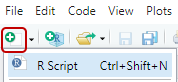
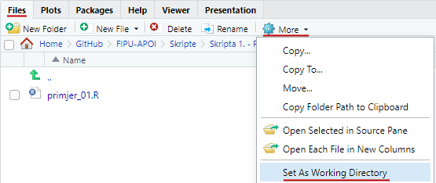
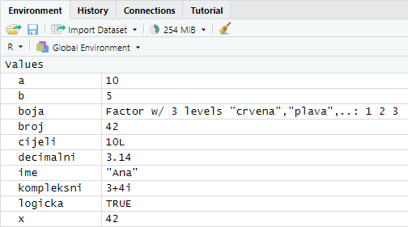
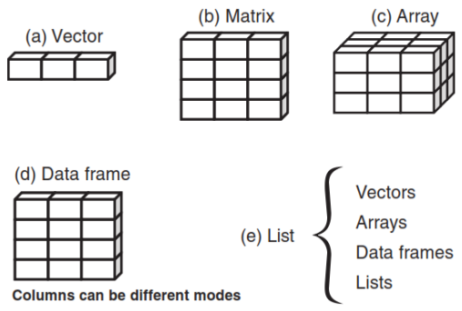
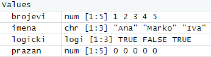
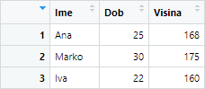
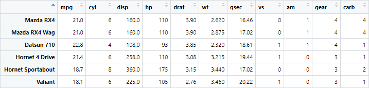

<div class="body">

# Analiza podataka i obrada informacija

**Nositelj**: izv. prof. dr. sc. Siniša Sovilj
**Asistent**: mag. inf. Alesandro Žužić

**Ustanova**: Sveučilište Jurja Dobrile u Puli, Fakultet informatike u Puli

<p style="float: clear; display: flex; gap: 8px; align-items: center;" class="font-brioni text-sm whitespace-nowrap">
    </img>
    Fakultet informatike u Puli
</p>

# [1] R osnove

<div style="display: flex; justify-content: space-between; text-align: justify; gap: 32px;">
    <p>
        R je programski jezik i okruženje za statističku analizu i grafičku vizualizaciju podataka. Nudi bogat skup funkcija za <b>statističko modeliranje</b>, <b>analizu podataka</b> i <b>strojno učenje</b>. Zbog svoje fleksibilnosti i velikog broja biblioteka, R je široko korišten u znanstvenim istraživanjima i industriji.
    </p>
    </img>
</div>

**Posljednje ažurirano:** 12. ožujka 2025.

<!-- TOC -->

- [Analiza podataka i obrada informacija](#analiza-podataka-i-obrada-informacija)
- [[1] R osnove](#1-r-osnove)
    - [RStudio](#rstudio)
        - [Preuzimanje i instalacija R-a](#preuzimanje-i-instalacija-r-a)
        - [Preuzimanje i instalacija RStudia](#preuzimanje-i-instalacija-rstudia)
- [Uvod](#uvod)
    - [Osnovna sintaksa](#osnovna-sintaksa)
        - [Osnovne operacije](#osnovne-operacije)
        - [Generiranje sekvenci brojeva](#generiranje-sekvenci-brojeva)
        - [Ispis podataka](#ispis-podataka)
            - [paste](#paste)
    - [Varijable i dodjela vrijednosti](#varijable-i-dodjela-vrijednosti)
        - [Imena varijabli](#imena-varijabli)
        - [Osnovne vrste podataka](#osnovne-vrste-podataka)
    - [Uvjeti](#uvjeti)
        - [IF uvjet](#if-uvjet)
        - [IFELSE uvjet](#ifelse-uvjet)
    - [Petlje](#petlje)
        - [FOR petlja](#for-petlja)
        - [WHILE petlja](#while-petlja)
        - [REPEAT petlja](#repeat-petlja)
    - [Funkcije](#funkcije)
- [Strukture podataka](#strukture-podataka)
    - [Podatkovni skupovi Datasets](#podatkovni-skupovi-datasets)
        - [Varijable prema mjernim skalama](#varijable-prema-mjernim-skalama)
    - [Vrste struktura podataka](#vrste-struktura-podataka)
        - [Vektor Vector](#vektor-vector)
        - [Primjer](#primjer)
        - [Matrica Matrix](#matrica-matrix)
        - [Polje Array](#polje-array)
        - [Okvir podataka Data Frame](#okvir-podataka-data-frame)
        - [Faktori Factors](#faktori-factors)
        - [Liste Lists](#liste-lists)
- [Učitavanje podataka](#u%C4%8Ditavanje-podataka)
    - [Učitavanje iz tekstualnih datoteka](#u%C4%8Ditavanje-iz-tekstualnih-datoteka)
        - [Učitavanje CSV datoteka](#u%C4%8Ditavanje-csv-datoteka)
        - [Učitavanje TXT datoteka](#u%C4%8Ditavanje-txt-datoteka)
    - [Učitavanje iz Excel datoteka](#u%C4%8Ditavanje-iz-excel-datoteka)
    - [Učitavanje s interneta](#u%C4%8Ditavanje-s-interneta)
    - [Učitavanje ugrađenih podataka](#u%C4%8Ditavanje-ugra%C4%91enih-podataka)
    - [Provjera i čišćenje podataka](#provjera-i-%C4%8Di%C5%A1%C4%87enje-podataka)
        - [Provjera strukture podataka](#provjera-strukture-podataka)
        - [Provjera nedostajućih vrijednosti](#provjera-nedostaju%C4%87ih-vrijednosti)
- [Samostalni zadatak za vježbu 1](#samostalni-zadatak-za-vje%C5%BEbu-1)

<!-- /TOC -->

<div class="page"></div>

## RStudio


**RStudio** je integrirano razvojno okruženje (IDE) za programski jezik **R**.

### Preuzimanje i instalacija R-a  

Prije nego što instaliramo RStudio, potrebno je instalirati R, jer je RStudio samo okruženje koje koristi R kao svoj temeljni jezik. 

Sa službene stranice R-a [https://cran.r-project.org](https://cran.r-project.org) preuzmite odgovarajuću verziju te pokrenite preuzetu datoteku slijedeći upute za instalaciju (ostavite zadane postavke).

### Preuzimanje i instalacija RStudia  


Nakon što je R instaliran, možemo instalirati RStudio tako da sa službene stranicu RStudia [https://posit.co/download/rstudio-desktop/](https://posit.co/download/rstudio-desktop/) preuzmemo **besplatnu verziju** RStudio Desktop *Open Source Edition (AGPL v3)*. Pokrenite preuzetu datoteku i slijedite upute za instalaciju (ostavite zadane postavke).  

---

Nakon instalacije, pokrenite RStudio. Prvi prikaz trebao bi izgledati ovako:  


RStudio se sastoji od nekoliko ključnih panela:  
- **Editor (Ime Datoteke/Untitled)** - mjesto gdje pišemo kôd odabrane/nove datoteke
- **Konzola (Console)** – mjesto gdje unosimo i izvršavamo R naredbe i vidimo ispis (print)
- **Okruženje (Environment)** – prikazuje trenutno učitane varijable i objekte  
- **Datoteke, Plots, Help, Packages** – panel za pregled datoteka, vizualizaciju grafova, instalaciju paketa i dokumentaciju  

<div class="page"></div>

Kako bi provjerili je li R ispravno instaliran, u konzolu upišemo `version`:  

```R
> version
               _                                
platform       x86_64-w64-mingw32               
arch           x86_64                           
os             mingw32                          
crt            ucrt                             
system         x86_64, mingw32                  
status                                          
major          4                                
minor          4.3                              
year           2025                             
month          02                               
day            28                               
svn rev        87843                            
language       R                                
version.string R version 4.4.3 (2025-02-28 ucrt)  
```

Za testiranje rada RStudia, možemo napisati sljedeću naredbu:  

```R
> print("Pozdrav iz RStudia!")
[1] "Pozdrav iz RStudia!"
```

# Uvod

Prvo što želimo napraviti je stvoriti novu R datoteku u kojoj ćemo spremati kôd koji pišemo. Možemo koristiti kraticu `Ctrl+Shift+N` ili kliknuti na *New File* ikonu:



Prvo što si želimo namjestiti u RStudiu je trenutni **radni direktorij** (*working directory*), što je u biti samo mapa (*folder*) u kojem ćemo raditi i stvarati datoteke.

Da bi provjerili u kojem se radnom direktoriju nalazimo, koristimo komandu: `getwd()` - get working directory <br>
Dok za namještanje novog direktorija, koristimo komandu: `setwd("<value>")` - set working directory

>Za **pokretanje** kôda u RStudio-u označimo jednu ili više linije kôda i pritisnemo kombinaciju tipki `Ctrl+Enter`

<div class="page"></div>

*Primjer:*

```R
getwd()

# primjer ispisa u konzoli
[1] "C:/Users/user/Documents/GitHub/FIPU-APOI/Skripte/Skripta 1. - R Osnove"
```
```R
setwd("~/GitHub/FIPU-APOI/Skripte/Skripta 1. - R Osnove/primjeri")
```


Ako ne želimo ručno pisati putanju do željenog radnog direktorija, možemo u panelu **Files** pronaći i namjestiti trenutni radni direktorij.



Ukoliko nismo sigurni kako neka ugrađena (*built-in*) funkcija ili komanda radi, uvijek možemo iću u panel *Help* te pretražiti dokumentaciju ili ispred funkcije staviti `?` i pokrenuti je:


<div class="page"></div>

## Osnovna sintaksa

Podsjetnik, u RStudiu možete izvršiti kôd tako da:  
- napišete naredbu i pritisnete `Ctrl+Enter` (Windows/Linux) ili `CMD+Enter` (Mac)
- označite više linija kôda i pokrenete ih na isti način
- konzolu možete očistiti pomoću `Ctrl+L`, kroz *Edit → Clear Console* ili pritiskom na ikonu *metle*

> U RStudiu **undo** se vrši kraticom `Ctrl+Z`, dok kraticom `Ctrl+Shift+Z` vršimo **redo**

*Jednolinijski (singleline) komentari u R-u se pišu s znakom `#`, višelinijskih (multiline) komentara nema:*

```R
# komentar

# jedini način pisanja komentara u
# više linija
```

> Za zakomentirat/odkomentirat više linija odjednom možemo koristiti kraticu `Ctrl+Shift+C`

### Osnovne operacije  
R podržava standardne matematičke operacije:  

```R
2 + 2     # Zbrajanje
 [1] 4

5 - 3     # Oduzimanje
 [1] 2

4 * 2     # Množenje
 [1] 8

7 / 2     # Dijeljenje
 [1] 3.5

7 %/% 2   # Cjelobrojno dijeljenje
 [1] 3

2^3       # Potenciranje (2 na treću)
 [1] 8

10 %% 3   # Modulo (ostatak pri dijeljenju)
 [1] 1
```

> U svim primjerima i nadalje, uglate zagrade s brojkom `[1]` će predstavljati ispis u konzoli (*kao u RStudiu*).

<div class="page"></div>

### Generiranje sekvenci brojeva  
R omogućuje jednostavno generiranje sekvenci brojeva pomoću operatora `:` ili funkcije `seq()` 

```R
1:10           # Generira brojeve od 1 do 10
 [1]  1  2  3  4  5  6  7  8  9 10

seq(1, 10)     # Isto kao 1:10
 [1]  1  2  3  4  5  6  7  8  9 10

seq(1, 10, 2)  # Generira brojeve od 1 do 10 s korakom 2
 [1] 1 3 5 7 9
```

---

### Ispis podataka  
Za ispis podataka u konzolu koristimo funkciju `print()` ili jednostavno napišemo ime varijable

```R
print("Hello, World!")    # Ispis niza znakova
 [1] "Hello, World!"

x <- 42   # Dodjeljivanje vrijednosti varijabli x
x         # Ispis varijable x
 [1] 42
```

#### `paste()`
Funkcija `paste()` u R-u spaja više objekata (stringova, brojeva, varijabli) u jedan tekstualni niz. Možemo postaviti separator između spojenih elemenata koristeći argument `sep`. Ako ne postavimo separator, koristi se razmak `' '`. 

```R
paste("Hello", "World") # "Hello World"
paste("2025", "03", "11", sep = "-") # "2025-03-11"
paste("Broj je:", 10) # "Broj je: 10"
```

Funkcija `paste0()` je varijanta koja ne koristi separator (nema razmaka), no isto je kao da napišemo `paste()` gdje je `sep=""`

<div class="page"></div>

## Varijable i dodjela vrijednosti  

Varijable u R-u dodjeljuju se pomoću `<-` ili `=`. Preporučeni operator je `<-`.

```R
a <- 10               # Dodjela broja 10 varijabli a
b = 5                 # Alternativni način (nije preporučeno)
ime <- "Ana"          # Tekstualna varijabla
logicka <- TRUE       # Logička varijabla

v1 <- v2 <- v3 <- "jabuka" # Dodjela iste vrijednosti više varijabli istovremeno
```

*Možemo ispisati varijable jednostavnim navođenjem njihovih imena:*

```R
a
 [1] 10
b
 [1] 5
ime
 [1] "Ana"
logicka
 [1] TRUE
```

---

### Imena varijabli  

Varijable u R-u mogu imati kratka imena (kao što su `x` i `y`) ili opisna imena (kao što su `godina`, `ime`, `ukupna_količina`). Iako postoji fleksibilnost u odabiru imena varijabli, postoji nekoliko pravila koja treba slijediti:

- Ime varijable mora započeti s velikim ili malim slovom
- Ime varijable može se sastojati od slova, brojeva, točke (`.`) i donje crte (`_`)
- Ako ime varijable započinje točkom (`.`), ne može biti praćeno brojem
- Ime varijable ne smije započeti brojem ili donjom crtom (`_`)
- Varijable su osjetljive na velika i mala slova, što znači da `mojavarijabla`, `MojaVarijabla` i `MOJAVARIJABLA` predstavljaju različite varijable
- Rezervirane riječi, poput `TRUE`, `FALSE`, `NULL` i ključnih riječi poput `if`, ne mogu se koristiti kao imena varijabli

*Primjeri dozvoljenih imena varijabli:*

```R
mojavarijabla <- "jabuka"
moja_varijabla <- "jabuka"
mojaVarijabla <- "jabuka"
MOJAVARIJABLA <- "jabuka"
mojavarijabla.2 <- "jabuka"
.mojavarijabla <- "jabuka"      # Izbjegavajte korištenje točki kod naziva varijabli
._._....___..._  <- "jabuka"    # Samo zato što je moguće nemojte činiti

```

*Primjeri nedozvoljenih imena varijabli:*

```R
2mojavarijabla <- "jabuka"  # Ne može započeti s brojem
moja-varijabla <- "jabuka"  # Crtica (-) nije dozvoljena
moja varijabla <- "jabuka"  # Razmaci nisu dozvoljeni
_mojavarijabla <- "jabuka"  # Ne smije započeti s donjom crtom
moja@varijabla <- "jabuka"  # Posebni znakovi nisu dozvoljeni
.2mojavarijabla <- "jabuka" # Ne smije započeti s točkom i brojem nakon točke
TRUE <- "jabuka"            # Rezervirana riječ 'TRUE' ne može biti korištena
```

> **Environment neće prikazati varijable koje počinju s točkom!**

### Osnovne vrste podataka

U R-u nije potrebno izričito navoditi tip podataka prilikom kreiranja varijable. R automatski prepoznaje vrstu varijable na temelju dodijeljene vrijednosti. Na primjer, ako dodijelimo brojčanu vrijednost, R će varijablu tretirati kao numeričku (`numeric`), dok će tekstualnu vrijednost automatski prepoznati kao znakovni tip (`character`). Također, vrijednost varijable se može kasnije ponovno dodijeliti, pri čemu R ažurira njezin tip ovisno o novoj dodijeljenoj vrijednosti.

- **Numeric (brojčani podaci)** – cijeli brojevi i decimalni brojevi
  ```R
  broj <- 42
  decimalni <- 3.14
  class(broj)       # Provjera vrste podataka
   [1] "numeric"
  class(decimalni)
   [1] "numeric"
  ```

- **Integer (cijeli brojevi)** – koriste se dodavanjem sufiksa `L`  
  ```R
  cijeli <- 10L
  class(cijeli)
   [1] "integer"
  ```

- **Character (tekstualni podaci)** – pohranjuju tekstualne vrijednosti (*stringove*)
  ```R
  ime <- "Ana"
  class(ime)
   [1] "character"
  ```

- **Logical (logički podaci)** – mogu imati vrijednosti `TRUE` ili `FALSE`
  ```R
  logicka <- TRUE
  class(logicka)
   [1] "logical"
  ```

- **Factor (kategorijske varijable)** – koristi se za rad s diskretnim kategorijama
  ```R
  boja <- factor(c("crvena", "plava", "zelena"))
  class(boja)
   [1] "factor"
  ```

- **Complex (kompleksni brojevi)** – koriste se rjeđe, ali su dostupni u R-u
  ```R
  kompleksni <- 3 + 4i
  class(kompleksni)
   [1] "complex"
  ```

---

<br>

Sve dodane aktivne varijable i podatke možemo vidjeti u panelu `Environment` u RStudio-u:



Za prikaz svih trenutno definiranih varijabli koristimo naredbu `ls()`:
```r
ls()
 [1] "a"          "b"          "boja"       "broj"       "cijeli"     "decimalni"  "ime"        "kompleksni"
 [9] "logicka"    "x"     
```

Za brisanje određene varijable koristimo naredbu `rm(<naziv_varijable>)`:  
```r
rm(a) # Briše varijablu 'a'

rm(list = ls()) # Za brisanje svih varijabli
```

> Za brisanje svih varijabli iz radnog prostora također možemo kliknuti na ikonu *metle* unutar panela `Environment`

<br>

## Uvjeti

Uvjeti omogućuju izvršavanje kôda samo ako je određeni uvjet ispunjen. U R-u možemo koristiti `if`, `else` i `ifelse` za kontrolu toka programa.

### IF uvjet

U slučaju kada želimo provjeriti određeni uvjet i izvršiti odgovarajući blok kôda, koristimo `if` uvjet:

```R
if (1 == 0) {
  print(1)
} else {
  print(0)
}

 [1] 0
```

U ovom primjeru, uvjet `1 == 0` nije zadovoljen, pa se izvršava blok u `else` dijelu. Rezultat će biti:

```
[1] "0"
```

### IFELSE uvjet

Za kraće uvjete koji se mogu izravno koristiti u izrazu, koristi se `ifelse` funkcija. Ova funkcija omogućava donošenje odluka na temelju uvjeta, bez potrebe za blokovima kôda.

```R
x <- c(1, 2, 3, 4, 5, 6, 7, 8, 9, 10)
ifelse(x < 5 | x > 8, x, 0)

 [1]  1  2  3  4  0  0  0  0  9 10
```

Ovdje će se provesti provjera je li element iz vektora `x` manji od 5 ili veći od 8. Ako je uvjet zadovoljen, vraća se vrijednost iz vektora `x`, a ako nije, vraća se 0.

<br>

## Petlje

Petlje u R-u omogućuju ponavljanje određenih operacija više puta, što je korisno za rad s velikim količinama podataka ili kada želimo izvršiti isti zadatak više puta bez potrebe za ponovnim pisanjem kôda. U R-u najčešće korištene petlje su `for`, `while` i `repeat`.

### FOR petlja

`for` petlja koristi se za iteriranje kroz nizove vrijednosti, kao što su vektori, liste, ili drugi objekti koji se mogu podijeliti na više elemenata. U svakom koraku petlje, promjenjiva (`i`) varijabla prima vrijednost iz niza, a zatim se izvršavaju naredbe unutar petlje.

```R
for (i in 1:10) {
  print(paste("i = ", i))
}

 [1] "i = 1"
 [1] "i = 2"
 [1] "i = 3"
 [1] "i = 4"
 [1] "i = 5"
 [1] "i = 6"
 [1] "i = 7"
 [1] "i = 8"
 [1] "i = 9"
 [1] "i = 10"
```

*Primjer sume brojeva:*

```R
suma <- 0
for (i in 1:10) {
  suma <- suma + i
}
print(paste("Suma brojeva od 1 do 10 je:", suma))

 [1] "Suma brojeva od 1 do 10 je: 55"
```

---

### WHILE petlja
`while` petlja izvršava blok kôda dok je uvjet istinit. Petlja će se ponavljati sve dok uvjet koji se navede unutar zagrade bude zadovoljen.

```R
i <- 3
while (i > 0) {
  print(paste("i =", i))
  i <- i - 1  # Smanjenje vrijednosti i
}

 [1] "i = 3"
 [1] "i = 2"
 [1] "i = 1"
```

<div class="page"></div>

### REPEAT petlja
`repeat` petlja je slična `while` petlji, ali se razlikuje u tome što petlja uvijek mora sadržavati uvjet za izlazak pomoću `break` naredbe. `repeat` petlja će se izvršavati besprijekorno dok ne naiđe na uvjet za izlaz. Sintaksa izgleda ovako:

```R
i <- 1
repeat {
  print(paste("i =", i))
  i <- i + 1
  if (i %% 5 == 0) {
    break
  }
}

 [1] "i = 1"
 [1] "i = 2"
 [1] "i = 3"
 [1] "i = 4"
```

<br>

## Funkcije  

Funkcije u R-u omogućuju ponovnu upotrebu kôda i povećavaju njegovu čitljivost. One prihvaćaju argumente, izvršavaju određene operacije i mogu vratiti rezultat.  

*Funkcija se definira pomoću ključne riječi `function`, a može primati jedan ili više argumenata:* 

```R
naziv_funkcije <- function(argument_1, argument_2, ...) {
  # tijelo funkcije/operacije 
  return(varijabla/vrijednost)
}
```

Funkciju možemo pozvati navođenjem njezina imena i prosljeđivanjem odgovarajućih argumenata.

*Funkcija bez argumenata:* 

```R
pozdrav <- function() {
  return("Ahoy!")
}

pozdrav()
 [1] "Ahoy!"
```

<div class="page"></div>

*Funkcija s jednim argumentom:*

```R
kvadrat <- function(x) {
  return(x^2)
}

kvadrat(4)
 [1] 16
```

*Funkcija s više argumenata:* 

```R
zbroj <- function(a, b) {
  return(a + b)
}

zbroj(5, 3)
 [1] 8
```

Argumentima funkcije možemo postaviti zadane (*default*) vrijednosti, što znači da će se, ako argument nije naveden prilikom poziva funkcije, automatski koristiti njegova unaprijed određena vrijednost.

*Funkcija sa zadanim argumentima:*

```R
ponovi_tekst <- function(tekst = "R!", n = 3) {
  return(rep(tekst, n)) # rep() -> ponavlja dani element n puta
}

ponovi_tekst(n = 5)
 [1] "R!" "R!" "R!" "R!" "R!"
```

# Strukture podataka

U R-u postoji nekoliko osnovnih struktura podataka koje se koriste za pohranu i manipulaciju podacima. Svaka od ovih struktura ima svoje specifične karakteristike i primjene.

## Podatkovni skupovi (*Datasets*)

U analizi podataka, **podatkovni skup** (*dataset*) predstavlja strukturirane podatke organizirane u obliku tablice. Tablica se sastoji od:

- **Redaka (opservacija, primjera)** – predstavljaju pojedinačne zapise, objekte ili slučajeve u skupu podataka  
- **Stupaca (varijabli, atributa)** – predstavljaju karakteristike ili atribute koji opisuju podatke

<div class="page"></div>

Matematički se podatkovni skup može prikazati kao:

$$
\text{podatkovni skup} = \text{redci (opservacije)} \times \text{stupci (varijable)}
$$
---

*Primjer tabličnog podatkovnog skupa:*

| PatientID | AdmDate    | Age | Diabetes | Status    |
| --------- | ---------- | --- | -------- | --------- |
| 1         | 10/15/2014 | 25  | Type1    | Poor      |
| 2         | 11/01/2014 | 34  | Type2    | Improved  |
| 3         | 10/21/2014 | 28  | Type1    | Excellent |
| 4         | 10/28/2014 | 52  | Type1    | Poor      |

---

### Varijable prema mjernim skalama

Varijable u podatkovnom skupu mogu se klasificirati prema **mjernim skalama**. Postoje dvije osnovne vrste varijabli:

**1. Kategorijske varijable** (*Categorical Variables*)
Kategorijske varijable predstavljaju podatke koji pripadaju određenim grupama ili kategorijama. U R-u se ovakve varijable definiraju kao **faktori (*factors*)**.

- **Nominalne varijable** (*Nominal variables*)  
  - Vrijednosti su imena kategorija bez prirodnog reda
  - **Primjer:** Spol (*M/Ž*), boja očiju, vrsta dijabetesa
  - **R reprezentacija:** `factor(c("M", "Ž", "M"))`

- **Ordinalne varijable** (*Ordinal variables*)  
  - Vrijednosti imaju prirodni redoslijed, ali razmaci između njih nisu nužno jednaki  
  - **Primjer:** Skala tvrdoće materijala (meko, srednje, tvrdo), ocjene (loše, dobro, odlično)  
  - **R reprezentacija:** `factor(c("Low", "Medium", "High"), ordered = TRUE)`

**2. Kontinuirane varijable** (*Continuous Variables*)
Kontinuirane varijable predstavljaju numeričke podatke koji se mogu mjeriti i koji imaju logičan redoslijed s definiranom skalom mjerenja.

- **Intervalne varijable** (*Interval variables*)  
  - Vrijednosti imaju definiran redoslijed i jednak razmak između jedinica, ali nemaju prirodnu nultu točku  
  - **Primjer:** Temperatura u stupnjevima Celzija (°C) ili Fahrenheita (°F)
  - **R reprezentacija:** `c(10, 20, 30)`

- **Racionalne varijable** (*Ratio variables*)  
  - Imaju prirodnu nultu točku, što omogućuje razmjerno uspoređivanje vrijednosti 
  - **Primjer:** Duljina, masa, broj stanovnika u gradu  
  - **R reprezentacija:** `c(100, 200, 300)`

## Vrste struktura podataka

U R-u postoje različite strukture podataka koje omogućuju učinkovitu pohranu i manipulaciju podacima.

**Klase struktura podataka (classes)**
- **Vektor (vector)** – osnovna struktura podataka, može sadržavati samo jedan tip podataka
- **Matrica (matrix)** – dvodimenzionalna struktura s elementima istog tipa
- **Polje (array)** – višedimenzionalna struktura, generalizacija matrice
- **Podatkovni okvir (data frame)** – tablična struktura koja može sadržavati različite tipove podataka po stupcima
- **Lista (list)** – kolekcija objekata različitih tipova podataka
- **Skalar** – jednoelementni vektor



**Podatkovni okvir (Data Frame)**
Data frame je glavna struktura podataka za pohranu **podatkovnih skupova** u R-u. Sličan je tablici, pri čemu stupci mogu sadržavati različite tipove podataka.

> Svaka struktura podataka može sadržavati jedan ili više tipova podataka, osim vektora, matrica i polja koji moraju imati homogeni tip podataka.

<div class="page"></div>

### Vektor (*Vector*)

Vektor je osnovna jedinica podataka u R-u. Može sadržavati elemente istog tipa, poput numeričkih, logičkih ili znakova. Vektori se kreiraju pomoću funkcije `c()`, koja spaja više vrijednosti u jednu sekvencu.

```R
# Numerički vektor
brojevi <- c(1, 2, 3, 4, 5)

# Znakovni vektor
imena <- c("Ana", "Marko", "Iva")

# Logički vektor
logicki <- c(TRUE, FALSE, TRUE)

# Prazan vektor određenog tipa i duljine
prazan <- vector(mode = "numeric", length = 5)
```



> **Indeksi u R-u počinju od `1`** (za razliku od većine programskih jezika koji počinju od 0)

*Možemo dohvatiti elemente vektora pomoću uglati zagrada `[]`:*

```R
brojevi[2]   # Dohvaća drugi element (2)
 [1] 2

imena[1]     # Dohvaća prvi element ("Ana")
 [1] "Ana"

logicki[3]   # Dohvaća treći element (TRUE)
 [1] TRUE
```

<div class="page"></div>

*Vektori podržavaju aritmetičke i logičke operacije:*

```R
# Aritmetičke operacije nad vektorima
x <- c(2, 4, 6)
y <- c(1, 2, 3)

zbroj <- x + y    # Rezultat: c(3, 6, 9)
umnozak <- x * y  # Rezultat: c(2, 8, 18)
kvadrati <- x^2   # Rezultat: c(4, 16, 36)

# Logičke operacije
logicki_v <- c(TRUE, FALSE, TRUE)
negacija <- !logicki_v  # Rezultat: c(FALSE, TRUE, FALSE)
```

*Vektore možemo filtrirati koristeći logičke izraze:*

```R
brojevi <- c(10, 20, 30, 40, 50)

# Dohvat brojeva većih od 25
veci_od_25 <- brojevi[brojevi > 25]  # Rezultat: c(30, 40, 50)
```

*Osim što možemo stvarati vektore isto ih možemo i kombinirati pomoću `c()` funkcije:*

```R
vektor1 <- c(1, 2, 3)
vektor2 <- c(4, 5, 6)

kombinirani <- c(vektor1, vektor2)  # Rezultat: c(1, 2, 3, 4, 5, 6)
```

*R omogućuje generiranje sekvenci pomoću dvotočja `:` i funkcije `seq()`:*

```R
sekvenca1 <- 1:10  # Rezultat: c(1, 2, 3, ..., 10)
sekvenca2 <- seq(2, 20, by = 2)  # Rezultat: c(2, 4, 6, ..., 20)
```

*Za ponavljanje elemenata koristimo funkciju `rep()`, omogućuje ponavljanje cijelog vektora više puta ili ponavljanje svakog njegovog elementa određeni broj puta.:*

```R
ponovljeni <- rep(1:3, times = 2)  # Rezultat: c(1, 2, 3, 1, 2, 3)
ponovljeni2 <- rep(1:3, each = 2)  # Rezultat: c(1, 1, 2, 2, 3, 3)
```

*Dodatne funkcije za rad s vektorima:*

```R
brojevi <- c(10, 20, 40, 20, 70, 20)
```

| Funkcija       | Opis                                                             | Primjer                          | Rezultat                       |
| -------------- | ---------------------------------------------------------------- | -------------------------------- | ------------------------------ |
| **`sum()`**    | Zbraja sve elemente u vektoru                                    | `sum(brojevi)`                   | `180`                          |
| **`min()`**    | Vraća minimalnu vrijednost u vektoru                             | `min(brojevi)`                   | `10`                           |
| **`max()`**    | Vraća maksimalnu vrijednost u vektoru                            | `max(brojevi)`                   | `70`                           |
| **`mean()`**   | Vraća prosječnu vrijednost vektora                               | `mean(brojevi)`                  | `30`                           |
| **`unique()`** | Vraća jedinstvene vrijednosti (bez duplikata)                    | `unique(brojevi)`                | `10, 20, 40, 70`               |
| **`length()`** | Vraća broj elemenata u vektoru                                   | `length(brojevi)`                | `6`                            |
| **`sort()`**   | Sortira elemente vektora (rastući redoslijed)                    | `sort(brojevi)`                  | `10, 20, 20, 20, 40, 70`       |
| **`rev()`**    | Obrće redoslijed elemenata u vektoru                             | `rev(brojevi)`                   | `20, 70, 20, 40, 20, 10`       |
| **`which()`**  | Vraća indekse elemenata koji zadovoljavaju uvjet                 | `which(brojevi > 30)`            | `3, 5` (indeksi)               |
| **`any()`**    | Provjerava postoji li barem jedan element koji zadovoljava uvjet | `any(brojevi > 50)`              | `TRUE`                         |
| **`all()`**    | Provjerava zadovoljavaju li svi elementi uvjet                   | `all(brojevi > 15)`              | `FALSE`                        |
| **`cumsum()`** | Vraća kumulativni zbroj elemenata                                | `cumsum(brojevi)`                | `10, 30, 70, 90, 160, 180`     |
| **`diff()`**   | Vraća razlike između susjednih elemenata                         | `diff(brojevi)`                  | `10, 20, -20, 50, -50`         |
| **`rep()`**    | Ponavlja elemente vektora                                        | `rep(c(1, 2), times = 3)`        | `1, 2, 1, 2, 1, 2`             |
| **`seq()`**    | Generira sekvencu brojeva                                        | `seq(from = 1, to = 10, by = 2)` | `1, 3, 5, 7, 9`                |
| **`paste()`**  | Spaja stringove u jedan vektor                                   | `paste("Broj", 1:3)`             | `"Broj 1", "Broj 2", "Broj 3"` |
| **`table()`**  | Vraća frekvenciju svake jedinstvene vrijednosti                  | `table(brojevi)`                 | `10:1, 20:3, 40:1, 70:1`       |
| **`range()`**  | Vraća minimalnu i maksimalnu vrijednost                          | `range(brojevi)`                 | `10, 70`                       |
| **`median()`** | Vraća medijan vektora                                            | `median(brojevi)`                | `20`                           |
| **`sd()`**     | Vraća standardnu devijaciju vektora                              | `sd(brojevi)`                    | `22.9089`                      |
| **`var()`**    | Vraća varijancu vektora                                          | `var(brojevi)`                   | `480`                          |

---

<div class="page"></div>

### Matrica (*Matrix*)  

Matrica je dvodimenzionalna struktura podataka u R-u koja sadrži **samo jedan tip podataka** (npr. samo numeričke vrijednosti ili samo znakove). Kreira se pomoću funkcije `matrix()`  

```R
# Kreiranje 3x3 matrice s brojevima od 1 do 9 po stupcima
mat <- matrix(1:9, nrow = 3, ncol = 3)
print(mat)

      [,1] [,2] [,3]
 [1,]    1    4    7
 [2,]    2    5    8
 [3,]    3    6    9
```
- Argument `nrow` određuje broj redaka, a `ncol` broj stupaca
- R automatski popunjava matricu po stupcima, osim ako se ne koristi `byrow = TRUE`

```R
# Kreiranje 3x3 matrice s brojevima od 1 do 9 po retcima
mat2 <- matrix(1:9, nrow = 3, byrow = TRUE)
print(mat2)

      [,1] [,2] [,3]
 [1,]    1    2    3
 [2,]    4    5    6
 [3,]    7    8    9
```

*Elementi matrice dohvaćaju se pomoću `[redak, stupac]`:*
```R
# Dohvaćanje elementa u drugom retku i trećem stupcu
mat[2,3]
 [1] 8

# Dohvaćanje cijelog retka
mat[2, ]
 [1] 2 5 8

# Dohvaćanje cijelog stupca
mat[ ,3]
 [1] 7 8 9
```

<div class="page"></div>

*Spajanje vektora u matricu vrši se pomoću funckija `cbind()` (column bind) i `rbind()` (row bind):*
```R
# Spajanje dvaju vektora u stupce
v1 <- c(1, 2, 3)
v2 <- c(4, 5, 6)
mat3 <- cbind(v1, v2)  # Kombinira vektore u stupce
print(mat3)

      v1 v2
 [1,]  1  4
 [2,]  2  5
 [3,]  3  6

# Spajanje dvaju vektora u retke
mat4 <- rbind(v1, v2)  # Kombinira vektore u retke
print(mat4)

    [,1] [,2] [,3]
 v1    1    2    3
 v2    4    5    6
```

*Matrice možemo vizualno pregledati ako kliknemo na njihovu varijablu unutar panela **Environment**:*


---

### Polje (*Array*)

Polje (*array*) je višedimenzionalna struktura podataka u R-u. Dok su matrice ograničene na dvije dimenzije (redci i stupci), polja mogu imati tri ili više dimenzija. Ova struktura korisna je za pohranu podataka koji zahtijevaju više od dvije dimenzije, poput vremenskih serija ili složenih eksperimentalnih podataka.

<div class="page"></div>

*Polja se kreiraju pomoću funkcije `array()`, gdje se definiraju dimenzije pomoću argumenta `dim`:*

```R
# Kreiranje polja s 3 reda, 2 stupca i 2 sloja
arr <- array(1:12, dim = c(3, 2, 2))
print(arr)

 , , 1
 
      [,1] [,2]
 [1,]    1    4
 [2,]    2    5
 [3,]    3    6
 
 , , 2
 
      [,1] [,2]
 [1,]    7   10
 [2,]    8   11
 [3,]    9   12
```

- Polje se može vizualizirati kao niz matrica, gdje svaki sloj predstavlja zasebnu matricu

*Elementi polja dohvaćaju se pomoću indeksa u obliku `[redak, stupac, sloj]`:*

```R
# Dohvaćanje elementa u drugom retku, prvom stupcu i drugom sloju
arr[2, 1, 2]
 [1] 8

# Dohvaćanje cijelog prvog sloja
arr[ , , 1]  
      [,1] [,2]
 [1,]    1    4
 [2,]    2    5
 [3,]    3    6

# Dohvaćanje cijelog drugog stupca u svim slojevima
arr[ , 2, ]  
      [,1] [,2]
 [1,]    4   10
 [2,]    5   11
 [3,]    6   12
```

<div class="page"></div>

*Polja podržavaju aritmetičke operacije, ali moraju imati iste dimenzije:*

```R
arr <- array(1:12, dim = c(3, 2, 2))
arr2 <- array(13:24, dim = c(3, 2, 2))

zbroj <- arr + arr2
print(zbroj)

 , , 1
 
      [,1] [,2]
 [1,]   14   20
 [2,]   16   22
 [3,]   18   24
 
 , , 2
 
      [,1] [,2]
 [1,]   26   32
 [2,]   28   34
 [3,]   30   36
```

**Primjeri upotrebe polja:**
1. **Vremenski podaci:** Polja se često koriste za pohranu podataka koji se mijenjaju kroz vrijeme, poput mjerenja temperature u različitim lokacijama i vremenskim intervalima
2. **Slike i videozapisi:** Polja se mogu koristiti za pohranu piksela slike ili videozapisa, gdje svaki sloj predstavlja različitu komponentu (npr. RGB)

*In a nutshell:*


---

### Okvir podataka (*Data Frame*)

Okvir podataka (`data.frame`) je jedna od najčešće korištenih struktura podataka u R-u. Omogućuje pohranu podataka u tabličnom formatu, gdje svaki stupac može sadržavati različite tipove podataka (npr. numeričke, znakovne, logičke).

*Okvir podataka kreira se pomoću funkcije `data.frame()`, gdje se svaki stupac definira kao **vektor**:*

```R
podaci <- data.frame(
  Ime = c("Ana", "Marko", "Iva", "Pero"),
  Dob = c(25, 30, 22, 25),
  Visina = c(168, 175, 160, 190)
)

print(podaci)

     Ime Dob Visina
 1   Ana  25    168
 2 Marko  30    175
 3   Iva  22    160
 4  Pero  25    191
```

- Svaki stupac može imati različit tip podataka (npr. `Ime` je znakovni, `Dob` i `Visina` su numerički)
- Redovi predstavljaju pojedinačne opservacije, a stupci varijable

*Također ih kao i matrice možemo vizualno pregledati ako kliknemo na njihovu varijablu unutar panela **Environment**:*




*Da bi dobili dimenzije tablice koristimo funkciju `dim()` ili `nrow()` za broj redaka i `ncol()` za broj stupaca:*
```R
dimenzije <- dim(podaci)

print(paste("Broj opservacija (redaka):", dimenzije[1]))
 [1] "Broj opservacija (redaka): 4"

print(paste("Broj varijabli (stupaca):", dimenzije[2]))
 [1] "Broj varijabli (stupaca): 3"

print(paste("Broj opservacija (redaka):", nrow(podaci)))
 [1] "Broj opservacija (redaka): 4"

print(paste("Broj varijabli (stupaca):", ncol(podaci)))
 [1] "Broj varijabli (stupaca): 3"
```
Ukoliko želimo ispraviti ili promijeniti neke podatke možemo korisitit funkciju `fix()` koja otvara grafički editor za interaktivno uređivanje objekata (vektora, okvira podataka, funkcija):

*Uređivanje okvira podataka:*

```R
fix(podaci)  # Otvara editor za podatke
```

---

Podacima u okviru možemo pristupiti na više načina:

1. **Pristup stupcima pomoću `$`:**
   ```R
   podaci$Ime  # Vraća vektor imena
    [1] "Ana"   "Marko" "Iva"   "Pero"
   ```

2. **Pristup određenom retku i stupcu pomoću `[]`:**
   ```R
   podaci[2, 3]  # Vraća vrijednost u drugom retku i trećem stupcu
    [1] 175
   ```

3. **Pristup cijelom retku ili stupcu:**
   ```R
   podaci[2, ]  # Vraća drugi redak

        Ime Dob Visina
    2 Marko  30    175

   podaci[, 3]  # Vraća treći stupac
    [1] 168 175 160 191
   ```

4. **Pristup pomoću imena stupaca:**
   ```R
   podaci["Visina"]  # Vraća stupac Visina kao podokvir

      Visina
    1    168
    2    175
    3    160
    4    190
   ```

<div class="page"></div>

*Novi stupac možemo dodati jednostavno dodjeljivanjem vrijednosti:*

```R
# Dodavanje stupca "Težina"
podaci$Težina <- c(55, 80, 60, 87)
print(podaci)

     Ime Dob Visina Težina
 1   Ana  25    168     55
 2 Marko  30    175     80
 3   Iva  22    160     60
 4  Pero  25    191     87
```

*Stupac možemo izbrisati postavljanjem tog stupca na `NULL`:*
```R
# Brisanje stupca "Težina"
podaci$Težina <- NULL
print(podaci)

     Ime Dob Visina
 1   Ana  25    168
 2 Marko  30    175
 3   Iva  22    160
 4  Pero  25    191
```

*Podatke možemo filtrirati koristeći logičke uvjete:*

```R
# Filtriranje osoba starijih od 23 godine
stariji_od_23 <- podaci[podaci$Dob > 23, ]
print(stariji_od_23)

     Ime Dob Visina
 1   Ana  25    168
 2 Marko  30    175
 3  Pero  25    191
```

<div class="page"></div>

*Podatke možemo sortirati pomoću funkcije `order()`:*

```R
podaci <- data.frame(
  Ime = c("Ana", "Marko", "Iva", "Petar", "Marija", "Ivan"),
  Dob = c(25, 30, 25, 28, 25, 30),
  Visina = c(168, 175, 160, 180, 165, 178)
)


# Sortiranje po dobi (silazno)
sortirani_podaci <- podaci[order(podaci$Dob, decreasing = TRUE), ]
print(sortirani_podaci)

     Ime Dob Visina
 2 Marko  30    175
 1   Ana  25    168
 3   Iva  22    160
```

*Funkcije poput `summary()` i `aggregate()` koriste se za sažimanje podataka:*

```R
# Sažetak podataka
summary(podaci)

      Ime                 Dob            Visina     
  Length:6           Min.   :25.00   Min.   :160.0  
  Class :character   1st Qu.:25.00   1st Qu.:165.8  
  Mode  :character   Median :26.50   Median :171.5  
                     Mean   :27.17   Mean   :171.0  
                     3rd Qu.:29.50   3rd Qu.:177.2  
                     Max.   :30.00   Max.   :180.0  

# Agregacija prosječne visine po dobi
aggregate(Visina ~ Dob, data = podaci, FUN = mean)

   Dob   Visina
 1  25 164.3333
 2  28 180.0000
 3  30 176.5000
```


Funkcija `colnames()` koristi se za dohvaćanje ili promjenu naziva stupaca u okviru podataka `data.frame`.

<div class="page"></div>

*Dohvaćanje naziva stupaca:*
```R
podaci <- data.frame(
  Ime = c("Ana", "Marko"),
  Dob = c(25, 30),
  Visina = c(168, 175)
)

# Dohvaćanje naziva stupaca
nazivi <- colnames(podaci)

print(nazivi)
 [1] "Ime"    "Dob"    "Visina"
```

*Promjena naziva stupaca:*
```R
# Promjena naziva svih stupaca
colnames(podaci) <- c("Name", "Age", "Height")

# Promjena naziva određenog stupca
colnames(podaci)[2] <- "Year"

print(podaci)

    Name Year Height
 1   Ana   25    168
 2 Marko   30    175
```

---

### Faktori (*Factors*)

Faktori su struktura podataka u R-u koja se koristi za pohranu kategorijskih varijabli. Kategorijske varijable su one koje imaju ograničen broj različitih vrijednosti (npr. spol, boja, razredi). Faktori su posebno korisni u statističkim analizama i modeliranju jer R interno pohranjuje faktore kao brojeve, što omogućuje efikasniju obradu podataka.

*Faktori se kreiraju pomoću funkcije `factor()`. Ona pretvara vektor u faktor i automatski određuje razine (*levels*) faktora:*

```R
# Kreiranje faktora za spol
spol <- factor(c("M", "Ž", "M", "Ž", "M"))
print(spol)

 [1] M Ž M Ž M
 Levels: M Ž
```

- `M` i `Ž` su razine (*levels*) faktora.
- R interno pohranjuje faktore kao brojeve (npr. `M` = 1, `Ž` = 2), ali prikazuje ih kao znakovne vrijednosti

*Razine faktora mogu se promijeniti pomoću argumenta `levels`:*

```R
# Promjena redoslijeda razina
spol <- factor(spol, levels = c("Ž", "M"))
print(spol)
 [1] M Ž M Ž M
 Levels: Ž M   # Sada je prva razina `Ž`, a druga `M`
```

*Ako želimo dodati nove razine koje nisu prisutne u podacima, možemo koristiti argument `levels`:*

```R
# Dodavanje nove razine "N" (nepoznato)
spol <- factor(spol, levels = c("M", "Ž", "N"))
print(spol)

 [1] M Ž M Ž M
 Levels: M Ž N
```

- Sada faktor ima tri razine, iako vrijednost `N` nije prisutna u podacima

*Faktori se mogu pretvoriti u znakovne vektore pomoću funkcije `as.character()` ili numeričke vektore pomoću funkcije `as.numeric()`:*

```R
# Pretvorba faktora u znakovni vektor
spol_znakovni <- as.character(spol)
print(spol_znakovni)
 [1] "M" "Ž" "M" "Ž" "M"

# Pretvorba faktora u numerički vektor
spol_numericki <- as.numeric(spol)
print(spol_numericki)
 [1] 1 2 1 2 1
```

- R interno pohranjuje faktore kao brojeve, gdje svaka razina ima svoj numerički kod.

**Primjeri upotrebe faktora:**
1. **Statističke analize:** Faktori su ključni u analizi varijance (ANOVA), regresiji i drugim statističkim metodama
2. **Grupiranje podataka:** Faktori se koriste za grupiranje podataka u grafikone i tablice
3. **Kodiranje podataka:** Faktori se koriste za pretvaranje tekstualnih podataka u numeričke kodove

---

<div class="page"></div>

### Liste (*Lists*)

Lista je fleksibilna struktura podataka koja može sadržavati različite tipove podataka, uključujući vektore, okvire podataka i čak druge liste. Liste se kreiraju pomoću funkcije `list()`.

*AKA:*


```R
moja_lista <- list(
  broj = 42,
  imena = c("Ana", "Marko"),
  matrica = matrix(1:4, nrow = 2)
)

print(moja_lista)

 $broj
 [1] 42
 
 $imena
 [1] "Ana"   "Marko"
 
 $matrica
      [,1] [,2]
 [1,]    1    3
 [2,]    2    4


moja_lista$broj
 [1] 42

moja_lista$imena[1]
 [1] "Ana"

moja_lista$matrica[1,2]
 [1] 3
```

<div class="page"></div>

# Učitavanje podataka

U R-u postoji više načina za učitavanje podataka iz različitih izvora, poput tekstualnih datoteka, Excel datoteka, baza podataka ili internetskih izvora.

## Učitavanje iz tekstualnih datoteka

Tekstualne datoteke (*npr. CSV, TXT*) najčešći su izvor podataka. R ima ugrađene funkcije za čitanje ovih datoteka.

### Učitavanje CSV datoteka
CSV (*Comma-Separated Values*) datoteke su tablični podaci pohranjeni u tekstualnom obliku, gdje su vrijednosti odvojene zarezom.

```R
# Učitavanje CSV datoteke
podaci <- read.csv("data/primjer.csv")

# Prikaz prva 3 retka
head(podaci, n = 3L)
     Ime Dob Visina   Grad
 1   Ana  25    168 Zagreb
 2 Marko  30    175  Split
 3   Iva  22    160 Rijeka

# Prikaz zadnja 3 retka
tail(podaci, n = 3L)
      Ime Dob Visina      Grad
 4  Petar  28    180    Osijek
 5 Marija  35    165     Zadar
 6   Ivan  40    178 Dubrovnik
```

- **Argumenti funkcije `read.csv()`:**
  - `file`: Putanja do datoteke.
  - `header`: Ako je `TRUE`, prvi redak se koristi kao nazivi stupaca (*default* je `TRUE`)
  - `sep`: Znak koji odvaja vrijednosti (*default* je `,`)

<div class="page"></div>

### Učitavanje TXT datoteka
Za datoteke s drugim separatorima (*npr. tabulator, točka-zarez, razmak*) koristi se funkcija `read.table()`.

```R
# Učitavanje TXT datoteke s razmakom kao separatorom
podaci <- read.table("data/primjer.txt", header = TRUE, sep = " ")

# Prikaz prva 2 retka
head(podaci, n = 2L)

      Ime Dob Visina      Grad
 1    Ana  25    168    Zagreb
 2  Marko  30    175     Split
```

- **Argumenti funkcije `read.table()`:**
  - `header`: Ako je `TRUE`, prvi redak se koristi kao nazivi stupaca
  - `sep`: Znak koji odvaja vrijednosti (npr. `sep = "\t"` za tabulator)

<br>

## Učitavanje iz Excel datoteka

Za učitavanje podataka iz Excel datoteka (*XLSX*) potreban je paket `readxl`:


```R
install.packages("readxl")  # Instalacija paketa
library(readxl)             # Učitavanje paketa

# Učitavanje Excel datoteke
podaci <- read_excel("putanja/do/datoteke.xlsx", sheet = 1)

# Prikaz prva 2 retka
head(podaci, n = 2L)

 # A tibble: 2 × 4
   Ime     Dob Visina Grad  
   <chr> <dbl>  <dbl> <chr> 
 1 Ana      25    168 Zagreb
 2 Marko    30    175 Split 
```

- **Argumenti funkcije `read_excel()`:**
  - `path`: Putanja do Excel datoteke
  - `sheet`: Naziv ili indeks lista koji se želi učitati (default je prvi list)
  - `range`: Opseg ćelija koji se želi učitati (npr. `range = "A1:D10"`)

<br>

<div class="page"></div>

## Učitavanje s interneta

R može učitati podatke s interneta, bilo izravno s web stranice ili iz API-ja.

Za učitavanje podataka s API-ja koristi se paket `httr`.

```R
install.packages("httr")  # Instalacija paketa
library(httr)

# Zahtjev za informacije o repozitoriju
odgovor <- GET("https://api.github.com/repos/tidyverse/ggplot2")

# Pretvorba odgovora u JSON
podaci <- content(odgovor, "parsed")

# Prikaz podataka
print(podaci)
```

<br>

## Učitavanje ugrađenih podataka

U R-u postoji veliki broj ugrađenih skupova podataka koji su dostupni odmah nakon pokretanja R-a. Ovi podaci često se koriste za demonstraciju, vježbu i testiranje različitih funkcija i paketa. Ugrađeni podaci mogu se učitati pomoću funkcije `data()`.

*Neki primjeri ugrađenih skupina podataka:*

| Skup podataka     | Opis                                                                                                                                                    |
| ----------------- | ------------------------------------------------------------------------------------------------------------------------------------------------------- |
| **`mtcars`**      | Podaci o različitim modelima automobila iz 1974. godine. Sadrži informacije o potrošnji goriva, broju cilindara, snazi motora i drugim karakteristikama |
| **`iris`**        | Podaci o cvijetu perunike (Iris). Sadrži mjere za duljinu i širinu latica i čašičnih listova za tri različite vrste perunike                            |
| **`airquality`**  | Podaci o kvaliteti zraka u New Yorku tijekom 1973. godine. Sadrži mjerenja ozona, sunčevog zračenja, temperature i drugih varijabli                     |
| **`Titanic`**     | Podaci o preživjelima na Titanicu. Organizirani u obliku tabele s informacijama o putnicima, uključujući klasu, spol, dob i preživljavanje              |
| **`USArrests`**   | Podaci o broju uhićenja po 100.000 stanovnika u SAD-u za različite zločine (ubojstvo, napad, silovanje) i postotak urbane populacije po državi          |
| **`ChickWeight`** | Podaci o težini pilića tijekom vremena, s informacijama o prehrani i dobi                                                                               |

<br>

<div class="page"></div>

*Funkcija `data()` prikazuje popis svih ugrađenih skupova podataka dostupnih u trenutnoj R sesiji. Ako želite učitati određeni skup podataka, jednostavno navedite njegovo ime kao argument:*

```R
# Prikaz popisa svih ugrađenih skupova podataka
data()

# Učitavanje određenog skupa podataka
data("mtcars")  # Učitava skup podataka 'mtcars'

cars <- data.frame(mtcars)

head(cars)

                    mpg cyl disp  hp drat    wt  qsec vs am gear carb
 Mazda RX4         21.0   6  160 110 3.90 2.620 16.46  0  1    4    4
 Mazda RX4 Wag     21.0   6  160 110 3.90 2.875 17.02  0  1    4    4
 Datsun 710        22.8   4  108  93 3.85 2.320 18.61  1  1    4    1
 Hornet 4 Drive    21.4   6  258 110 3.08 3.215 19.44  1  0    3    1
 Hornet Sportabout 18.7   8  360 175 3.15 3.440 17.02  0  0    3    2
 Valiant           18.1   6  225 105 2.76 3.460 20.22  1  0    3    1
```



<br>

<div class="page"></div>

## Provjera i čišćenje podataka

Nakon učitavanja podataka, važno je provjeriti njihovu strukturu i očistiti ih od eventualnih grešaka.

### Provjera strukture podataka
```R
podaci <- read.csv("data/primjer_with_nulls.csv")

# Prikaz strukture podataka
str(podaci)

 'data.frame':	6 obs. of  4 variables:
  $ Ime   : chr  "Ana" "" "Iva" "Petar" ...
  $ Dob   : int  25 30 22 28 35 40
  $ Visina: int  NA 175 160 180 165 NA
  $ Grad  : chr  "Zagreb" "Split" "Rijeka" "" ...


# Sažetak podataka
summary(podaci)

      Ime                 Dob            Visina          Grad          
  Length:6           Min.   :22.00   Min.   :160.0   Length:6          
  Class :character   1st Qu.:25.75   1st Qu.:163.8   Class :character  
  Mode  :character   Median :29.00   Median :170.0   Mode  :character  
                     Mean   :30.00   Mean   :170.0                     
                     3rd Qu.:33.75   3rd Qu.:176.2                     
                     Max.   :40.00   Max.   :180.0                     
                                     NA's   :2                         
```

<div class="page"></div>

### Provjera nedostajućih vrijednosti
```R
# Broj nedostajućih vrijednosti po stupcu
colSums(is.na(podaci))
    Ime    Dob Visina   Grad 
      0      0      2      0 

# Uklanjanje redaka s nedostajućim vrijednostima
podaci_clean <- na.omit(podaci)
podaci_clean

      Ime Dob Visina   Grad
 2         30    175  Split
 3    Iva  22    160 Rijeka
 4  Petar  28    180       
 5 Marija  35    165  Zadar


 # Uklanjanje redaka gdje bilo "Ime" ili "Grad" ima prazne stringove
podaci_clean <- podaci_clean[podaci_clean$Ime != "" | podaci_clean$Grad != "", ]
podaci_clean

      Ime Dob Visina   Grad
 3    Iva  22    160 Rijeka
 5 Marija  35    165  Zadar
```

<div class="page"></div>

# Samostalni zadatak za vježbu 1

Skup podataka `mtcars` sadrži informacije o različitim modelima automobila iz 1974. godine. Podaci uključuju potrošnju goriva, broj cilindara, snagu motora i druge karakteristike.

Učitajte skup podataka `mtcars` u varijablu naziva `cars` i odgovorite na sljedeća pitanja:

1. **Koliko ima opservacija (redaka) i varijabli (stupaca)?**

2. **Navedite kojeg su tipa varijable.**

3. **Ima li nedostajućih vrijednosti?**

4. **Izmijenite nazive stupaca tako da budu na hrvatskom jeziku.**
    - Hint: `colnames()`
    - Koristite sljedeće nazive:
        - `mpg` → `potrosnja`
        - `cyl` → `cilindri`
        - `disp` → `zapremina`
        - `hp` → `snaga`
        - `drat` → `omjer`
        - `wt` → `tezina`
        - `qsec` → `ubrzanje`
        - `vs` → `motor`
        - `am` → `mjenjac`
        - `gear` → `brzine`
        - `carb` → `karburatori`

5. **Koja je minimalna, maksimalna i prosječna potrošnja goriva?** - Hint: `min()`, `max()`, `mean()`

6. **Koliko je različitih brojeva cilindara u skupu podataka?** - Hint: `unique()`

7. **Koliko je automobila s ručnim mjenjačem (`mjenjac = 1`)?** - Hint: `sum()`

8. **Kreirajte novi dataframe koji sadrži sve podatke za automobile s 8 cilindara. Spremite podatke u varijablu naziva `cars_8cyl`.**

9. **Koliko iznosi prosječna težina automobila s 8 cilindara?**

10. **Koliko iznosi potrošnja goriva za prva 3 automobila?** - Hint: `head()`

11. **Koliko iznosi potrošnja goriva za posljednjih 5 automobila?** - Hint: `tail()`

12. **Prikažite sažetak svih numeričkih varijabli u skupu podataka.**

</div>