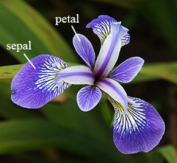

# Samostalni zadatak za vježbu 2

**Analiza skupa podataka `iris`**

Skup podataka `iris` sadrži mjerenja duljine i širine čašičnih listova (*sepal*) i latica (*petal*) za tri vrste irisa: *Iris setosa*, *Iris versicolor* i *Iris virginica*.

Učitajte skup podataka `iris` u varijablu naziva `iris_podaci` i odgovorite na sljedeća pitanja:

---

1. **Koliko ima opservacija i varijabli?**

2. **Navedite nazive varijabli i kojeg su tipa.**

3. **Koja je minimalna, maksimalna i prosječna duljina čašičnog lista (`Sepal.Length`)?**

4. **Koliko je različitih vrsta irisa u skupu podataka?**

5. **Koliko je opservacija za svaku vrstu irisa?**

6. **Koliko iznosi prosječna širina latica (`Petal.Width`) za vrstu *Iris virginica*?**

7. **Dodajte 2 nova stupca, jedan nakon koji izračunava površinu čašičnog lista (*Sepal*), drugi koji izračunava površinu latice (*Petal*)**

8. **Kreirajte novi okvir koji sadrži sve podatke za vrstu *Iris setosa*. Spremite podatke u varijablu naziva `setosa`. Zatim pronađite opservaciju koja ima najveći omjer između površine čašičnog lista i površine latice.**

9. **Koja vrsta **iris-a** ima u prosjeku najdulji čašični list (*Sepal.Length*), a koja vrsta ima u prosjeku najmanju površinu latica (*Petal*)**?
   - Hint: `aggregate()`

10. **Kreirajte novi okvir koji sadrži samo one opservacije gdje je površina latica (Petal.Area) veća od prosječne površine latica za cijeli skup podataka. Spremite podatke u varijablu naziva `irisIznadProsjeka`. Zatim izračunajte koliko je takvih opservacija za svaku vrstu irisa te koja vrsta ima najmanje latice?**

11. **Provjerite da li opservacija s najvećim omjerom iz okvira `setosa` ima veću površinu čašičnog lista i površinu latice od opservacija s najmanjom površinom čašičnog lista i površinom latice iz okvira**

