<div class="body">

# Analiza podataka i obrada informacija

**Nositelj**: izv. prof. dr. sc. Siniša Sovilj <br>
**Asistent**: mag. inf. Alesandro Žužić

**Ustanova**: Sveučilište Jurja Dobrile u Puli, Fakultet informatike u Puli

<p style="float: clear; display: flex; gap: 8px; align-items: center;" class="font-brioni text-sm whitespace-nowrap">
    </img>
    Fakultet informatike u Puli
</p>
 
# [2] Vizualizacija podataka

<div style="display: flex; justify-content: space-between; text-align: justify; gap: 32px;">
    <p>
        R nudi napredne mogućnosti za <b>grafičku vizualizaciju podataka</b>s bogatim skupom biblioteka i funkcija, omogućava učinkovito stvaranje vizualnih prikaza podataka, olakšavajući analizu i interpretaciju rezultata. Neke od osnovnih grafičkih prikaza koje ćemo proći su: <i>osnovni X-Y prikaz: plot(), histogram: hist(), točkasti prikaz: dotchart(), stupčasti prikaz: barplot(), tortni prikaz: pie(), kutijasti prikaz: boxplot(), raspršeni graf: scatterplot()</i>
    </p>
    </img>
</div>

**Posljednje ažurirano:** 27. ožujka 2025.

<!-- TOC -->

- [Analiza podataka i obrada informacija](#analiza-podataka-i-obrada-informacija)
- [[2] Vizualizacija podataka](#2-vizualizacija-podataka)
    - [X-Y prikaz plot](#x-y-prikaz-plot)
        - [Abline](#abline)
        - [Lines](#lines)
    - [Ostali elementi](#ostali-elementi)
        - [Vježba 1](#vje%C5%BEba-1)
    - [Histogram hist](#histogram-hist)
        - [Vježba 2](#vje%C5%BEba-2)
    - [Točkasti dijagram dotchart](#to%C4%8Dkasti-dijagram-dotchart)
        - [Vježba 3](#vje%C5%BEba-3)
    - [Stupčasti prikaz barplot](#stup%C4%8Dasti-prikaz-barplot)
        - [Vježba 4](#vje%C5%BEba-4)
    - [Tortni prikaz pie](#tortni-prikaz-pie)
    - [Kutijasti prikaz boxplot](#kutijasti-prikaz-boxplot)
        - [Vježba 5](#vje%C5%BEba-5)
    - [Raspršeni graf - korelacijska matrica](#raspr%C5%A1eni-graf---korelacijska-matrica)
        - [Osnovna sintaksa](#osnovna-sintaksa)
        - [Vježba 6](#vje%C5%BEba-6)

<!-- /TOC -->
## X-Y prikaz `plot()`

X-Y prikaz u R-u koristi se za vizualizaciju odnosa između dviju numeričkih varijabli. Ovaj tip grafa je koristan za ispitivanje korelacije ili uzorka među podacima, a osnovna funkcija za izradu ovih prikaza je `plot()`. X-Y prikaz daje jasnu sliku o tome kako se jedna varijabla mijenja u odnosu na drugu.

U R-u, funkcija `plot()` koristi dva osnovna argumenta: **x** i **y**. Prvi argument predstavlja vrijednosti na *X-osi*, a drugi na *Y-osi*. 

Na primjer, ako imamo skup podataka o težini vozila (`wt`) i potrošnji goriva (`mpg`) iz skupa podataka `mtcars`, možemo koristiti X-Y prikaz za vizualizaciju kako težina vozila utječe na njegovu potrošnju goriva.

*Primjer:*

```r
attach(mtcars)  # Učitavanje podataka
plot(wt, mpg)   # Iscrtavanje podataka
abline(lm(mpg ~ wt))  # Dodavanje regresijskog pravca
title("Regresija: MPG = a + b * WT")  # Naslov grafa
```

<div style="width: 100%; display: flex; justify-content: center;">
    
</div>

1. **attach(mtcars)**: Funkcija `attach()` omogućava lakši pristup varijablama unutar skupa podataka. Bez nje, morali bismo svaki put navoditi `mtcars$wt` ili `mtcars$mpg`. Korištenjem `attach(mtcars)`, možemo direktno koristiti `wt` i `mpg` varijable.

2. **plot(wt, mpg)**: Ova funkcija stvara osnovni X-Y graf, gdje je `wt` (težina vozila) *na X-osi*, a `mpg` (potrošnja goriva) na *Y-osi*.

3. **abline(lm(mpg ~ wt))**: Funkcija `abline()` dodaje pravac na graf. U ovom slučaju, koristi se linearni model (`lm()`) koji prikazuje regresijsku liniju između težine vozila i potrošnje goriva. Model je izražen kao \( \text{MPG} = a + b \cdot \text{WT} \), gdje su \(a\) i \(b\) koeficijenti koji se izračunavaju pomoću funkcije `lm()`. To omogućuje vizualno prikazivanje trenda ili povezanosti između tih dviju varijabli.

4. **title("Regresija: MPG = a + b * WT")**: Dodaje naslov grafu koji jasno označava o čemu se radi. U ovom slučaju, to je linearna regresija između potrošnje goriva i težine vozila.

**Dodatne opcije i prilagodbe**

Funkcija `plot()` omogućuje brojne prilagodbe kako bi graf bio jasniji i vizualno pregledniji:

- **Podešavanje boja i oznaka**: Možemo koristiti argumente `col` (boja) i `pch` (simboli točaka)

```r
plot(wt, mpg, col="blue", pch=16)
```

<div style="width: 100%; display: flex; justify-content: center;">
    
</div>

<div class="page"></div>

- **Promjena naziva x/y osi**: Argumenti poput `xlab` i `ylab` omogućuju postavljanje oznaka za X i Y osi

```r
plot(wt, mpg, xlab="Težina vozila (wt)", ylab="Potrošnja goriva (mpg)")
```

<div style="width: 100%; display: flex; justify-content: center;">
    
</div>

- **Dodavanje rešetke**: Funkcija `grid()` može se koristiti za dodavanje mreže na grafu, što može pomoći u preciznijem čitanju podataka

```r
plot(wt, mpg)
grid()
```

<div style="width: 100%; display: flex; justify-content: center;">
    
</div>

Parametri grafova, linija i teksta:

| Parametar                                                       | Opis                                                                                    | Primjer                                                    | Korištenje                                                                               |
| --------------------------------------------------------------- | --------------------------------------------------------------------------------------- | ---------------------------------------------------------- | ---------------------------------------------------------------------------------------- |
| **xlab, ylab**                                                  | Naziv osi x i y                                                                         | `xlab="Težina"`, `ylab="Potrošnja goriva"`                 | `plot(wt, mpg, pch=16, col="blue", xlab="Težina", ylab="Potrošnja goriva")`              |
| **pch**                                                         | Simbol za iscrtavanje točaka na grafu                                                   | `pch=17` (trokutasti simbol)                               | `plot(wt, mpg, pch=17, col="blue")`                                                      |
| **col**                                                         | Boja simbola ili linije na grafu                                                        | `col="red"` (crvena boja)                                  | `plot(wt, mpg, pch=16, col="red")`                                                       |
| **bg, fg**                                                      | Boje pozadine (ispune) i prednje strane (granice) objekta, *radi samo za simbole 21-25* | `bg="yellow"`, `fg="brown"` (pozadina žuta, granica smeđa) | `plot(wt, mpg, pch=21, col="orangered", bg="yellow", fg="brown")`                        |
| **cex**                                                         | Proširenje veličine simbola ili teksta                                                  | `cex=2` (dvostruko veći simbol)                            | `plot(wt, mpg, pch=5, col="blue", cex=2)`                                                |
| **lwd**                                                         | Širina linije                                                                           | `lwd=2` (dvostruko šira linija)                            | `plot(wt, mpg, pch=16, col="blue"); abline(lm(mpg ~ wt), lwd=2)`                         |
| **lth**                                                         | Tip linije                                                                              | `lty=2` (crtasta linija)                                   | `plot(wt, mpg, pch=16, col="blue"); abline(lm(mpg ~ wt), lty=2)`                         |
| **font** *(1=plain, 2=bold, 3=italic, 4=bold italic, 5=symbol)* | Tip fonta za tekst                                                                      | `font=3` (italic)                                          | `plot(wt, mpg, pch=16, col="blue", main="Font (font=3, italic)", font.main=3)`           |
| **ps**                                                          | Veličina fonta u točkama                                                                | Veličina teksta = `ps * cex`                               | `plot(wt, mpg, pch=16, col="blue", main="Veličina fonta (ps=2)", cex.main=2)`            |
| **family**                                                      | Obitelj fonta                                                                           | `family="mono"`                                            | `plot(wt, mpg, pch=16, col="blue", main="Obitelj fonta (family='mono')", family="mono")` |

<div style="width: 100%; display: flex; justify-content: center; margin-bottom: 16px;">
    <div style="padding: 16px; width: 50%">
        
    </div>
    <div style="padding: 16px; width: 50%">
        
    </div>
</div>

<div style="width: 100%; display: flex; justify-content: center;">
    
</div>

<div style="width: 100%; display: flex; justify-content: center;">
    
</div>

---

**`type=`** parametar određuje stil crte, npr. `"l"` za linije, `"b"` za točke i linije itd.

*Primjer:*
```r
x <- 1:10
y <- c(2, 4, 3, 5, 7, 6, 9, 8, 10, 12)

plot(x, y, type = "b", main = "Točke povezane linijama (b)")
```

Vrste linija: **"p"** za točke, **"l"** za linije, **"o"** za preklopljene točke i linije, **"b"** za točke povezane linijama, **"c"** za prazne točke povezane linijama, **"s"** i **"S"** za korake, **"h"** za okomite linije te **"n"** za isključivanje točaka i linija.

<div style="width: 100%; display: flex; justify-content: center;">
    
</div>

*Sažetak:*

```r
x <- 1:10
y <- c(1,3,5,2,4,6,4,8,6,2)
plot(
  x,                 # vrijednosti na osi x 
  y,                 # vrijednosti na osi y 
  xlim = c(1, 9),    # raspon x vrijednost
  ylim = c(1, 8),    # raspon y vrijednost
  main = "Naslov",   # naslov grafa
  xlab = "X os",     # naziv osi x
  ylab = "y os",     # naziv osi y
  cex.main = 2,      # veličina naslova
  cex.lab = 1.5,     # veličina naziva osi
  cex.axis = 1.25,   # veličina labela osi
  type = "b",        # vrsta linija/točaka
  lth  = 2,          # vrsta linije
  pch  = 21,         # vrsta točke
  lwd  = 3,          # debljina linije i obruba točki
  cex  = 2,          # veličina točki
  col  = "brown",    # boja linije i točki
  bg   = "orange",   # boja ispune točke
  fg   = "tomato",   # boja obruba grafa
)
```

<div style="width: 100%; display: flex; justify-content: center;">
    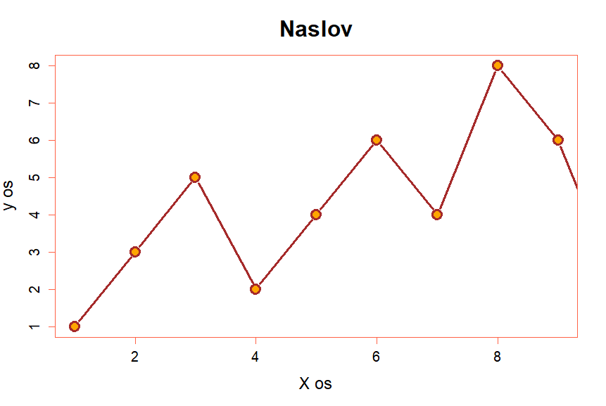
</div>

### Abline

Funkcija `abline()` koristi se za dodavanje linija na grafove. Možemo dodati horizontalne, vertikalne linije, kao i linije temeljene na regresijskim modelima.

| **Funkcija** | **Opis**                                                   | **Argumenti**                            | **Primjer**                                     |
| ------------ | ---------------------------------------------------------- | ---------------------------------------- | ----------------------------------------------- |
| **h**        | Dodavanje horizontalne linije na određenu y-koordinatu     | `col`, `lty`, `lwd`  | `abline(h = 5, col = "red", lty = 2, lwd = 2)`  |
| **v**        | Dodavanje vertikalne linije na određenu x-koordinatu       | `col`, `lty`, `lwd`  | `abline(v = 3, col = "blue", lty = 1, lwd = 1)` |
| **lm()**     | Dodavanje linije temeljene na linearnom modelu (regresija) | Model (npr. `lm()`), `col`, `lty`, `lwd` | `abline(lm(mpg ~ wt), col = "green")`           |

*Primjer:*

```r
plot(wt, mpg)
abline(lm(mpg ~ wt), col="red", lwd=2)  # linija linearne regresije
abline(h=mean(mpg), col="blue", lwd=2, lty=2)  # linija aritmetičke sredine mpg
abline(v=median(wt), col="green", lwd=2, lty=2)  # linija medijana wt

text(x=min(wt)*1.3, y=max(mpg)*0.9, labels="Regresijska linija", col="red", pos=1)
text(x=max(wt)*0.85, y=mean(mpg)*0.95, labels="Aritmetička sredina", col="blue", pos=4)
text(x=median(wt), y=max(mpg)*0.8, labels="Medijan WT", col="green", pos=2)
```

<div style="width: 100%; display: flex; justify-content: center;">
    
</div>

### Lines  

Funkcija `lines()` koristi se za dodavanje linija na postojeći graf u R-u. Za razliku od `plot()`, koji kreira novi graf, `lines()` samo nadodaje linije na postojeći prikaz. Može se koristiti za povezivanje točaka u skupu podataka, crtanje funkcija ili dodavanje trendova.  

*Primjer:*  

```r
x <- seq(0, 10, by=0.1)
x2 <- seq(0, 10, by=1)

y1 <- sin(x)
y2 <- cos(x)
y3 <- c(-0.2, -0.3, 0.75, 0, 0.13, -0.8, 0.7, 0.21, -0.45, -0.32, 0.625)

plot(x, y1, type="l", col="red", lwd=2, ylim=c(-1,1), xlab="X Vrijednosti", ylab="Y Vrijednosti")
lines(x, y2, col="blue", lwd=2, lty=2)  
lines(x2, y3, col="green", lwd=2, lty=4)  

legend("topright", legend=c("sin(x)", "cos(x)", "rigid"), col=c("red", "blue", "green"), lty=c(1,2,4), lwd=2)
```

<div style="width: 100%; display: flex; justify-content: center;">
    
</div>

<div class="page"></div>

## Ostali elementi

U R-u, razni elementi mogu se dodavati na grafove kako bi poboljšali čitljivost i interpretaciju podataka. To uključuje naslove, oznake osi, legende i grafičke oblike.  

| **Funkcija**   | **Opis**                                           | **Argumenti**                                                          | **Primjer**                                                                                             |
| -------------- | -------------------------------------------------- | ---------------------------------------------------------------------- | ------------------------------------------------------------------------------------------------------- |
| **title()**    | Dodaje naslov, podnaslov ili oznake osi            | `main`, `sub`, `xlab`, `ylab`, `col.main`, `col.sub` itd.              | `title(main="Naslov", sub="Podnaslov", col.main="red")`                                                 |
| **mtext()**    | Dodaje tekst izvan granica grafičkog prikaza       | `text`, `side` (1=bottom, 2=left, 3=top, 4=right), `line`, `col`, `at` | `mtext("Dodatni tekst", side=3, line=2, col="blue")`                                                    |
| **legend()**   | Dodaje legendu unutar ili izvan grafičkog prikaza  | `x`, `y`, `legend`, `col`, `lty`, `pch`, `bty`                         | `legend("topright", legend=c("Linija A", "Linija B"), col=c("red", "blue"), lty=1:2, cex=0.8, bty="n")` |
| **text()**     | Dodaje prilagođeni tekst unutar grafičkog prostora | `x`, `y`, `labels`, `col`, `pos`, `cex`                                | `text(5, 0.5, "Ovdje je oznaka", col="green", pos=4)`                                                   |
| **grid()**     | Dodaje mrežu za lakše očitavanje vrijednosti       | `col`, `lty`, `lwd`                                                    | `grid(col="gray", lty=2, lwd=0.5)`                                                                      |
| **rect()**     | Ističe određeni dio grafa bojom u pozadini         | `xleft`, `ybottom`, `xright`, `ytop`, `col`, `border`                  | `rect(2, -1, 4, 1, col=rgb(1,0,0,0.2), border=NA)`                                                      |
| **segments()** | Dodaje referentne crte                             | `x0`, `y0`, `x1`, `y1`, `col`, `lty`, `lwd`                            | `segments(2, -1, 2, 1, col="black", lty=2, lwd=2)`                                                      |
| **polygon()**  | Iscrtava područje između određenih točaka          | `x`, `y`, `col`, `border`                                              | `polygon(c(2,3,3,2), c(-1,-1,1,1), col=rgb(0,0,1,0.3), border=NA)`                                      |
| **points()**   | Dodaje specifične oblike na pojedine točke         | `x`, `y`, `pch`, `col`, `cex`                                          | `points(5, 0, pch=19, col="red", cex=2)`                                                                |
| **arrows()**   | Dodaje strelice za označavanje smjera              | `x0`, `y0`, `x1`, `y1`, `col`, `lty`, `length`                         | `arrows(2,0,3,0.5, col="red", lwd=2, length=0.1)`                                                       |
| **par(mfrow)** | Omogućuje prikaz više grafova u istom prozoru      | `mfrow=c(n,m)`                                                         | `par(mfrow=c(2,2)); plot(x,y); hist(x); boxplot(y); barplot(y)`                                         |

<div class="page"></div>

*Primjer 1:* 

```r
x <- seq(0, 10, by=0.1)
y <- sin(x)
z <- cos(x)

par(mfrow=c(1, 2))

plot(x, y, type="l", col="blue", lwd=2, xlab="Vrijeme", ylab="Amplituda")

title(main="Sinusni val", sub="Primjer prilagođenog grafičkog prikaza", col.main="blue", col.sub="gray")
legend("topright", legend=c("sin(x)"), col="blue", lty=1, cex=0.8, bty="n")

mtext("Sin i col grafovi", line=1, col="purple", at=c(0,0))

plot(x, z, type="l", col="red", lwd=2, lty=2,  xlab="Vrijeme", ylab="Amplituda")

title(main="Sinusni val", sub="Primjer prilagođenog grafičkog prikaza", col.main="red", col.sub="gray")
legend("topright", legend=c("cos(x)"), col="red", lty=2, cex=0.8, bty="n")
```

<div style="width: 100%; display: flex; justify-content: center;">
    
</div>
<div class="page"></div>

*Primjer 2:*
```r
x <- seq(0, 10, by=0.1)
y <- sin(x)

plot(x, y, type="l", col="blue", lwd=2, xlab="Vrijeme", ylab="Amplituda")
title(main="Sinusni val s dodatnim elementima")

# Dodavanje mreže
grid(col="gray", lty=2, lwd=0.5)

# Dodavanje pravokutnika
rect(2, -1, 4, 1, col=rgb(1,0,0,0.2), border=NA)

# Dodavanje referentne linije
segments(2, -1, 2, 1, col="black", lty=2, lwd=2)

# Dodavanje poligona
polygon(c(6,7,7,6), c(-1,-1,1,1), col=rgb(0,0,1,0.3), border=NA)

# Dodavanje oznaka
text(5, 0, "Nulta točka", col="black", pos=3)
text(3, 0.5, "Označeno područje", col="red", pos=4)

# Dodavanje strelice
arrows(2, 0, 3, 0.5, col="red", lwd=2, length=0.1)

# Dodavanje točke s posebnim simbolom
points(5, 0, pch=19, col="red", cex=2)
```

<div style="width: 100%; display: flex; justify-content: center;">
    
</div>
<div class="page"></div>

### Vježba 1

Istražujemo podatke o automobilima i želimo vizualizirati odnos između težine vozila (`wt`) i potrošnje goriva (`mpg`) koristeći skup podataka `mtcars`. Cilj je dodati korisne vizualne elemente kako biste istaknuli važne vrijednosti i trendove.  

1. Nacrtajte raspršeni dijagram (`plot()`) za `wt` (x-os) i `mpg` (y-os)
2. Dodajte regresijsku liniju koristeći `abline(lm())`
3. Dodajte horizontalnu liniju na prosječnu vrijednost `mpg` i vertikalnu liniju na medijan `wt`
4. Dodajte naslov i oznake osi koristeći `title()`
5. Dodajte legendu koja označava regresijsku liniju, prosječnu vrijednost i medijan 
6. Koristite `text()` za dodavanje oznaka uz sve tri linije grafa 
7. Dodajte mrežu (`grid()`) radi boljeg pregleda podataka
8. Ručno označite područje između prvog i trećeg kvartila pomoću `rect()`
9. Dodajte strelicu (`arrows()`) koja upućuje na vozilo s najvećom potrošnjom (`mpg`)  

<div style="width: 100%; display: flex; justify-content: center;">
    
</div>

## Histogram `hist()`

Histogram je grafički prikaz distribucije numeričkih podataka. Koristi se za vizualizaciju frekvencije pojavljivanja vrijednosti unutar određenog raspona (intervala). U R-u, histogram se generira pomoću funkcije `hist()`.

Osnovna sintaksa funkcije `hist()`:
```r
# Generiranje normalno distribuirane varijable
set.seed(123)
x <- rnorm(500, mean = 100, sd = 15)

hist(
  x,                      # vrijednosti
  breaks = 20,            # razredi
  xlim = c(50, 160),      # raspon x vrijednost
  ylim = c(0, 80),        # raspon y vrijednost
  main = "Naslov",        # naslov
  xlab = "X os",          # naziv osi x
  ylab = "Y os",          # naziv osi y
  cex.main = 2,           # veličina naslova
  cex.lab = 1.5,          # veličina naziva osi
  cex.axis = 1.25,        # veličina labela osi
  col = "lightblue",      # boja stupaca
  border = "darkblue",    # boja rubova
)
```

<div style="width: 100%; display: flex; justify-content: center;">
    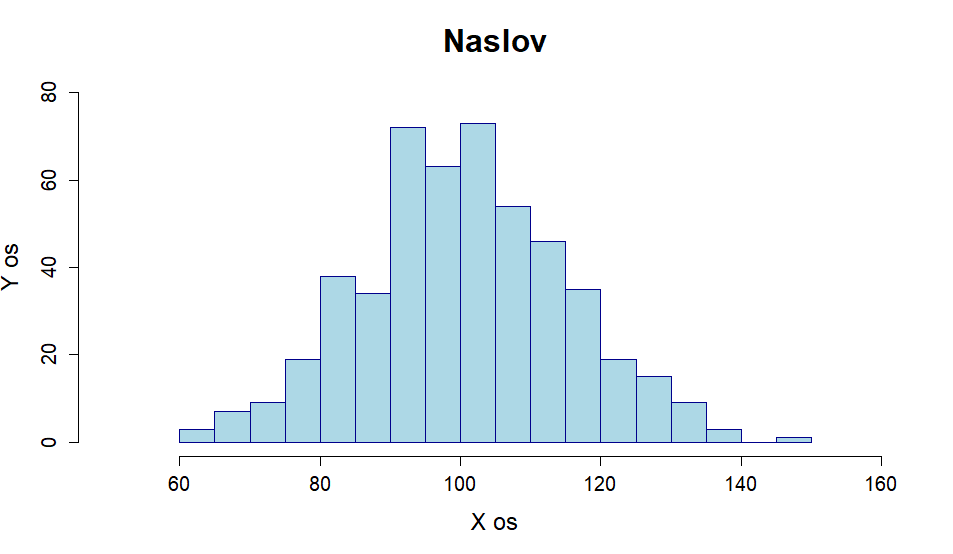
</div>

**Podešavanje intervala (breaks)**:
   - Može biti broj (broj intervala)
   - Vektor graničnih vrijednosti
   - Naziv algoritma ("Sturges", "Scott", "FD")

*Primjer:*
```r
par(mfrow=c(1,3))
hist(podaci, main="Fiksni broj", breaks = 50)  
hist(podaci, main="Prilagođeni intervali", breaks = seq(10, 200, by = 10))
hist(podaci, main="Friedman-Diaconis algoritam", breaks = "FD")
```

<div style="width: 100%; display: flex; justify-content: center;">
    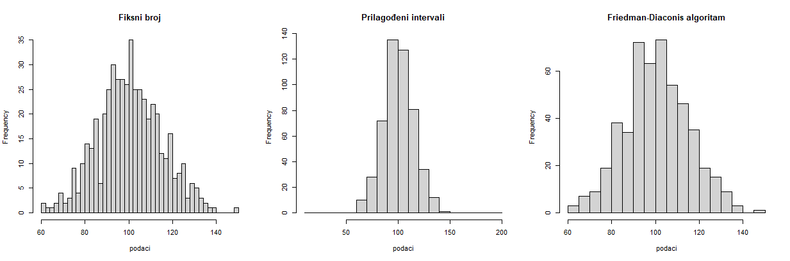
</div>

*Više histograma na istoj slici koristeći parametar `add`:*
```r
set.seed(123)
podaci1 <- rnorm(500, mean = 100, sd = 15)
podaci2 <- rnorm(500, mean = 120, sd = 10)

hist(podaci1, 
     col = rgb(1,0,0,0.5),   # Crvena s prozirnošću
     main = "Usporedba distribucija",
     xlab = "Vrijednosti",
     xlim = c(50, 160))
hist(podaci2, 
     col = rgb(0,0,1,0.5),    # Plava s prozirnošću
     add = TRUE)              # Dodaj na postojeći graf
legend("topright", 
       legend = c("Skup 1", "Skup 2"),
       fill = c(rgb(1,0,0,0.5), rgb(0,0,1,0.5)))
```

<div style="width: 100%; display: flex; justify-content: center;">
    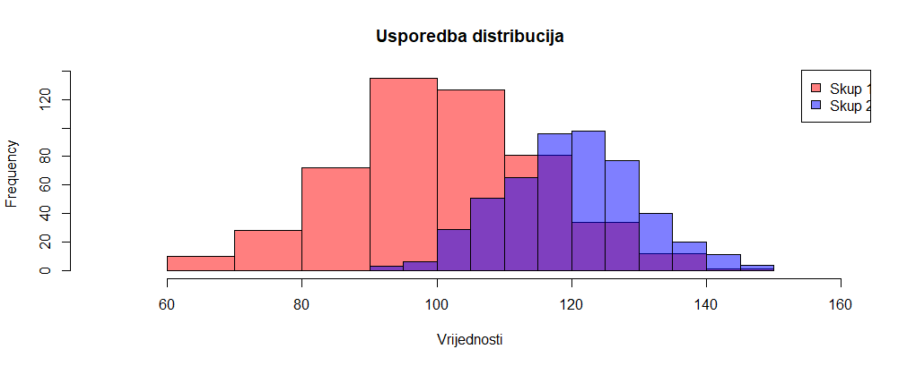
</div>

*Dodavanje krivulje gustoće `freq=FALSE` i `lines(density(x))`:*
```r
hist(podaci, 
     freq = FALSE,            # Prikaz gustoće umjesto frekvencije
     col = "lightgreen",
     main = "Histogram s krivuljom gustoće")
lines(density(podaci),        # Dodavanje krivulje gustoće
      col = "red", 
      lwd = 2)
```

<div style="width: 100%; display: flex; justify-content: center;">
    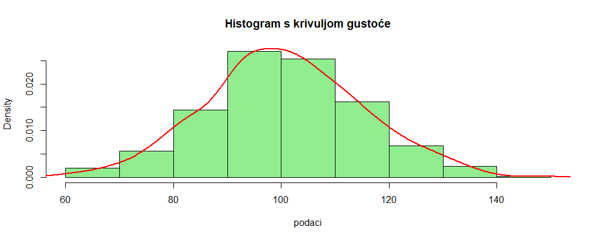
</div>

### Vježba 2

Istražujemo podatke o erupcijama gejzira i želimo vizualizirati distribuciju vremena između erupcija `waiting` koristeći skup podataka **faithful**. Cilj je dodati korisne vizualne elemente kako bismo istaknuli važne vrijednosti i karakteristike distribucije.

1. Koristite podatke `waiting` (vrijeme između erupcija gejzira)
2. Kreirajte histogram s `15` *razreda*
3. Postavite **naslov** "*Distribucija vremena između erupcija*"
4. Oznake osi neka budu "*Vrijeme čekanja (minute)*" i "*Broj erupcija*"
5. Postavite boju stupaca na `lightsteelblue`
6. Dodajte **krivulju gustoće distribucije** (*crvena boja, debljina linije 2*)
7. Dodajte **vertikalnu liniju** za **srednju vrijednost** (*plava, puna linija*)
8. Dodajte **vertikalnu liniju** za **medijan** (*zelena, isprekidana linija*)
9. Dodajte **legendu** koja objašnjava sve elemente grafa

*Primjer:*

<div style="width: 100%; display: flex; justify-content: center;">
    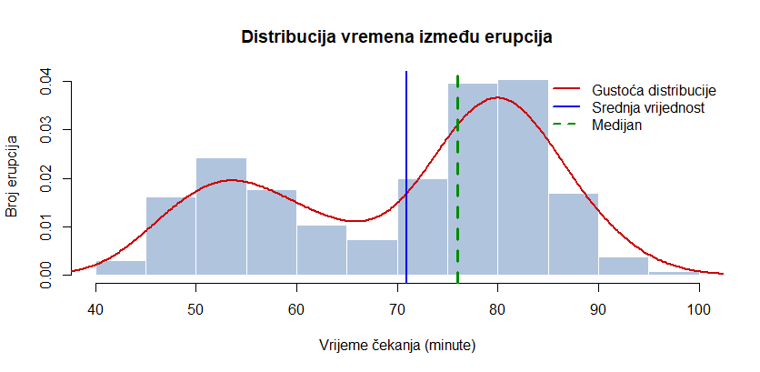
</div>

## Točkasti dijagram `dotchart()`

Točkasti dijagram je vrsta grafičkog prikaza koji prikazuje vrijednosti podataka kao točke duž brojčane linije. Ova vrsta vizualizacije posebno je korisna za:

- Prikazivanje distribucije podataka
- Usporedbu vrijednosti između različitih kategorija
- Vizualizaciju rang-liste vrijednosti

```r
data(iris)
dotchart(iris$Sepal.Length,
         main = "Dužina čašičnih listova",
         xlab = "Dužina (cm)",
         ylab = "Uzorak")
```

<div style="width: 100%; display: flex; justify-content: center;">
    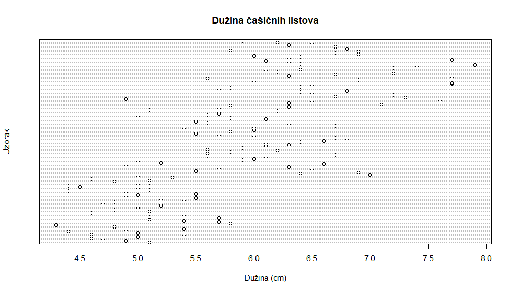
</div>

```r
dotchart(x = iris$Sepal.Length,
         groups = iris$Species,
         gcolor = c("#FF6B6B", "#4CAF50", "#2196F3"),
         lcolor = "gray80",
         color = c("#FF6B6B", "#4CAF50", "#2196F3")[as.numeric(iris$Species)],
         bg = rev(c("#FFCDD2", "#C8E6C9", "#BBDEFB"))[as.numeric(iris$Species)],
         main = "Dužina čašičnih listova po vrstama",
         xlab = "Dužina (cm)",
         ylab = "Uzorak",
         pch = 21,
         pt.cex = 1.5,
         cex = 1)
```

- `x` - Vektor podataka (dužine čašičnih listova)  
- `groups` - Grupiranje po vrstama cvijeća  
- `gcolor` - Boje oznaka grupa (crvena, zelena, plava)  
- `lcolor` - Boja linija poveznica (svijetlo siva)  
- `color` - Boje rubova točaka po vrstama  
- `bg` - Boje ispune točaka (svjetlije nijanse)  
- `pt.cex` - Veličina točaka (1.5× standardne)  

<div style="width: 100%; display: flex; justify-content: center;">
    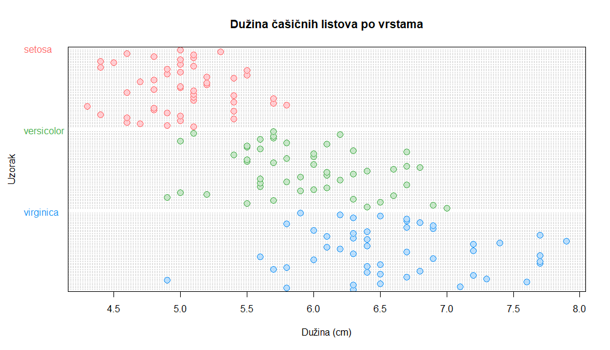
</div>

### Vježba 3

Istražujemo podatke o karakteristikama cvijeća iz **Iris** dataseta i želimo vizualizirati omjer dužine i širine latica (`Petal.Length/Petal.Width`) koristeći točkasti dijagram. Cilj je istaknuti razlike između vrsta cvijeća i njihove prosječne vrijednosti.

1. Koristite podatke `Petal.Length` i `Petal.Width` za izračun omjera (`Ratio`)
2. Kreirajte **točkasti dijagram** s grupiranjem po vrstama cvijeća (`Species`)
3. Postavite **naslov** "*Omjer dužine i širine latica po vrstama*"
4. Oznake osi neka budu "*Omjer (dužina/širina)*" i "*Uzorak*"
5. Postavite **boje grupa**: 
   - Setosa (`red`)
   - Versicolor (`green`) 
   - Virginica (`blue`)
6. Dodajte **vertikalne linije** za prosječne vrijednosti po vrstama
7. Dodajte **legendu**:
    - Boje točaka = vrste cvijeća
    - Linija = prosjek
 
*Primjer:*

<div style="width: 100%; display: flex; justify-content: center;">
    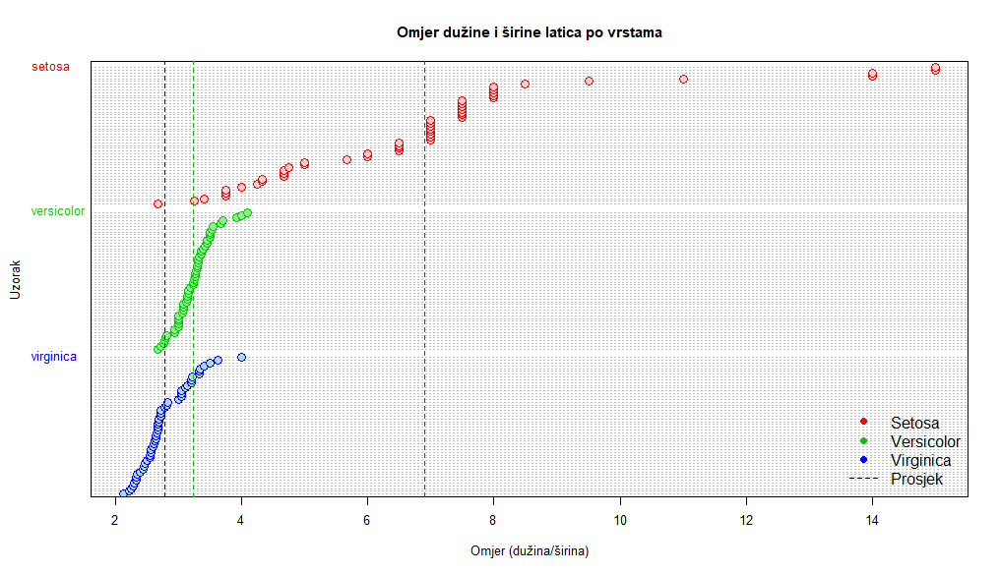
</div>

## **Stupčasti prikaz `barplot()`**

Stupčasti dijagram (`barplot`) koristi se za vizualizaciju kategoričkih podataka, prikazujući vrijednosti u obliku vertikalnih ili horizontalnih stupaca. Posebno je koristan za usporedbu vrijednosti između različitih skupina.

Funkcija `barplot()` stvara stupčasti dijagram na temelju numeričkog vektora ili matrice.

```r
barplot(height, names.arg = NULL, horiz = FALSE, col = NULL, ...)
```
- **`height`** – vektor ili matrica vrijednosti za prikaz  
- **`names.arg`** – oznake za svaki stupac  
- **`horiz`** – `TRUE` za horizontalne stupce, `FALSE` (default) za vertikalne  
- **`col`** – boje stupaca  


```r
data(ChickWeight)
# Prosječna težina po dijeti
mean_weight <- aggregate(weight ~ Diet, ChickWeight, mean)

bp <- barplot(mean_weight$weight,
        main = "Prosječna težina pilića po dijeti",
        xlab = "Dijeta",
        ylab = "Težina (g)",
        col = c("#FF9999", "#99FF99", "#9999FF", "#FFCC99"),
        ylim = c(0, 150))
```

<div style="width: 100%; display: flex; justify-content: center;">
    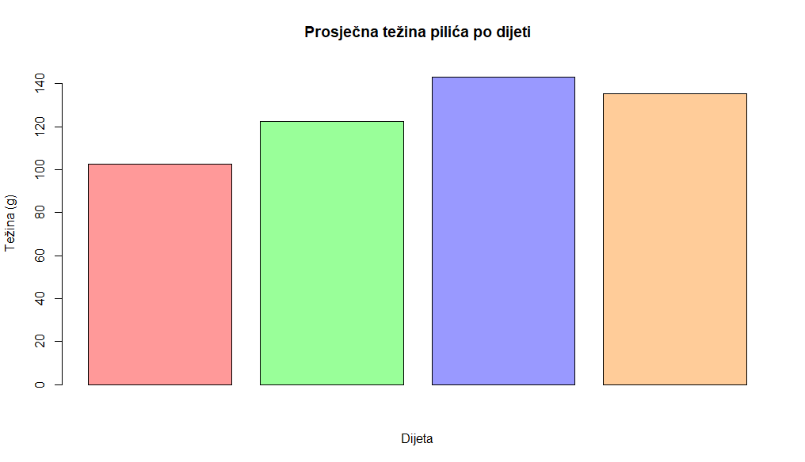
</div>

*Dodavanje oznaka iznad svakog stupca:*
```r
text(x = bp, y = mean_weight$weight, labels = round(mean_weight$weight), pos = 3)
```

<div style="width: 100%; display: flex; justify-content: center;">
    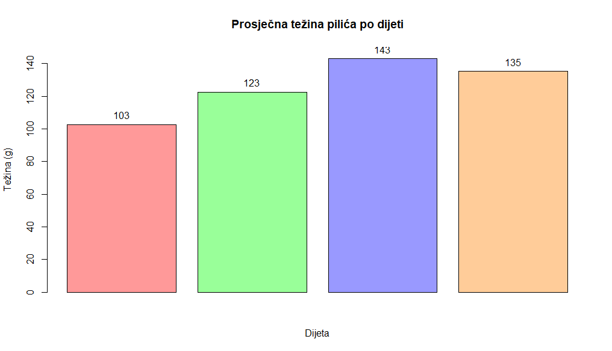
</div>

*Horizontalni stupčasti dijagram `horiz = TRUE`:*
```r
# Najveća težina po dijeti
max_weight <- aggregate(weight ~ Diet, ChickWeight, max)

barplot(max_weight$weight,
        horiz = TRUE,
        main = "Maksimalna težina po dijeti",
        xlab = "Težina (g)",
        ylab = "Dijeta",
        col = terrain.colors(4),
        xlim = c(0, 400))
```

<div style="width: 100%; display: flex; justify-content: center;">
    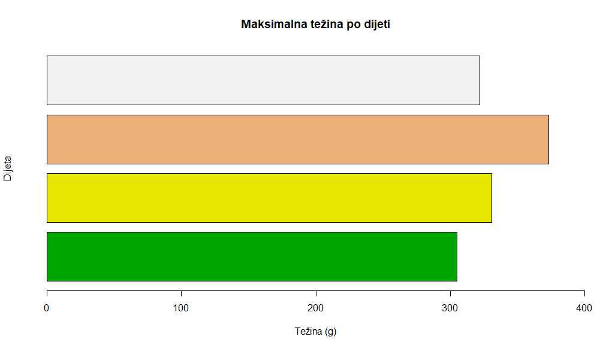
</div>

### Vježba 4

Istražujemo podatke o razvoju pilića iz **ChickWeight** dataseta i želimo vizualizirati prosječnu težinu pilića u *21. danu* prema različitim dijetama koristeći stupčasti dijagram. Cilj je istaknuti razlike u razvoju između skupina s različitim načinima ishrane.

1. Koristite podatke `weight` i `Diet` za piliće u 21. danu
2. Kreirajte **stupčasti dijagram** prosječnih težina po dijetama
3. Postavite **naslov** "*Težina pilića u 21. danu po dijetama*"
4. Oznake osi neka budu "*Dijeta*" i "*Težina (g)*"
5. Postavite **boje stupaca**
6. Dodajte **numeričke vrijednosti** iznad svakog stupca
7. Dodajte **legendu** koja objašnjava:
   - Boje stupaca = vrste dijeta
   - Numeričke vrijednosti = prosječna težina u gramima

<div style="width: 100%; display: flex; justify-content: center;">
    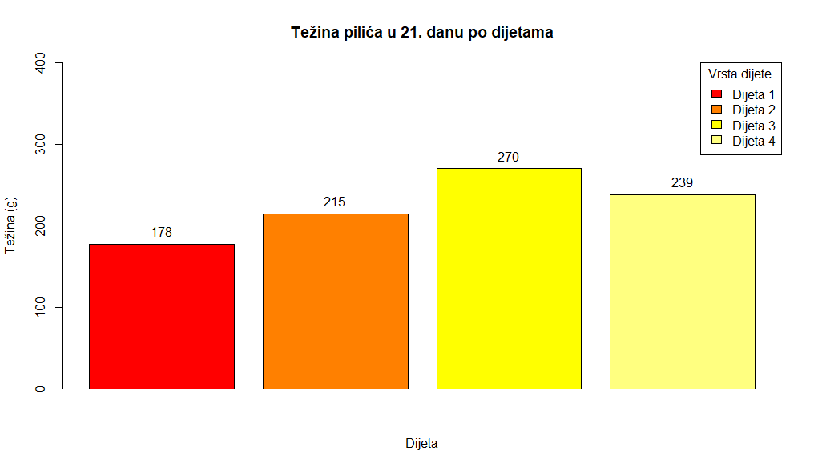
</div>

## Tortni prikaz `pie()`

Tortni dijagram (`pie`) koristi se za prikazivanje proporcija ili postotaka u skupu podataka. Posebno je koristan za vizualizaciju strukture cjeline.

```r
data(PlantGrowth)
# Broj biljaka po skupinama
counts <- table(PlantGrowth$group)

pie(counts,
    main = "Raspodjela biljaka po eksperimentalnim skupinama",
    col = c("#FF6B6B", "#4CAF50", "#2196F3"))
```

<div style="width: 100%; display: flex; justify-content: center;">
    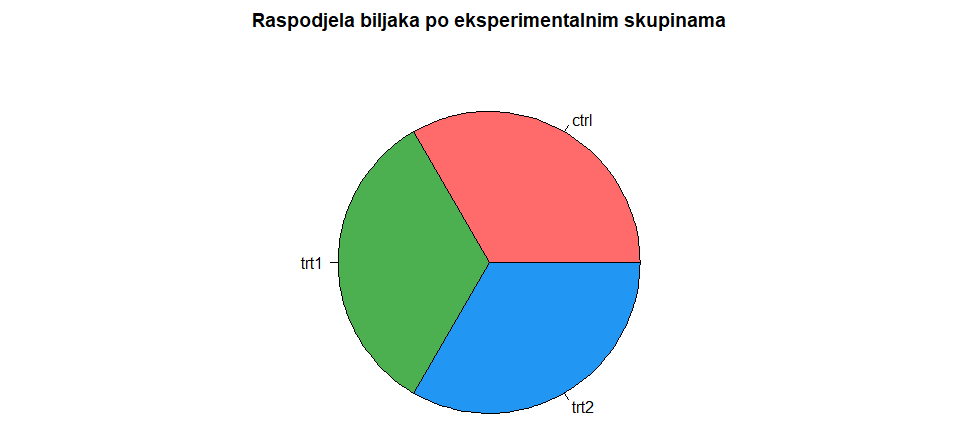
</div>

*Postoci i legenda:*
```r
# Izračun postotaka
percentages <- round(100 * counts/sum(counts), 1)

pie(counts,
    labels = paste0(percentages, "%"),
    main = "Postotna raspodjela biljaka po skupinama",
    col = c("#FF9999", "#99FF99", "#9999FF"))

legend("topright",
       legend = c("Kontrola", "Tretman 1", "Tretman 2"),
       fill = c("#FF9999", "#99FF99", "#9999FF"))
```

<div style="width: 100%; display: flex; justify-content: center;">
    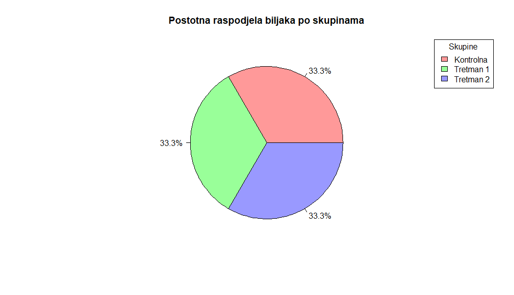
</div>

## Kutijasti prikaz `boxplot()`

Kutijasti dijagram (boxplot) prikazuje distribuciju numeričkih podataka kroz njihove kvartile, pružajući vizualni pregled središnje tendencije, varijabilnosti i outliera.

```r
data(airquality)
boxplot(airquality$Ozone,
        main = "Distribucija ozonskih vrijednosti",
        ylab = "Ozon (ppb)",
        col = "lightblue")
```

<div style="width: 100%; display: flex; justify-content: center;">
    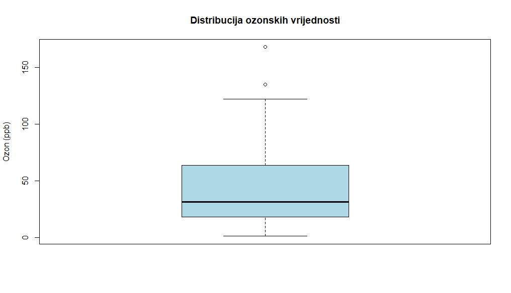
</div>

- **Kutija** prikazuje interkvartilni raspon (IQR, 25-75 percentil)
- **Crta** u kutiji označava medijan
- **Brkovi/Linije** pokazuju raspon podataka (obično 1.5 × IQR)
- **Točke** izvan brkova su outlieri
- **Širina kutije** ukazuje na broj opažanja (šira kutija = više podataka)

*Vertikalni boxplot (Ozon po mjesecima) `~`:*
```r
boxplot(Ozone ~ Month, data = airquality,
        main = "Ozon po mjesecima",
        xlab = "Mjesec",
        ylab = "Ozon (ppb)",
        col = terrain.colors(5),
        names = month.name[5:9])
```
- `names`: postavljanje imena za svaku kutiju

<div style="width: 100%; display: flex; justify-content: center;">
    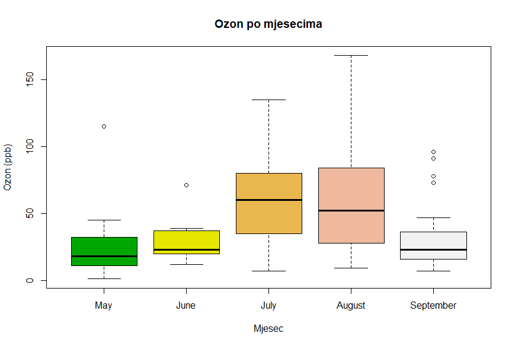
</div>

*Horizontalni boxplot (Temperature po mjesecima) `horizontal = TRUE`, `notch = TRUE`:*
```r
boxplot(airquality$Temp ~ airquality$Month,
        horizontal = TRUE,
        main = "Temperature po mjesecima",
        ylab = "Mjesec",
        xlab = "Temperatura (°F)",
        col = heat.colors(5),
        notch = TRUE,
        boxwex = 0.75)
```
- `horizontal`: smjer kutija
- `notch` (*urez*): Prikazuje 95% interval pouzdanosti za medijan
- `boxwex`: širina/debljina kutija

<div style="width: 100%; display: flex; justify-content: center;">
    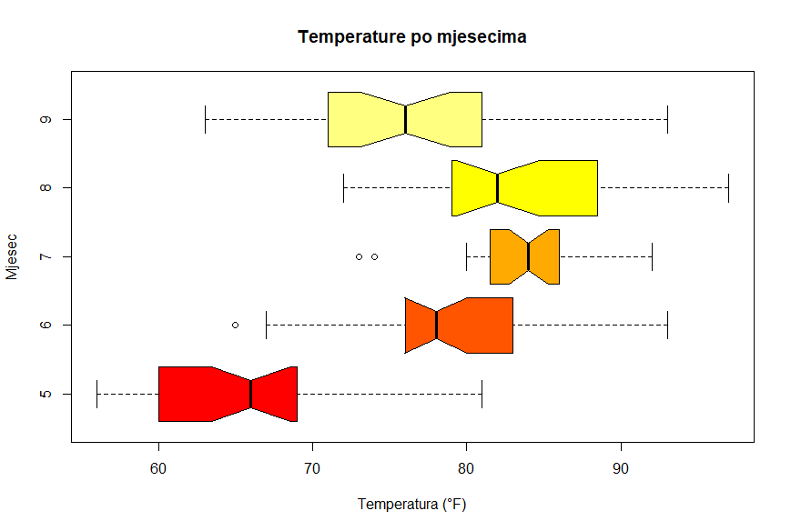
</div>

### Vježba 5

Istražujemo podatke o kvaliteti zraka iz **airquality** dataseta i želimo vizualizirati distribuciju brzine vjetra (`Wind`) po mjesecima koristeći kutijasti dijagram. Cilj je istaknuti sezonske varijacije u brzinama vjetra i njihove prosječne vrijednosti.

1. Koristite podatke `Wind` i `Month` iz skupa podataka `airquality`
2. Kreirajte **kutijasti dijagram** brzina vjetra grupiranih po mjesecima
3. Postavite **naslov** "*Distribucija brzine vjetra po mjesecima*"
4. Oznake osi neka budu "*Mjesec*" i "*Brzina vjetra (mph)*"
5. Postavite **boje kutija**
6. Dodajte **crvene točke** za prikaz srednjih vrijednosti po mjesecima
7. Dodajte **legendu**:
    - Crvena točka = srednja vrijednost

<div style="width: 100%; display: flex; justify-content: center;">
    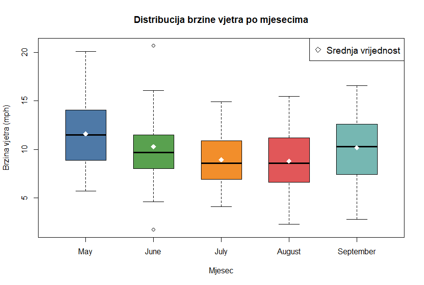
</div>

## Raspršeni graf - korelacijska matrica

Raspršeni graf prikazuje odnos između dvije numeričke varijable, što ga čini idealnim za analizu korelacija i trendova u podacima. U R-u možemo koristiti osnovnu funkciju `plot()` za kreiranje raspršenih grafova.

### Osnovna sintaksa
```r
plot(
  x,                      # vrijednosti na x-osi
  y,                      # vrijednosti na y-osi 
  xlim = c(min, max),     # raspon x vrijednosti
  ylim = c(min, max),     # raspon y vrijednosti
  main = "Naslov",        # naslov grafa
  xlab = "X os",          # oznaka x-osi
  ylab = "Y os",          # oznaka y-osi
  cex.main = 2,           # veličina naslova
  cex.lab = 1.5,          # veličina oznaka osi
  cex.axis = 1.25,        # veličina brojeva na osima
  pch = 19,               # tip točke (19=puni krug)
  cex = 1,                # veličina točaka
  col = "blue",           # boja točaka
  bg = "lightblue",       # boja ispune (za pch 21-25)
  lwd = 1                 # debljina linija/obruba
)
```

*Primjer:*
```r
data(quakes)
plot(quakes$long, quakes$lat,
     main = "Lokacije potresa",
     xlab = "Geografska dužina",
     ylab = "Geografska širina",
     pch = 21,
     col = rgb(0,0.2,0.4,0.75),
     bg = rgb(0,0.4,0.8,0.2),
     cex = (quakes$mag^3)/50)
```

- U `cex` proslijeđujemo `magnitudu` za vizualni prikaz jačine potresa

<div style="width: 100%; display: flex; justify-content: center;">
    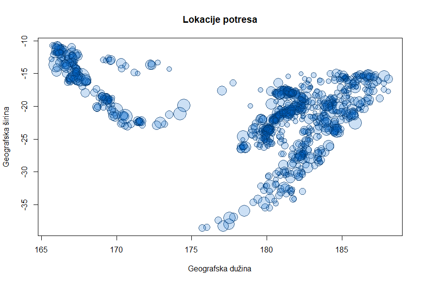
</div>


```r
# Različite boje po intenzitetu
intensity_col <- rev(heat.colors(10))[cut(quakes$mag, breaks=10)]
plot(quakes$depth, quakes$stations, col=intensity_col, pch=19, main="Boje po magnitudi")
```

- `cut()` grupira brojeve u vektoru
- što je crvenije to je jača magnituda

<div style="width: 100%; display: flex; justify-content: center;">
    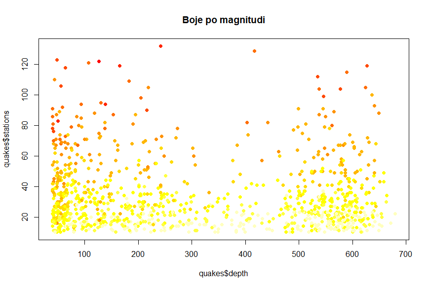
</div>

**Korelacijska matrica:**
```r
# Prikaz svih varijabli u korelacijskoj matrici
pairs(quakes,
      main = "Matrica raspršenih dijagrama",
      pch = 21,
      bg = adjustcolor("blue", alpha.f = 0.3),
      col = adjustcolor("darkblue", alpha.f = 0.5))
```

<div style="width: 100%; display: flex; justify-content: center;">
    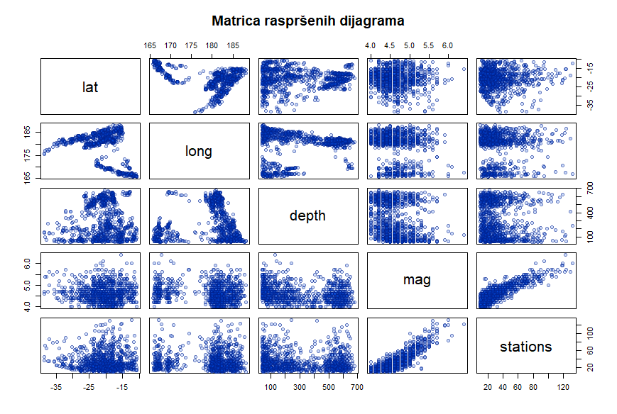
</div>

**Izračun korelacijske matrice:**
```r
cor_matrix <- cor(quakes)
round(cor_matrix, 2)
```
*Rezultat:*
```R
           lat  long depth   mag stations
lat       1.00 -0.36  0.03 -0.05     0.00
long     -0.36  1.00  0.14 -0.17    -0.05
depth     0.03  0.14  1.00 -0.23    -0.07
mag      -0.05 -0.17 -0.23  1.00     0.85
stations  0.00 -0.05 -0.07  0.85     1.00
```

**Testiranje korelacija:**
```r
cor.test(quakes$mag, quakes$stations)
```
*Rezultat:*
```R
	Pearson's product-moment correlation

data:  quakes$mag and quakes$stations
t = 51.231, df = 998, p-value < 2.2e-16
alternative hypothesis: true correlation is not equal to 0
95 percent confidence interval:
 0.8331527 0.8674048
sample estimates:
      cor 
0.8511824 
```

*Prikaz najmanje i najveće korelacijske matrice:*
```r
par(mfrow=c(1,2))

# Magnituda vs stanice
plot(quakes$mag, quakes$stations,
     main = "Magnituda vs broj stanica\n(r = 0.85)",
     xlab = "Magnituda",
     ylab = "Broj stanica",
     pch = 19,
     col = rgb(0.8,0,0,0.3))
abline(lm(stations ~ mag, data=quakes), col="blue", lwd=3)

# Dubina vs magnituda
plot(quakes$depth, quakes$mag,
     main = "Dubina vs magnituda\n(r = -0.23)",
     xlab = "Dubina (km)",
     ylab = "Magnituda",
     pch = 19,
     col = rgb(0,0.5,0,0.3))
abline(lm(mag ~ depth, data=quakes), col="orange", lwd=3)
```

<div style="width: 100%; display: flex; justify-content: center;">
    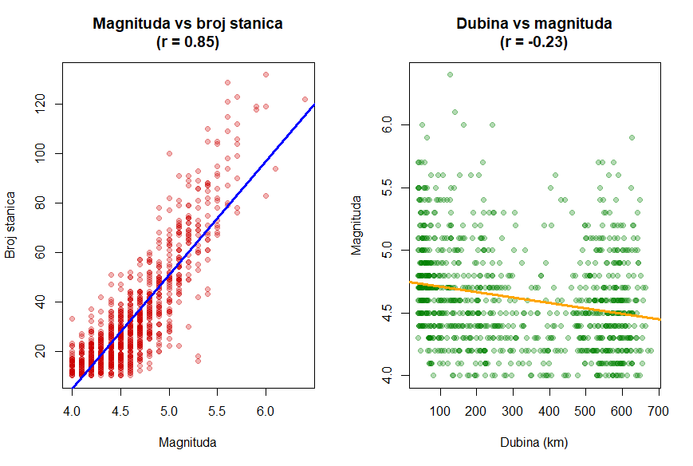
</div>

### Vježba 6

Istražujemo podatke o potresima iz skupa podataka **quakes** i želimo vizualizirati odnos između broja seizmoloških stanica koje su detektirale potres (`stations`) i magnitude potresa (`mag`). Cilj je istražiti kako se broj detekcija povezuje s jačinom potresa i uočiti eventualne obrasce.

1. Koristite podatke `stations` i `mag` iz skupa podataka `quakes`
2. Kreirajte **raspršeni graf** koji prikazuje odnos ove dvije varijable
3. Postavite **naslov** "*Broj stanica vs magnituda potresa*"
4. Oznake osi neka budu "*Broj stanica*" i "*Magnituda*"
5. Podijelite dubine potresa na **5 intervala** pomoću funkcije `cut()` 
6. Koristite **paletu boja** `terrain.colors()` za vizualno razlikovanje dubina
7. Dodajte **glatku trend liniju** pomoću funkcije `lowess()`
8. Postavite **veličinu točaka** proporcionalnu dubini potresa
9. Dodajte **legendu** koja objašnjava kategorije dubina

*Primjer:*
<div style="width: 100%; display: flex; justify-content: center;">
    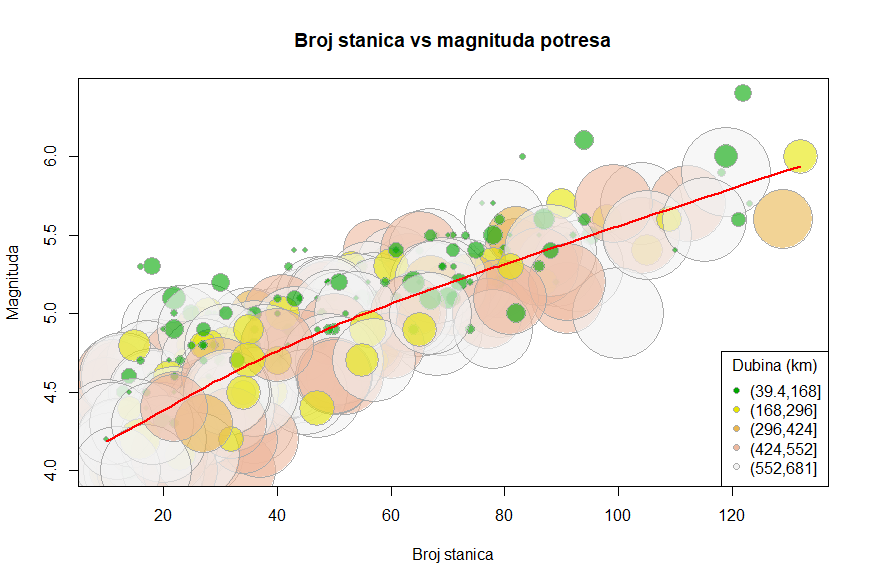
</div>

</div>