<div class="body">

# Analiza podataka i obrada informacija

**Nositelj**: izv. prof. dr. sc. Siniša Sovilj <br>
**Asistent**: mag. inf. Alesandro Žužić

**Ustanova**: Sveučilište Jurja Dobrile u Puli, Fakultet informatike u Puli

<p style="float: clear; display: flex; gap: 8px; align-items: center;" class="font-brioni text-sm whitespace-nowrap">
    </img>
    Fakultet informatike u Puli
</p>

# [2] Vizualizacija podataka

<div style="display: flex; justify-content: space-between; text-align: justify; gap: 32px;">
    <p>
        R nudi napredne mogućnosti za <b>grafičku vizualizaciju podataka</b>s bogatim skupom biblioteka i funkcija, omogućava učinkovito stvaranje vizualnih prikaza podataka, olakšavajući analizu i interpretaciju rezultata. Neke od osnovnih grafičkih prikaza koje ćemo proći su: <i>osnovni X-Y prikaz: plot(), linijski prikaz: lines(), histogram: hist(), točkasti prikaz: dotchart(), stupčasti prikaz: barplot(), tortni prikaz: pie(), kutijasti prikaz: boxplot(), raspršeni graf: scatterplot()</i>
    </p>
    </img>
</div>

**Posljednje ažurirano:** 19. ožujka 2025.

<!-- TOC -->

- [Analiza podataka i obrada informacija](#analiza-podataka-i-obrada-informacija)
- [[2] Vizualizacija podataka](#2-vizualizacija-podataka)
    - [X-Y prikaz plot](#x-y-prikaz-plot)
        - [Osnovna sintaksa](#osnovna-sintaksa)
        - [Slova i margine](#slova-i-margine)
        - [Abline](#abline)
        - [Lines](#lines)
        - [Ostali elementi](#ostali-elementi)
    - [Vježba](#vje%C5%BEba)

<!-- /TOC -->

<div class="page"></div>

## X-Y prikaz `plot()`

X-Y prikaz u R-u koristi se za vizualizaciju odnosa između dviju numeričkih varijabli. Ovaj tip grafa je koristan za ispitivanje korelacije ili uzorka među podacima, a osnovna funkcija za izradu ovih prikaza je `plot()`. X-Y prikaz daje jasnu sliku o tome kako se jedna varijabla mijenja u odnosu na drugu.

### Osnovna sintaksa

U R-u, funkcija `plot()` koristi dva osnovna argumenta: **x** i **y**. Prvi argument predstavlja vrijednosti na *X-osi*, a drugi na *Y-osi*. 

Na primjer, ako imamo skup podataka o težini vozila (`wt`) i potrošnji goriva (`mpg`) iz skupa podataka `mtcars`, možemo koristiti X-Y prikaz za vizualizaciju kako težina vozila utječe na njegovu potrošnju goriva.

*Primjer:*

```r
attach(mtcars)  # Učitavanje podataka
plot(wt, mpg)   # Iscrtavanje podataka
abline(lm(mpg ~ wt))  # Dodavanje regresijskog pravca
title("Regresija: MPG = a + b * WT")  # Naslov grafa
```
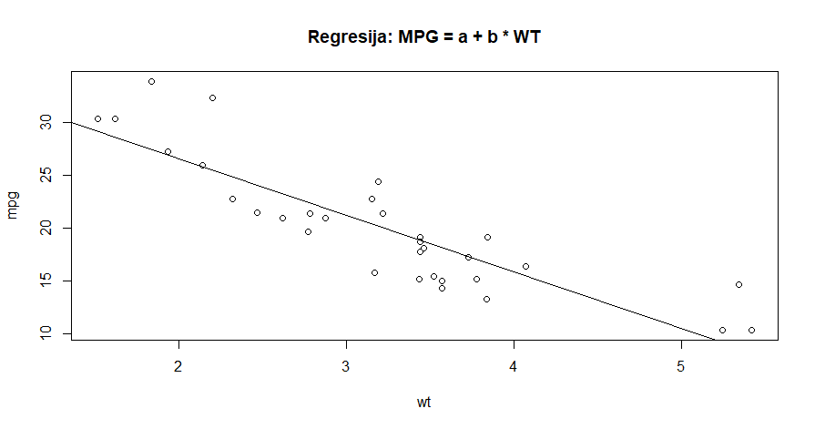

1. **attach(mtcars)**: Funkcija `attach()` omogućava lakši pristup varijablama unutar skupa podataka. Bez nje, morali bismo svaki put navoditi `mtcars$wt` ili `mtcars$mpg`. Korištenjem `attach(mtcars)`, možemo direktno koristiti `wt` i `mpg` varijable.

2. **plot(wt, mpg)**: Ova funkcija stvara osnovni X-Y graf, gdje je `wt` (težina vozila) *na X-osi*, a `mpg` (potrošnja goriva) na *Y-osi*.

3. **abline(lm(mpg ~ wt))**: Funkcija `abline()` dodaje pravac na graf. U ovom slučaju, koristi se linearni model (`lm()`) koji prikazuje regresijsku liniju između težine vozila i potrošnje goriva. Model je izražen kao \( \text{MPG} = a + b \cdot \text{WT} \), gdje su \(a\) i \(b\) koeficijenti koji se izračunavaju pomoću funkcije `lm()`. To omogućuje vizualno prikazivanje trenda ili povezanosti između tih dviju varijabli.

4. **title("Regresija: MPG = a + b * WT")**: Dodaje naslov grafu koji jasno označava o čemu se radi. U ovom slučaju, to je linearna regresija između potrošnje goriva i težine vozila.

**Dodatne opcije i prilagodbe**

Funkcija `plot()` omogućuje brojne prilagodbe kako bi graf bio jasniji i vizualno pregledniji:

- **Podešavanje boja i oznaka**: Možemo koristiti argumente `col` (boja) i `pch` (simboli točaka)

```r
plot(wt, mpg, col="blue", pch=16)
```
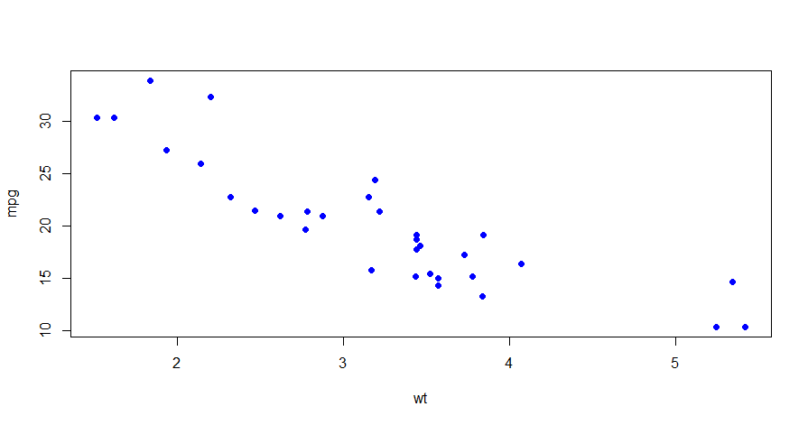

- **Prilagodba osovina**: Argumenti poput `xlab` i `ylab` omogućuju postavljanje oznaka za X i Y osi

```r
plot(wt, mpg, xlab="Težina vozila (wt)", ylab="Potrošnja goriva (mpg)")
```


- **Dodavanje grid linija**: Funkcija `grid()` može se koristiti za dodavanje mreže na grafu, što može pomoći u preciznijem čitanju podataka

```r
plot(wt, mpg)
grid()
```

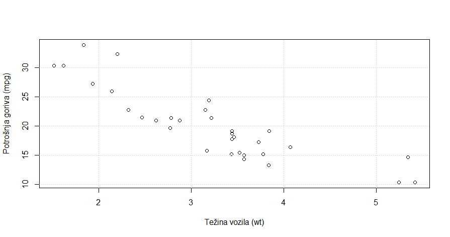

Parametri grafova, linija i teksta:

| Parametar                                                       | Opis                                                                                    | Primjer                                                    | Korištenje                                                                               |
| --------------------------------------------------------------- | --------------------------------------------------------------------------------------- | ---------------------------------------------------------- | ---------------------------------------------------------------------------------------- |
| **xlab, ylab**                                                  | Naziv osi x i y                                                                         | `xlab="Težina"`, `ylab="Potrošnja goriva"`                 | `plot(wt, mpg, pch=16, col="blue", xlab="Težina", ylab="Potrošnja goriva")`              |
| 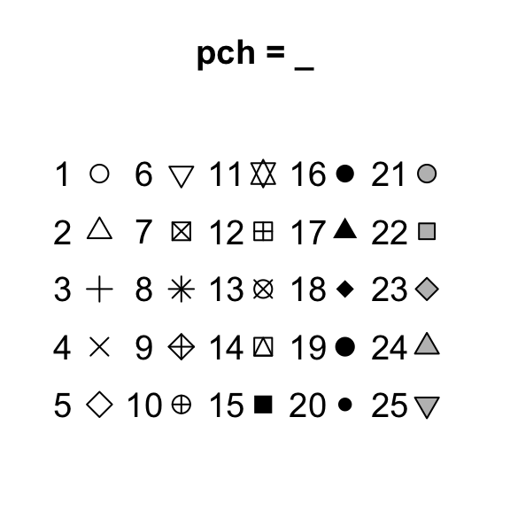                                 | Simbol za iscrtavanje točaka na grafu                                                   | `pch=17` (trokutasti simbol)                               | `plot(wt, mpg, pch=17, col="blue")`                                                      |
| **col**                                                         | Boja simbola ili linije na grafu                                                        | `col="red"` (crvena boja)                                  | `plot(wt, mpg, pch=16, col="red")`                                                       |
| **bg, fg**                                                      | Boje pozadine (ispune) i prednje strane (granice) objekta, *radi samo za simbole 21-25* | `bg="yellow"`, `fg="brown"` (pozadina žuta, granica smeđa) | `plot(wt, mpg, pch=21, col="orangered", bg="yellow", fg="brown")`                        |
| **cex**                                                         | Proširenje veličine simbola ili teksta                                                  | `cex=2` (dvostruko veći simbol)                            | `plot(wt, mpg, pch=5, col="blue", cex=2)`                                                |
| **lwd**                                                         | Širina linije                                                                           | `lwd=2` (dvostruko šira linija)                            | `plot(wt, mpg, pch=16, col="blue"); abline(lm(mpg ~ wt), lwd=2)`                         |
| 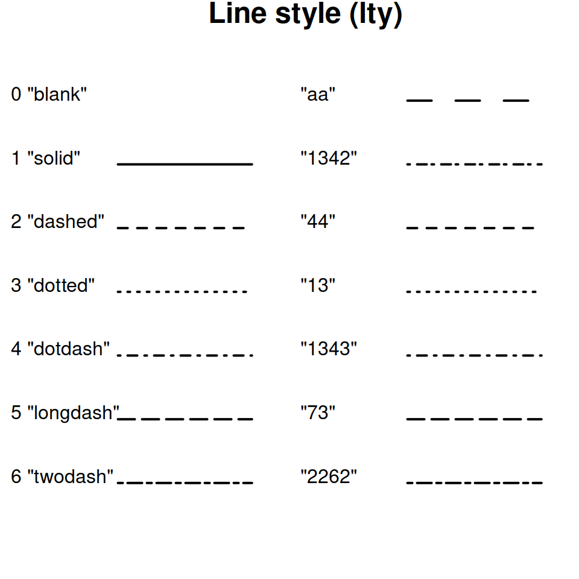                              | Tip linije                                                                              | `lty=2` (crtasta linija)                                   | `plot(wt, mpg, pch=16, col="blue"); abline(lm(mpg ~ wt), lty=2)`                         |
| **font** *(1=plain, 2=bold, 3=italic, 4=bold italic, 5=symbol)* | Tip fonta za tekst                                                                      | `font=3` (italic)                                          | `plot(wt, mpg, pch=16, col="blue", main="Font (font=3, italic)", font.main=3)`           |
| **ps**                                                          | Veličina fonta u točkama                                                                | Veličina teksta = `ps * cex`                               | `plot(wt, mpg, pch=16, col="blue", main="Veličina fonta (ps=2)", cex.main=2)`            |
| **family**                                                      | Obitelj fonta                                                                           | `family="mono"`                                            | `plot(wt, mpg, pch=16, col="blue", main="Obitelj fonta (family='mono')", family="mono")` |

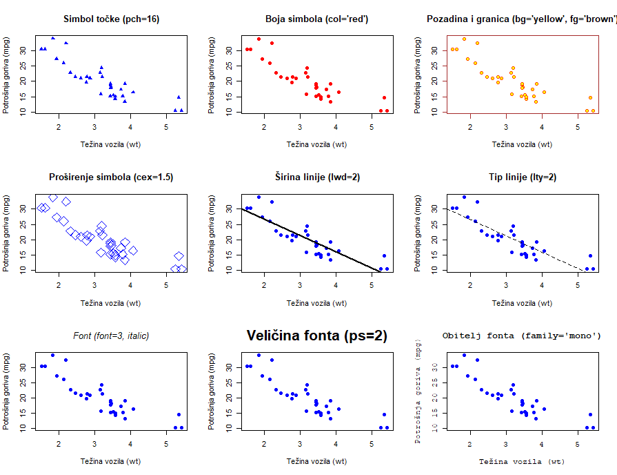

*Sve boje u R-u:*
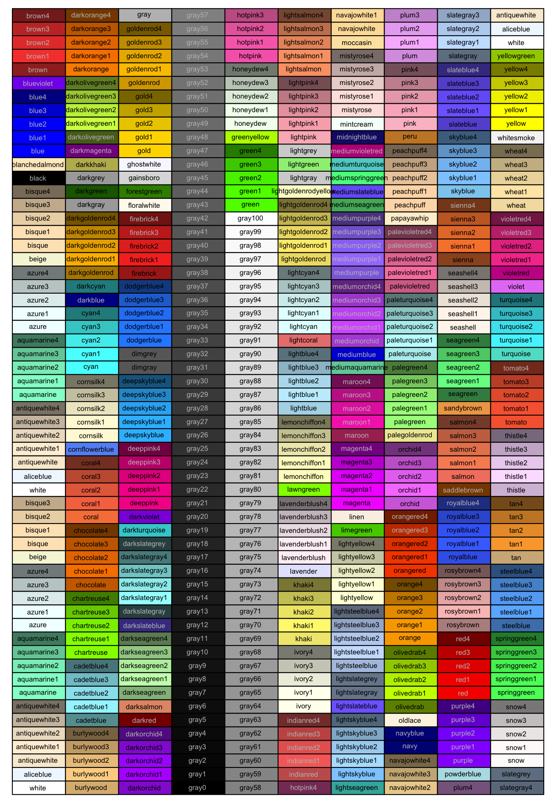

---

### Slova i margine

U R-u, slova i margine na grafu mogu se prilagoditi pomoću nekoliko parametara. Parametri koji kontroliraju veličinu fonta, poziciju teksta, kao i margine između grafova, omogućuju precizno oblikovanje vizualnih prikaza.

| Parametar    | Opis                                                                                                        | Primjer                                       |
| ------------ | ----------------------------------------------------------------------------------------------------------- | --------------------------------------------- |
| **cex**      | Veličina teksta na grafu.                                                                                   | `plot(wt, mpg, cex=1.5)`                      |
| **cex.axis** | Veličina teksta na osovinama (X i Y os).                                                                    | `plot(wt, mpg, cex.axis=1.2)`                 |
| **cex.lab**  | Veličina teksta na oznakama osovina (X i Y).                                                                | `plot(wt, mpg, cex.lab=1.3)`                  |
| **cex.main** | Veličina teksta naslova grafa.                                                                              | `plot(wt, mpg, cex.main=2)`                   |
| **mar**      | Parametar koji kontrolira margine oko grafa. Definira veličinu prostora između osovina i grafičkog prikaza. | `par(mar=c(5, 4, 4, 2) + 0.1); plot(wt, mpg)` |

*Primjer:*

```r
par(mar=c(5, 4, 4, 2) + 0.1)  # Margine: (donja, lijeva, gornja, desna)
plot(wt, mpg, cex.main=1.5, cex.lab=1.2, cex.axis=1.1, main="Naslov s većim fontom")
```

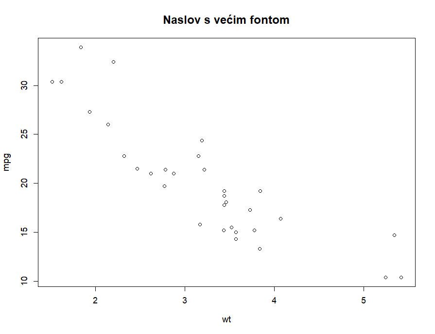

**Linijski prikaz `lines(x, y, type=)`**

Funkcija **`lines(x, y, type=)`** u R-u koristi se za dodavanje linija na postojeći graf izrađen pomoću `plot()`. Ova funkcija je korisna kada želimo prikazati više serija podataka na istom grafu ili naglasiti određene trendove.

- **`x`** – vrijednosti na x-osi  
- **`y`** – vrijednosti na y-osi  
- **`type=`** – određuje stil crte, npr. `"l"` za linije, `"b"` za točke i linije itd.

*Primjer:*
```r
x <- 1:10
y <- c(2, 4, 3, 5, 7, 6, 9, 8, 10, 12)

plot(x, y, type = "b", main = "Točke povezane linijama (b)")
```

| Grafički parametar | Opis                                      |
| ------------------ | ----------------------------------------- |
| p                  | Točke (points)                            |
| l                  | Linije (lines)                            |
| o                  | Preklopljene točke i linije (overplotted) |
| b                  | Točke povezane linijama                   |
| c                  | Prazne točke povezane linijama            |
| s                  | Koraci (stair steps)                      |
| S                  | Koraci s drugačijim stilom (stair steps)  |
| h                  | Okomite linije (histogram-like)           |
| n                  | Bez točaka i linija                       |

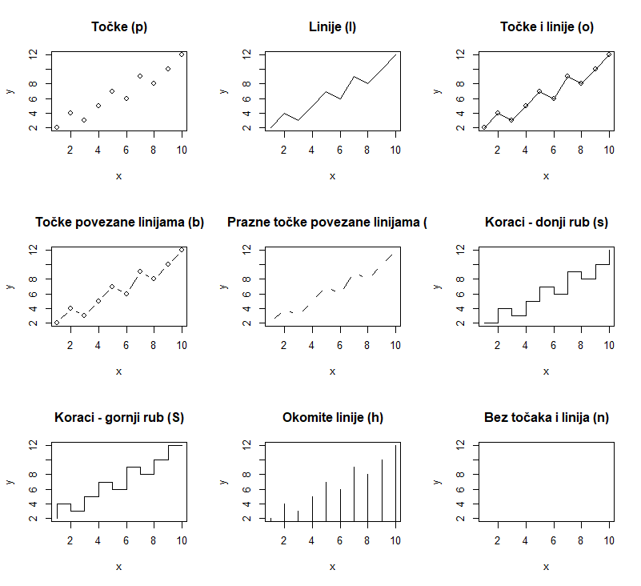

### Abline

Funkcija `abline()` koristi se za dodavanje linija na grafove. Možemo dodati horizontalne, vertikalne linije, kao i linije temeljene na regresijskim modelima.

| **Funkcija** | **Opis**                                                   | **Argumenti**                            | **Primjer**                                     |
| ------------ | ---------------------------------------------------------- | ---------------------------------------- | ----------------------------------------------- |
| **h**        | Dodavanje horizontalne linije na određenu y-koordinatu     | `y` (y-koordinata), `col`, `lty`, `lwd`  | `abline(h = 5, col = "red", lty = 2, lwd = 2)`  |
| **v**        | Dodavanje vertikalne linije na određenu x-koordinatu       | `x` (x-koordinata), `col`, `lty`, `lwd`  | `abline(v = 3, col = "blue", lty = 1, lwd = 1)` |
| **lm()**     | Dodavanje linije temeljene na linearnom modelu (regresija) | Model (npr. `lm()`), `col`, `lty`, `lwd` | `abline(lm(mpg ~ wt), col = "green")`           |

*Primjer:*

```r
plot(wt, mpg)
abline(lm(mpg ~ wt), col="red", lwd=2)  # linija linearne regresije
abline(h=mean(mpg), col="blue", lwd=2, lty=2)  # linija aritmetičke sredine
abline(v=median(wt), col="green", lwd=2, lty=2)  # linija medijana wt

text(x=min(wt)*1.3, y=max(mpg)*0.9, labels="Regresijska linija", col="red", pos=1)
text(x=max(wt)*0.85, y=mean(mpg)*0.95, labels="Aritmetička sredina", col="blue", pos=4)
text(x=median(wt), y=max(mpg)*0.8, labels="Medijan WT", col="green", pos=2)
```

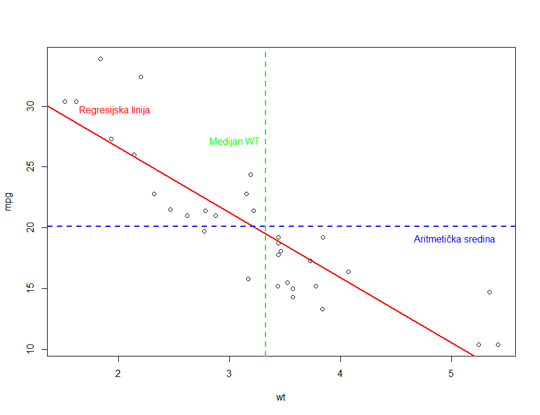


### Lines  

Funkcija `lines()` koristi se za dodavanje linija na postojeći graf u R-u. Za razliku od `plot()`, koji kreira novi graf, `lines()` samo nadodaje linije na postojeći prikaz. Može se koristiti za povezivanje točaka u skupu podataka, crtanje funkcija ili dodavanje trendova.  

*Primjer:*  

```r
x <- seq(0, 10, by=0.1)
x2 <- seq(0, 10, by=1)

y1 <- sin(x)
y2 <- cos(x)
y3 <- c(-0.2, -0.3, 0.75, 0, 0.13, -0.8, 0.7, 0.21, -0.45, -0.32, 0.625)

plot(x, y1, type="l", col="red", lwd=2, ylim=c(-1,1), xlab="X Vrijednosti", ylab="Y Vrijednosti")
lines(x, y2, col="blue", lwd=2, lty=2)  
lines(x2, y3, col="green", lwd=2, lty=4)  

legend("topright", legend=c("sin(x)", "cos(x)", "rigid"), col=c("red", "blue", "green"), lty=c(1,2,4), lwd=2)
```

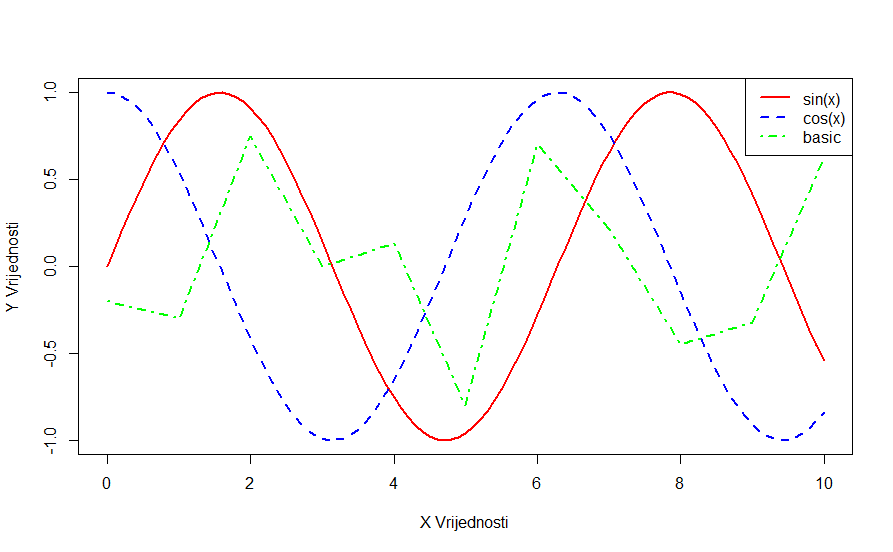

### Ostali elementi

U R-u, razni elementi mogu se dodavati na grafove kako bi poboljšali čitljivost i interpretaciju podataka. To uključuje naslove, oznake osi, legende i grafičke oblike.  

| **Funkcija** | **Opis**                                           | **Argumenti**                                                          | **Primjer**                                                                                             |
| ------------ | -------------------------------------------------- | ---------------------------------------------------------------------- | ------------------------------------------------------------------------------------------------------- |
| **title()**  | Dodaje naslov, podnaslov ili oznake osi            | `main`, `sub`, `xlab`, `ylab`, `col.main`, `col.sub` itd.              | `title(main="Naslov", sub="Podnaslov", col.main="red")`                                                 |
| **mtext()**  | Dodaje tekst izvan granica grafičkog prikaza       | `text`, `side` (1=bottom, 2=left, 3=top, 4=right), `line`, `col`, `at` | `mtext("Dodatni tekst", side=3, line=2, col="blue")`                                                    |
| **legend()** | Dodaje legendu unutar ili izvan grafičkog prikaza  | `x`, `y`, `legend`, `col`, `lty`, `pch`, `bty`                         | `legend("topright", legend=c("Linija A", "Linija B"), col=c("red", "blue"), lty=1:2, cex=0.8, bty="n")` |
| **text()**   | Dodaje prilagođeni tekst unutar grafičkog prostora | `x`, `y`, `labels`, `col`, `pos`, `cex`                                | `text(5, 0.5, "Ovdje je oznaka", col="green", pos=4)`                                                   |
| **grid()**   | Dodaje mrežu za lakše očitavanje vrijednosti       | `col`, `lty`, `lwd`                                                   | `grid(col="gray", lty=2, lwd=0.5)`                                                                      |
| **rect()**   | Ističe određeni dio grafa bojom u pozadini         | `xleft`, `ybottom`, `xright`, `ytop`, `col`, `border`                  | `rect(2, -1, 4, 1, col=rgb(1,0,0,0.2), border=NA)`                                                      |
| **segments()** | Dodaje referentne crte                           | `x0`, `y0`, `x1`, `y1`, `col`, `lty`, `lwd`                            | `segments(2, -1, 2, 1, col="black", lty=2, lwd=2)`                                                      |
| **polygon()** | Iscrtava područje između određenih točaka        | `x`, `y`, `col`, `border`                                             | `polygon(c(2,3,3,2), c(-1,-1,1,1), col=rgb(0,0,1,0.3), border=NA)`                                      |
| **points()**  | Dodaje specifične oblike na pojedine točke        | `x`, `y`, `pch`, `col`, `cex`                                         | `points(5, 0, pch=19, col="red", cex=2)`                                                               |
| **arrows()**  | Dodaje strelice za označavanje smjera            | `x0`, `y0`, `x1`, `y1`, `col`, `lty`, `length`                        | `arrows(2,0,3,0.5, col="red", lwd=2, length=0.1)`                                                       |
| **par(mfrow)** | Omogućuje prikaz više grafova u istom prozoru    | `mfrow=c(n,m)`                                                         | `par(mfrow=c(2,2)); plot(x,y); hist(x); boxplot(y); barplot(y)`                                         |

*Primjer 1:* 

```r
x <- seq(0, 10, by=0.1)
y <- sin(x)
z <- cos(x)

par(mfrow=c(1, 2))

plot(x, y, type="l", col="blue", lwd=2, xlab="Vrijeme", ylab="Amplituda")

title(main="Sinusni val", sub="Primjer prilagođenog grafičkog prikaza", col.main="blue", col.sub="gray")
legend("topright", legend=c("sin(x)"), col="blue", lty=1, cex=0.8, bty="n")

mtext("Sin i col grafovi", line=1, col="purple", at=c(0,0))

plot(x, z, type="l", col="red", lwd=2, lty=2,  xlab="Vrijeme", ylab="Amplituda")

title(main="Sinusni val", sub="Primjer prilagođenog grafičkog prikaza", col.main="red", col.sub="gray")
legend("topright", legend=c("cos(x)"), col="red", lty=2, cex=0.8, bty="n")
```

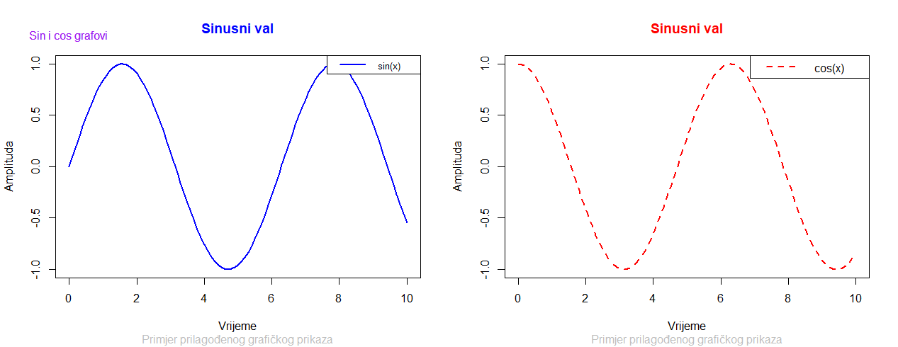

*Primjer 2:*
```r
x <- seq(0, 10, by=0.1)
y <- sin(x)

plot(x, y, type="l", col="blue", lwd=2, xlab="Vrijeme", ylab="Amplituda")
title(main="Sinusni val s dodatnim elementima")

# Dodavanje mreže
grid(col="gray", lty=2, lwd=0.5)

# Dodavanje pravokutnika
rect(2, -1, 4, 1, col=rgb(1,0,0,0.2), border=NA)

# Dodavanje referentne linije
segments(2, -1, 2, 1, col="black", lty=2, lwd=2)

# Dodavanje poligona
polygon(c(6,7,7,6), c(-1,-1,1,1), col=rgb(0,0,1,0.3), border=NA)

# Dodavanje oznaka
text(5, 0, "Nulta točka", col="black", pos=3)
text(3, 0.5, "Označeno područje", col="red", pos=4)

# Dodavanje strelice
arrows(2, 0, 3, 0.5, col="red", lwd=2, length=0.1)

# Dodavanje točke s posebnim simbolom
points(5, 0, pch=19, col="red", cex=2)
```

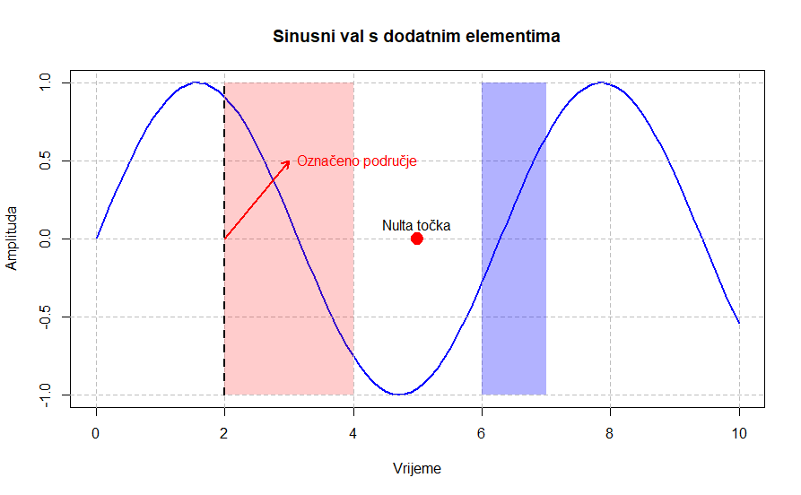

## Vježba

Istražujemo podatke o automobilima i želimo vizualizirati odnos između težine vozila (`wt`) i potrošnje goriva (`mpg`) koristeći skup podataka `mtcars`. Cilj je dodati korisne vizualne elemente kako biste istaknuli važne vrijednosti i trendove.  

1. Nacrtajte raspršeni dijagram (`plot()`) za `wt` (x-os) i `mpg` (y-os)
2. Dodajte regresijsku liniju koristeći `abline(lm())`
3. Dodajte horizontalnu liniju na prosječnu vrijednost `mpg` i vertikalnu liniju na medijan `wt`
4. Dodajte naslov i oznake osi koristeći `title()`
5. Dodajte legendu koja označava regresijsku liniju, prosječnu vrijednost i medijan 
6. Koristite `text()` za dodavanje oznaka uz sve tri linije grafa 
7. Dodajte mrežu (`grid()`) radi boljeg pregleda podataka
8. Ručno označite područje između prvog i trećeg kvartila pomoću `rect()`.  
9. Dodajte strelicu (`arrows()`) koja upućuje na vozilo s najvećom potrošnjom (`mpg`)  

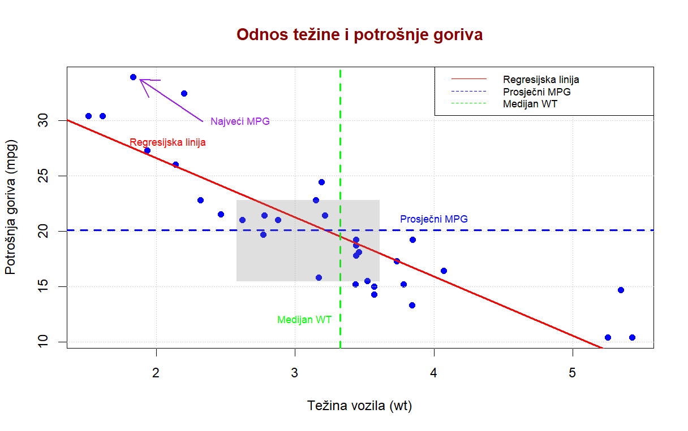