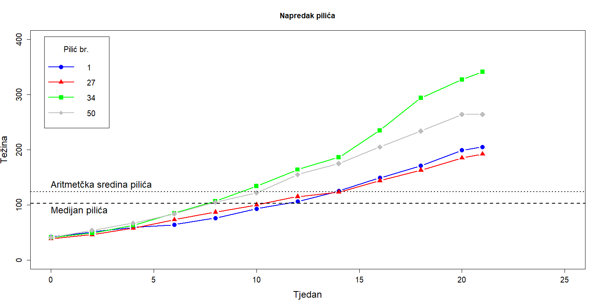
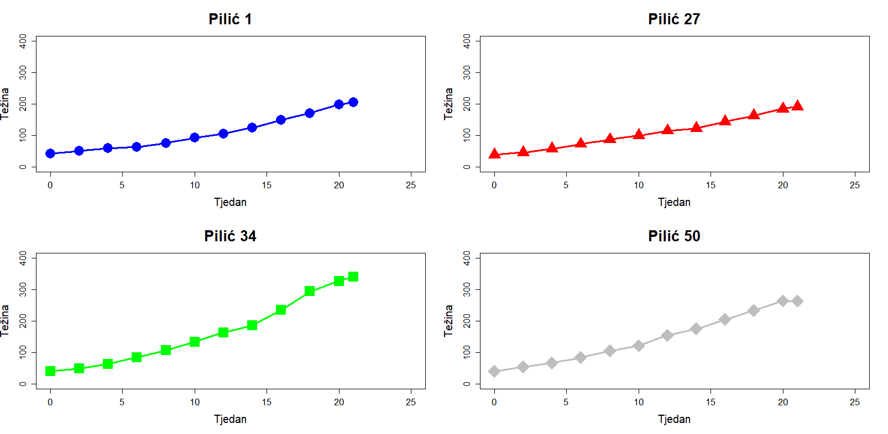

# Samostalni zadatak za vježbu 3

**Analiza rasta pilića u R-u**  

Podaci o pilićima dostupni su u ugrađenom skupu podataka **ChickWeight** unutar R-a. Eksperiment prati rast pilića pod različitim režimima prehrane kroz određeno vremensko razdoblje.

1. **Osnovne informacije o podacima**  
   - Koliko opservacija i varijabli sadrži skup podataka?  
   - Koji su nazivi varijabli i kojeg su tipa?  
   - Ima li nedostajućih vrijednosti u podacima?  

2. **Preimenovanje stupaca**  
   - Promijenite nazive stupaca na hrvatski jezik:  
     - `weight` → **tezina**  
     - `Time` → **tjedan**  
     - `Chick` → **pilic**  
     - `Diet` → **dijeta**  

3. **Statističke vrijednosti težine pilića**  
   - Koja je minimalna, maksimalna i prosječna težina pilića?  

4. **Analiza dijeta i pilića**  
   - Koliko postoji različitih dijeta?  
   - Koliko je različitih pilića uključeno u istraživanje?  
   - Koliko pilića je bilo na dijeti broj 4?  

5. **Specifične opservacije težine**  
   - Koja je težina pilića u prve tri opservacije?  
   - Koja je težina pilića u posljednjih sedam opservacija?  

6. **Filtriranje podataka za odabrane piliće**  
   - Kreirajte novi dataframe koji sadrži sve podatke samo za pilića **1, 27, 34 i 50**
   - Spremite ih u varijable `pilic1`, `pilic27`, `pilic34` i `pilic50`
   - Kojoj dijeti pripada svaki od ovih pilića?  

7. **Analiza težine u 12. tjednu**  
   - Kolika je težina pilića 1 u **12. tjednu**?  
   - Koliko teži najteži pilić u **12. tjednu**?  
   - Koji je to pilić?  

8. **Prikaz rasta kroz vrijeme za odabrane piliće**  
   - Grafički prikažite napredak pilića **1, 27, 34 i 50** kroz vrijeme na istom grafu
   - Podesite **raspon y-osi od 0 do 400**, a naslov i osi ostavite bez oznaka
   - Koristite sljedeće oznake za podatke:  
     - **Pilić 1** – puna linija s **ispunjenim plavim kružićima**  
     - **Pilić 27** – puna linija s **ispunjenim crvenim trokutima**  
     - **Pilić 34** – puna linija s **ispunjenim zelenim kvadratima**  
     - **Pilić 50** – puna linija s **ispunjenim sivim rombovima**  
   - Dodajte naslov **"Napredak pilića"**, oznaku x-osi **"Tjedan"** i y-osi **"Težina"**
   - Uključite legendu u **gornji lijevi kut** s naslovom **"Pilić br."**
   - Dodajte **točkastu horizontalnu liniju** na razinu prosječne težine svih pilića i označite je tekstom **"Aritmetička sredina težine svih pilića"**
   - Dodajte **isprekidanu horizontalnu liniju** na razinu medijalne težine svih pilića i označite je tekstom **"Medijalna težina"**

9. **Zaključci iz grafičkog prikaza**  
    - Koji je pilić **prvi dosegao prosječnu težinu**?  
    - Koji je pilić **posljednji dosegao medijalnu težinu**?  
    - Koji je pilić ostvario **najveći rast na kraju promatranog razdoblja**?  

10. **Individualni prikazi napretka pilića**  
    - Prikažite napredak svakog pilića **na zasebnom grafu**
    - Organizirajte prikaz u **dva retka i dva stupca**
    - Dodajte sve potrebne oznake osi, naslove i legende

