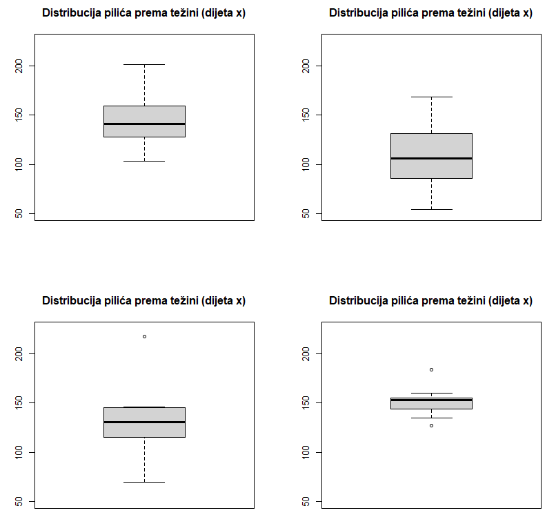
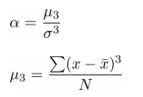
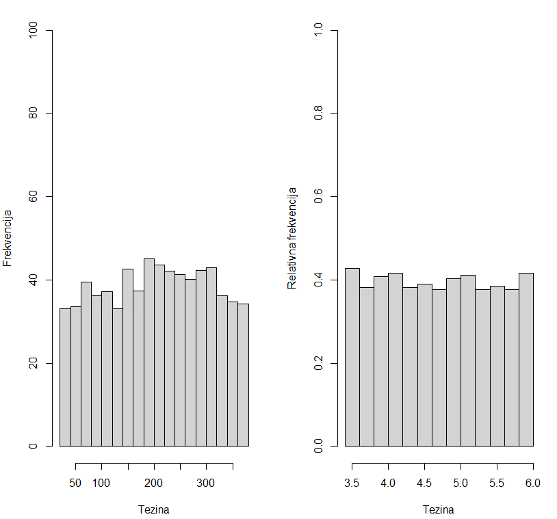

# Samostalni zadatak za vježbu 5

Radit ćemo s podacima `ChickWeight`, koji sadrže informacije o težini pilića tijekom različitih tjedana i njihovoj prehrani. Cilj je analizirati podatke, vizualizirati distribucije i usporediti rezultate između različitih dijeta.  

---

**Priprema podataka**  

1. **Učitajte skup podataka `ChickWeight` kao `data.frame` u varijablu `cw`**  

2. **Izmijenite nazive stupaca na hrvatski jezik:**  
    - `weight` → **tezina**  
    - `Time` → **tjedan**  
    - `Chick` → **pilic**  
    - `Diet` → **dijeta**  

3. **Kreirajte zasebne `data.frame` objekte za odabrane piliće:**  
    - `pilic1`: podaci za pilića **1**  
    - `pilic27`: podaci za pilića **27**  
    - `pilic34`: podaci za pilića **34**  
    - `pilic50`: podaci za pilića **50**  

---

4. **Prikažite distribuciju težine pilića u **12. tjednu** za svaku dijetu koristeći četiri odvojena boxplota `boxplot()`** (po dva u svakom retku `par() mfrow`)  
    - Ograničite raspon osi **y od 50 do 225** `ylim`
    - Naslovi grafova `main`:  
        - **Distribucija pilića prema težini (dijeta 1)**  
        - **Distribucija pilića prema težini (dijeta 2)**  
        - **Distribucija pilića prema težini (dijeta 3)**  
        - **Distribucija pilića prema težini (dijeta 4)**  

*Primjer:*

---

**Analiza distribucije**  

5. **Koja dijeta ima najveći raspon vrijednosti težine?**  
    - Zaključiti iz boxplot grafikona

6. **Postoje li stršeće vrijednosti (outlieri)?**  
    - Ako postoje, za koju dijetu?  
    - Jesu li to minimalne ili maksimalne vrijednosti?  
    - Zaključiti iz boxplot grafikona

7. **Izračunajte sljedeće statističke mjere za dijetu 1:**  
    - **Raspon vrijednosti** `diff(range(x))`
    - **Interkvartilni raspon** `IQR()`

8. **Izračunajte Pearsonov koeficijent asimetrije za dijetu 2 i dijetu 4.**  
    
    - `alpha = mu/sd(x)^3`
    - `mu = sum((x - mean(x))^3)/N`

9. **Za koju je dijetu asimetrija veća?**  
    - 0         = simetrična distribucija
    - 0 - 0.5   = približno simetrična distribucija
    - 0.5 - 1   = umjerena asimetrija
    - \>1       = izražena asimetrija
    
---

**Histogram distribucije težine**  

10. **Napravite histogram distribucije težine pilića `hist()`:**  
    - Prikaz svih pilića pomoću histograma s **15 razreda** `breaks`  
    - **Naslov:** *Distribucija pilića prema težini*  
    - **Veličina slova u naslovu** smanjena na **75%**  
    - **Nazivi osi:**  
        - x-os: **Težina**  
        - y-os: **Frekvencija**  
    - **Ograničite raspon y-osi** na **0 do 100** `ylim`  

11. **Na temelju histograma, je li težina pilića normalno distribuirana?**  

12. **Transformirajte podatke kako bi distribucija bila bliža normalnoj te prikažite novi histogram pored postojećeg:**  
    - `probability = TRUE` 
    - **Naslov:** *Distribucija pilića prema težini (log)* 
    - **Nazivi osi:**  
        - x-os: **Težina**  
        - y-os: **Relativna Frekvencija**  

*Primjer:*

---

**Usporedba pilića izražena u standardnim devijacijama**  

13. **Izračunajte prosječnu težinu pilića u 8. i 12. tjednu.**  

14. **Izračunajte standardnu devijaciju `sd()` težine pilića u 8. i 12. tjednu.**  

15. **Tko je postigao bolji napredak izražen u standardnim devijacijama?** 
    - Pilić **1 u 8. tjednu** ili pilić **27 u 12. tjednu**?  
    - Standardizacija: `(x - mean(x))/sd(x)`

---

**Usporedba dijeta**  

16. **Izračunajte prosječnu težinu pilića za svaku dijetu.**  

17. **Izračunajte standardnu devijaciju težine pilića za svaku dijetu.**  

18. **Na kojoj su dijeti pilići u prosjeku postigli najveću težinu?**  

19. **Je li aritmetička sredina dovoljno reprezentativna za tu dijetu?**
    - Izračunat koeficijent varijacije: `(sd(x)/mean(x))*100`

