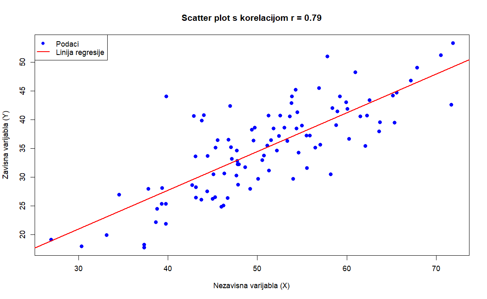

<div class="body">

# Analiza podataka i obrada informacija

**Nositelj**: izv. prof. dr. sc. Siniša Sovilj <br>
**Asistent**: mag. inf. Alesandro Žužić

**Ustanova**: Sveučilište Jurja Dobrile u Puli, Fakultet informatike u Puli

<p style="float: clear; display: flex; gap: 8px; align-items: center;" class="font-brioni text-sm whitespace-nowrap">
    </img>
    Fakultet informatike u Puli
</p>
 
# [3] Korelacija i regresija, vremenski nizovi, klasifikacija i grupacija

<div style="display: flex; justify-content: space-between; text-align: justify; gap: 32px;">
    <p>
        <b>Korelacija</b> mjeri linearnu povezanost između varijabli. <b>Regresija</b> modelira odnose za predviđanje vrijednosti. <b>Vremenski nizovi</b> analiziraju podatke ovisne o vremenu. <b>Klasifikacija</b> dodjeljuje podatke unaprijed definiranim kategorijama, dok <b>grupiranje</b> (klasteriranje) automatski identificira prirodne grupe u podacima. U R-u se koriste funkcije poput <code>cor()</code>, <code>lm()</code>, <code>forecast()</code>, <code>caret</code> i <code>kmeans()</code>, a vizualizacija pomaže u interpretaciji rezultata.
    </p>
    </img>
</div>

**Posljednje ažurirano:** 11. travnja 2025.

<!-- TOC -->

- [Analiza podataka i obrada informacija](#analiza-podataka-i-obrada-informacija)
- [[3] Korelacija i regresija, vremenski nizovi, klasifikacija i grupacija](#3-korelacija-i-regresija-vremenski-nizovi-klasifikacija-i-grupacija)
    - [Korelacija](#korelacija)
        - [Četiri osnovna tipa korelacijskih odnosa:](#%C4%8Detiri-osnovna-tipa-korelacijskih-odnosa)
        - [Koeficijenti korelacije](#koeficijenti-korelacije)
            - [Pearsonov koeficijent korelacije](#pearsonov-koeficijent-korelacije)
            - [Spearmanov koeficijent korelacije](#spearmanov-koeficijent-korelacije)
        - [Matrica korelacije](#matrica-korelacije)
        - [Outlieri u korelacijskoj analizi](#outlieri-u-korelacijskoj-analizi)
        - [Kovarijanca](#kovarijanca)
    - [Regresijska analiza](#regresijska-analiza)
        - [Linearna regresija](#linearna-regresija)
        - [Logistička regresija](#logisti%C4%8Dka-regresija)

<!-- /TOC -->
 
<div class="page"></div>

## Korelacija  

**Korelacija** kvantificira statističku povezanost između **dvije numeričke** varijable, pokazujući koliko se one zajedno mijenjaju. Povezanost znači da je vrijednost jedne varijable s nekom vjerojatnošću moguće predvidjeti na osnovi saznanja o vrijednosti druge varijable.

Promjena vrijednosti jedne varijable utječe na promjenu vrijednosti druge varijable. Varijabla koja svojom vrijednošću utječe na drugu varijablu naziva se **neovisna varijabla**. Varijabla na koju se utječe naziva se **ovisna varijabla**. 

> Mogući su slučajevi da dvije varijable istovremeno utječu jedna na drugu, pa su u tom slučaju obje varijable istovremeno i ovisne i neovisne.

*U R-u korelacija se računa pomoću sljedeće funkcije:*
```r
cor(x, y)
```

Međusoban odnos između dvije varijable, grafički možemo prikazati pomoću dvodimenzionalnog grafa, tzv. **scatter dijagram** (dijagrama raspršenja).

<div style="width: 100%; display: flex; justify-content: center;">
    
</div>

Ovisno o međusobnom odnosu dvaju varijabli među kojima postoji korelacija, ona može biti **linearna** ili **nelinearna**. 
- Kod **linearne korelacije**, točke su grupirane oko pravca. 
- Kod **nelinearne korelacije**, točke su grupirane oko neke druge krivulje.

<div style="width: 100%; display: flex; justify-content: center;">
    
</div>

### Četiri osnovna tipa korelacijskih odnosa:

1. **Pozitivna korelacija** (`+`)
    - **Karakteristike**:
        - Mala vrijednost varijable X ↔ mala vrijednost varijable Y
        - Velika vrijednost varijable X ↔ velika vrijednost varijable Y
    - **Grafički prikaz**: Točke se koncentriraju oko uzlazne linije

2. **Negativna korelacija** (`-`)
    - **Karakteristike**:
        - Mala vrijednost varijable X ↔ velika vrijednost varijable Y
        - Velika vrijednost varijable X ↔ mala vrijednost varijable Y
    - **Grafički prikaz**: Točke se koncentriraju oko silazne linije

3. **Nemonotona korelacija** (`ciklička`)
    - **Karakteristike**:
        - Odnos se mijenja po intervalima
        - U nekim dijelovima može biti pozitivan, u drugima negativan
        - Ako se smjer mijenja više puta → ciklička korelacija
    - **Grafički prikaz**: Točke slijede valoviti obrazac (npr. sinusoida)

4. **Nul-korelacija** (`0`)
    - **Karakteristike**:
        - Nema vidljive veze između varijabli
        - Vrijednosti jedne varijable ne pružaju informaciju o vrijednostima druge
    - **Grafički prikaz**: Točke potpuno nasumično raspršene

| Tip korelacije | Smjer      | Snaga            | Primjer vizualizacije          |
| -------------- | ---------- | ---------------- | ------------------------------ |
| Pozitivna      | ↗          | Jaka do umjerena | Točke blisko uz uzlaznu liniju |
| Negativna      | ↘          | Jaka do umjerena | Točke blisko uz silaznu liniju |
| Nemonotona     | Promjenjiv | Varira           | Valoviti/periodični obrazac    |
| Nul-korelacija | -          | 0                | Kaotično raspršene točke       |

<div style="width: 100%; display: flex; justify-content: center;">
    
</div>

### Koeficijenti korelacije

**Koeficijenti korelacije** mjere povezanost između varijabli na standardiziranoj skali neovisnoj o mjernim jedinicama. Dva najčešća koeficijenta su:  

1. **Pearsonov (r)** - mjeri **linearnu** povezanost (-1 do +1), optimalan za normalno distribuirane podatke  
2. **Spearmanov (ρ)** - mjeri **monotonu** povezanost kroz rangove, robusniji na nelinearnosti i outlier-e  

Pearson je osjetljiv na linearne odnose, dok Spearman hvata širi spektar monotonih veza (uključujući nelinearne). Oba koeficijenta eliminiraju utjecaj mjernih jedinica, omogućavajući usporedbu različitih varijabli.

#### Pearsonov koeficijent korelacije  

Pearsonov koeficijent (r) mjeri **linearnu povezanost** između dvije numeričke varijable s normalnom distribucijom. Vrijednost Pearsonovog koeficijenta korelacije kreće se od `+1` (*savršena pozitivna korelacija*) do `–1` (*savršena negativna korelacija*). **Predznak** koeficijenta nas upućuje na **smjer korelacije** – je li pozitivna ili negativna, ali nas ne upućuje na snagu korelacije. Pearsonov koeficijent korelacije bazira se na usporedbi stvarnog utjecaja promatranih varijabli jedne na drugu u odnosu na maksimalni mogući utjecaj dviju varijabli.
Vrijednosti:  
- **+1**: savršena pozitivna korelacija  
- **-1**: savršena negativna korelacija  
- **0**: nema linearne veze  

> Osjetljiv je na outlier-e te zahtijeva linearnost i normalnu distribuciju  

`cor()` funkcija uvijek koristi **Pearsonov koeficijent** tako da se ne navodi kao argument:

```r
cor(x, y)
```

*Vrijednosti Pearsonovog koeficijenta korelacije:*

| Vrijednost (r)  | Jakost veze        | Smjer veze |
| --------------- | ------------------ | ---------- |
| -1.0            | Funkcionalna veza  | Negativan  |
| -1.0 < r < -0.8 | Jaka veza          | Negativan  |
| -0.8 ≤ r < -0.5 | Umjerena veza      | Negativan  |
| -0.5 ≤ r < 0    | Slaba veza         | Negativan  |
| 0               | Nema linearne veze | -          |
| 0 < r ≤ 0.5     | Slaba veza         | Pozitivan  |
| 0.5 < r ≤ 0.8   | Umjerena veza      | Pozitivan  |
| 0.8 < r < 1.0   | Jaka veza          | Pozitivan  |
| 1.0             | Funkcionalna veza  | Pozitivan  |

#### Spearmanov koeficijent korelacije  

Spearmanov koeficijent (ρ) mjeri **monotonu povezanost** (linearne i nelinearne) kroz rangove vrijednosti. Koristi se za mjerenje povezanosti između varijabli u slučajevima kada nije moguće primijeniti Pearsonov koeficijent korelacije. Bazira se na tome da se izmjeri dosljednost povezanosti između poredanih varijabli, a oblik povezanosti (npr. linearni oblik koji je preduvjet za korištenje Pearsonovog koeficijenta) nije bitan. 

> Robusniji na odstupanja od normalnosti te detektira širi spektar veza

Da bi koristili **Spearmanov koeficijent** u `cor()` funkciji trebamo ga navesti kao metodu:

```r
cor(x, y, method = "spearman")
```

<div style="width: 100%; display: flex; justify-content: center;">
    
</div>

### Matrica korelacije

Matrica korelacije je tabularni prikaz koeficijenata korelacije između svih parova varijabli u skupu podataka. Omogućuje:
- Simultani pregled međusobnih odnosa više varijabli
- Identifikaciju najjačih povezanosti
- Preliminarnu analizu prije složenijih statističkih modela

**Dijagonala**: Uvijek sadrži vrijednosti 1 (savršena korelacija varijable same sa sobom)
**Simetričnost**: `cor(X,Y) = cor(Y,X)`  

*Izrada korelacijske matrice u R-u s pomoću `corrplot()` ili `corrgram()` funkcija:*
```r
#install.packages("corrplot")
#install.packages("corrgram)
library(corrplot)
library(corrgram)

par(mfrow = c(2, 3))
cor_matrix <- cor(quakes)

corrplot(cor_matrix) # method = "circle" - ako nije postavljeno
corrplot(cor_matrix, method = "color")
corrplot(cor_matrix, method = "number")
corrplot(cor_matrix, method = "square")
corrplot(cor_matrix, method = "ellipse")
corrplot(cor_matrix, method = "pie")
```

<div style="width: 100%; display: flex; justify-content: center;">
    
</div>

<br/>

*Izrada korelacijske matrice u R-u s pomoću `pairs()` funkcije:*
```r
pairs(quakes)
```

<div style="width: 100%; display: flex; justify-content: center;">
    
</div>

### Outlieri u korelacijskoj analizi

**Outlieri** su **ekstremne vrijednosti** koje značajno odstupaju od većine podataka i mogu dramatično utjecati na rezultate korelacijske analize. Budući da *Pearsonov koeficijent* koristi metode najmanjih kvadrata, samo nekoliko ekstremnih vrijednosti može potpuno iskriviti pravi odnos između varijabli. Vizualna detekcija s pomoću **boxplot**-a jedan je način za vizualnu identifikaciju outliera.

U praksi se koriste **kvantitativne metode** za identifikaciju outliera, poput:  
- Uklanjanja vrijednosti izvan `±2` standardne devijacije  
- IQR metode (vrijednosti izvan `1.5×IQR` od kvartila)  

> Ključni izazov je razlikovati prave outliere od rijetkih ali autentičnih vrijednosti. U velikim uzorcima s malim brojem outliera, njihovo uklanjanje je opravdano. Međutim, u malim uzorcima ili kada outlieri predstavljaju važne biološke/prirodne pojave, njihovo uklanjanje može dovesti do gubitka ključnih informacija.  

<div style="width: 100%; display: flex; justify-content: center;">
    
</div>

### Kovarijanca

**Kovarijanca** mjeri zajedničku varijabilnost dviju numeričkih varijabli, pokazujući kako se jedna mijenja u odnosu na drugu. Za razliku od korelacije koja je standardizirana, kovarijanca ovisi o mjernim jedinicama varijabli što otežava izravnu usporedbu između različitih studija. Računa se kao prosječni umnožak odstupanja svake varijable od svoje srednje vrijednosti. 

**Pozitivna vrijednost** ukazuje da se veće vrijednosti jedne varijable obično javljaju uz veće vrijednosti druge, dok **negativna pokazuje** suprotan odnos. **Nulta vrijednost** sugerira odsutnost linearne povezanosti.

- **Pozitivna kovarijanca**: Veće vrijednosti *X* tendiraju uz veće vrijednosti *Y*  
- **Negativna kovarijanca**: Veće vrijednosti *X* tendiraju uz manje vrijednosti *Y*  
- **Nula**: Nema linearne povezanosti  

*U R-u kovarijanca se računa pomoću sljedeće funkcije:*
```r
cov(x, y)
```  

Korelacija je standardizirana verzija kovarijance:  
\[
\rho = \frac{\text{cov}(X,Y)}{\sigma_X \sigma_Y}
\]  
Dok kovarijanca može biti bilo koji realan broj, korelacija je uvijek između -1 i 1.  

### Multikolearnost

**Multikolinearnost** nastaje kada su dva ili više prediktora u regresijskom modelu visoko međusobno korelirana, što otežava pouzdano procjenjivanje njihovih pojedinačnih utjecaja.

**Zašto je problematična:**

* Koeficijenti postaju nestabilni i osjetljivi na male promjene u podacima
* Standardne pogreške rastu → p-vrijednosti mogu postati nenamjerno visoke
* Teže je interpretirati doprinos pojedinih varijabli

**Kako otkriti:**

* **Korelacijska matrica**: Pogledati visoke korelacije između prediktora (npr. > 0.8)
* **VIF (Variance Inflation Factor)**: Ako je VIF > 5 (ili 10), postoji jaka multikolinearnost

```R
library(car)
vif(model)
```

**Rješenja:**

* Ukloniti jedan od koreliranih prediktora
* Kombinirati varijable (npr. PCA)
* Korištenje regularizacije (npr. Ridge, Lasso regresija)

```R
sqrt(vif(model))>2
# Ako je sve false neme problema multikolinearnosti
```

## Regresijska analiza

Regresijska analiza omogućuje kvantificiranje veze između promatranih pojava kroz matematički model. 

1. **Objašnjenje odnosa**: Utvrđivanje kako nezavisne varijable utječu na zavisnu varijablu  
2. **Predviđanje vrijednosti**: Procjena budućih vrijednosti zavisne varijable na temelju poznatih vrijednosti nezavisnih varijabli  

*Tipovi regresije:*

| Tip            | Formula                     | Primjena            |
| -------------- | --------------------------- | ------------------- |
| **Linearna**   | \(Y = β_0 + β_1X + ε\)      | Kontinuirani odnosi |
| **Logistička** | \(ln(\frac{p}{1-p}) = βX\)  | Binarni ishodi      |
| **Polinomska** | \(Y = β_0 + β_1X + β_2X^2\) | Nelinearni trendovi |

### Linearna regresija

*Primjer*:  
```r
# Linearna regresija
model <- lm(mpg ~ wt + hp, data = mtcars)
summary(model)
```  

*Output:*
```R
Call:
lm(formula = mpg ~ wt + hp, data = mtcars)

Residuals:
   Min     1Q Median     3Q    Max 
-3.941 -1.600 -0.182  1.050  5.854 

Coefficients:
            Estimate Std. Error t value Pr(>|t|)    
(Intercept) 37.22727    1.59879  23.285  < 2e-16 ***
wt          -3.87783    0.63273  -6.129 1.12e-06 ***
hp          -0.03177    0.00903  -3.519  0.00145 ** 
---
Signif. codes:  0 ‘***’ 0.001 ‘**’ 0.01 ‘*’ 0.05 ‘.’ 0.1 ‘ ’ 1

Residual standard error: 2.593 on 29 degrees of freedom
Multiple R-squared:  0.8268,	Adjusted R-squared:  0.8148 
F-statistic: 69.21 on 2 and 29 DF,  p-value: 9.109e-12
```

Ova naredba u R-u:

```R
lm(formula = mpg ~ wt + hp, data = mtcars)
```

pokreće **linearnu regresiju** gdje je cilj predvidjeti **potrošnju goriva u miljama po galonu (mpg)** na temelju dvaju prediktora:

* **wt**: težina automobila (u tisućama funti),
* **hp**: konjske snage automobila.

Rezultat koji dobivamo sastoji se od nekoliko dijelova:

**1. Reziduali (Residuals):**

```R
   Min     1Q Median     3Q    Max 
-3.941 -1.600 -0.182  1.050  5.854 
```

Reziduali su razlike između stvarnih vrijednosti (`mpg`) i onih predviđenih modelom:

* **Min**: Najveća negativna pogreška
* **1Q**: Donji kvartil (25% podataka ima manji rezidual)
* **Median**: Srednja vrijednost reziduala (idealno blizu 0)
* **3Q**: Gornji kvartil (25% podataka ima veći rezidual)
* **Max**: Najveća pozitivna pogreška

**2. Koeficijenti regresije (Coefficients):**

| Predictor | Estimate | Std. Error | t value | Pr(\|>t\|) | Signif. code |
| --------- | -------- | ---------- | ------- | ---------- | ------------ |
| Intercept | 37.227   | 1.599      | 23.285  | < 2e-16    | \*\*\*       |
| wt        | -3.878   | 0.633      | -6.129  | 1.12e-06   | \*\*\*       |
| hp        | -0.03177 | 0.00903    | -3.519  | 0.00145    | \*\*         |

* **Intercept (presjek)**: Kada su težina i snaga 0, očekivana vrijednost `mpg` je 37.23 (tehnički, nije realna situacija, ali služi kao referentna točka).
* **wt**: Svako povećanje težine za 1 (tj. 1000 funti) smanjuje `mpg` za 3.88 jedinica, pod uvjetom da su ostali prediktori konstantni.
* **hp**: Svako povećanje snage za 1 konjsku snagu smanjuje `mpg` za oko 0.032 jedinice.

**Std. Error (standardna pogreška)**: Predstavlja procjenu nesigurnosti oko vrijednosti koeficijenta. Manja vrijednost znači veću pouzdanost.
- standardna pogreška za `wt` iznosi 0.633, što ukazuje na relativno stabilnu i pouzdanu procjenu njegovog utjecaja na `mpg`

**t value (t-vrijednost)**: Pokazuje koliko je procijenjeni koeficijent udaljen od nule u jedinicama svoje standardne pogreške. Što je t-vrijednost veća (pozitivno ili negativno), veća je vjerojatnost da koeficijent **nije slučajan**, već ima stvarni utjecaj na zavisnu varijablu (`mpg`). 
- t-vrijednost `-6.129` za `wt` znači da je koeficijent vrlo značajan

**Pr(>|t|)** prikazuje **p-vrijednosti** – sve su značajno manje od 0.05 → svi koeficijenti su statistički značajni.

```R
Signif. codes:  0 ‘***’ 0.001 ‘**’ 0.01 ‘*’ 0.05 ‘.’ 0.1 ‘ ’ 1
```

Oznake govore koliko je prediktor statistički značajan:

- `***` → vrlo značajan (p < 0.001)
- `**` → značajan (p < 0.01)
- `*` → umjereno značajan (p < 0.05)
- `.` → slabo značajan (p < 0.1)
- ` ` (prazno) → nije značajan (p ≥ 0.1)

**3. Ostale statističke vrijednosti modela:**

```R
Residual standard error: 2.593 on 29 degrees of freedom
Multiple R-squared:  0.8268
Adjusted R-squared:  0.8148
F-statistic: 69.21 on 2 and 29 DF,  p-value: 9.109e-12
```

- **Residual standard error**: Prosječna udaljenost stvarnih vrijednosti `mpg` od vrijednosti predviđenih modelom. Niža vrijednost znači da su predikcije bliže stvarnim podacima (ovdje: 2.593).
- **Multiple R-squared**: Postotak varijance u `mpg` koji model objašnjava pomoću prediktora `wt` i `hp`. Vrijednost 0.8268 znači da model objašnjava 82.68% ukupne varijacije.
- **Adjusted R-squared**: Kao R-squared, ali uzima u obzir broj prediktora. Koristi se kako bi se izbjegla umjetna inflacija R-squared vrijednosti kod dodavanja irelevantnih varijabli. Ovdje: 81.48%.
- **F-statistic**: Testira cijeli model – provjerava je li barem jedan prediktor značajan. Visoka vrijednost (69.21) i vrlo mala p-vrijednost (9.109e-12) ukazuju da je model statistički značajno bolji od modela bez prediktora.

### Logistička regresija

Logistička regresija se koristi za predviđanje binarnih ishoda, tj. kada zavisna varijabla ima dvije kategorije (npr. da/ne, uspješno/neuspješno). U R-u, za izvođenje logističke regresije koristi se funkcija `glm()`, a rezultati se analiziraju kroz koeficijente, standardne pogreške, p-vrijednosti i druge metrike.

Logistička regresija se koristi za predviđanje binarne varijable — u ovom slučaju: ima li osoba prihod veći od *50k USD* ili *ne*. Zavisna varijabla je `income`, s vrijednostima <`=50K` i `>50K`.

*Primjer:*
```R
adult <- read.csv("adult.data", header = FALSE, strip.white = TRUE)
colnames(adult) <- c("age", "workclass", "fnlwgt", "education", "education.num",
                     "marital.status", "occupation", "relationship", "race", "sex",
                     "capital.gain", "capital.loss", "hours.per.week", "native.country", "income")

adult <- na.omit(adult)

adult$income_bin <- ifelse(adult$income == ">50K", 1, 0)

model <- glm(income_bin ~ age + education.num, data = adult, family = binomial)
summary(model)
```

*Output:*
```R
Call:
glm(formula = income_bin ~ age + education.num, family = binomial, 
    data = adult)

Coefficients:
               Estimate Std. Error z value Pr(>|z|)    
(Intercept)   -6.748100   0.088629  -76.14   <2e-16 ***
age            0.043483   0.001091   39.87   <2e-16 ***
education.num  0.362109   0.006366   56.89   <2e-16 ***
---
Signif. codes:  0 ‘***’ 0.001 ‘**’ 0.01 ‘*’ 0.05 ‘.’ 0.1 ‘ ’ 1

(Dispersion parameter for binomial family taken to be 1)

    Null deviance: 35948  on 32560  degrees of freedom
Residual deviance: 30231  on 32558  degrees of freedom
AIC: 30237

Number of Fisher Scoring iterations: 5
```

| Predictor     | Estimate | Std. Error | z value | Pr(&#124;&gt;z&#124;) | Signif. code |
| ------------- | -------- | ---------- | ------- | --------------------- | ------------ |
| Intercept     | -6.7481  | 0.0886     | -76.14  | < 2e-16               | ***          |
| age           | 0.0435   | 0.0011     | 39.87   | < 2e-16               | ***          |
| education.num | 0.3621   | 0.0064     | 56.89   | < 2e-16               | ***          |

* **(Intercept)**: Logaritamski omjer vjerojatnosti da osoba zarađuje >50k USD kada su `age` i `education.num` jednaki 0. Iako ta situacija nije realna (osoba stara 0 godina s obrazovanjem 0), presjek služi kao referentna točka u modelu.

* **age**: Koeficijent `0.0435` znači da svaka dodatna godina starosti povećava log-odds za zaradu veću od 50k za 0.0435. Budući da je pozitivan, stariji ljudi imaju veću vjerojatnost da imaju veće prihode — uz pretpostavku da je `education.num` konstantan.

* **education.num**: Koeficijent `0.3621` znači da svaka dodatna razina obrazovanja (npr. prelazak s 10 na 11 godina formalnog obrazovanja) povećava log-odds za visoku zaradu za 0.3621. Dakle, veće obrazovanje snažno utječe na vjerojatnost veće plaće.


### Izračunavanje vjerojatnosti

Za predviđanje vjerojatnosti određenog ishoda (npr. `outcome = 1`), koristimo funkciju `predict()`:

```R
prob <- predict(model, type = "response")
```

Ova funkcija vraća vjerojatnosti (između 0 i 1) za svaki primjerak u datasetu. Ako želimo pretvoriti te vjerojatnosti u kategorije (npr. 1 ako je vjerojatnost veća od 0.5, inače 0), možemo to napraviti ovako:

```R
pred_class <- ifelse(prob > 0.5, 1, 0)
```

Za procjenu kvalitete modela možemo koristiti nekoliko metrika, uključujući **točnost (accuracy)**, **preciznost (precision)**, **osjetljivost (recall)** i **F1-score**. Također, često se koristi **confusion matrix** za vizualizaciju performansi modela:

```r
table(Predicted = pred_class, Actual = adult$income_bin)
```

Dobivena matrica:

|             | Actual 0 (`<=50K`) | Actual 1 (`>50K`) |
| ----------- | ------------------ | ----------------- |
| Predicted 0 | 23,286 (TN)        | 5,656 (FN)        |
| Predicted 1 | 1,434 (FP)         | 2,185 (TP)        |

* **TN (True Negative)** = 23,286
  → Model je točno predvidio da osoba *nema visoki prihod* (`<=50K`)

* **TP (True Positive)** = 2,185
  → Model je točno predvidio da osoba *ima visoki prihod* (`>50K`)

* **FN (False Negative)** = 5,656
  → Model je krivo predvidio da osoba *nema visoki prihod*, iako zapravo ima (`>50K`)

* **FP (False Positive)** = 1,434
  → Model je krivo predvidio da osoba *ima visoki prihod*, iako zapravo nema (`<=50K`)

*Izračun metrika:*
```r
# Vrijednosti iz confusion matrice
TP <- 2185
TN <- 23286
FP <- 1434
FN <- 5656

# Ukupno primjera
total <- TP + TN + FP + FN  # = 32361

# Izračun metrika
accuracy    <- (TP + TN) / total        # Točnost
precision   <- TP / (TP + FP)           # Preciznost
recall      <- TP / (TP + FN)           # Osjetljivost (Recall)
specificity <- TN / (TN + FP)           # Specifičnost
f1_score    <- 2 * (precision * recall) / (precision + recall)  # F1-score
```

**Rezultati:**

| Metrika          | Vrijednost | Objašnjenje                                                    |
| ---------------- | ---------- | -------------------------------------------------------------- |
| **Točnost**      | 0.7822     | 78.22% ispravnih predikcija                                    |
| **Preciznost**   | 0.6037     | Od svih za koje je model rekao `>50K`, točno je 60.37%         |
| **Osjetljivost** | 0.2786     | Od svih koji stvarno imaju `>50K`, uhvaćeno je 27.86%          |
| **Specifičnost** | 0.9419     | Od svih koji stvarno imaju `<=50K`, točno klasificirano 94.19% |
| **F1-score**     | 0.3813     | Harmonična sredina preciznosti i osjetljivosti (za `>50K`)     |