<div class="body">

# Analiza podataka i obrada informacija

**Nositelj**: izv. prof. dr. sc. Siniša Sovilj <br>
**Asistent**: mag. inf. Alesandro Žužić

**Ustanova**: Sveučilište Jurja Dobrile u Puli, Fakultet informatike u Puli

<p style="float: clear; display: flex; gap: 8px; align-items: center;" class="font-brioni text-sm whitespace-nowrap">
    </img>
    Fakultet informatike u Puli
</p>
 
# [3] Korelacija i regresija, vremenski nizovi, klasifikacija i grupiranje

<div style="display: flex; justify-content: space-between; text-align: justify; gap: 32px;">
    <p>
        <b>Korelacija</b> mjeri linearnu povezanost između varijabli. <b>Regresija</b> modelira odnose za predviđanje vrijednosti. <b>Vremenski nizovi</b> analiziraju podatke ovisne o vremenu. <b>Klasifikacija</b> dodjeljuje podatke unaprijed definiranim kategorijama, dok <b>grupiranje</b> (klasteriranje) automatski identificira prirodne grupe u podacima. U R-u se koriste funkcije poput <code>cor()</code>, <code>lm()</code>, <code>forecast()</code>, <code>rpart()</code> i <code>kmeans()</code>, a vizualizacija pomaže u interpretaciji rezultata.
    </p>
    </img> 
</div>

**Posljednje ažurirano:** 21. svibnja 2025.

<!-- TOC -->

- [Analiza podataka i obrada informacija](#analiza-podataka-i-obrada-informacija)
- [[3] Korelacija i regresija, vremenski nizovi, klasifikacija i grupiranje](#3-korelacija-i-regresija-vremenski-nizovi-klasifikacija-i-grupiranje)
    - [Korelacija](#korelacija)
        - [Četiri osnovna tipa korelacijskih odnosa:](#%C4%8Detiri-osnovna-tipa-korelacijskih-odnosa)
        - [Koeficijenti korelacije](#koeficijenti-korelacije)
            - [Pearsonov koeficijent korelacije](#pearsonov-koeficijent-korelacije)
            - [Spearmanov koeficijent korelacije](#spearmanov-koeficijent-korelacije)
        - [Matrica korelacije](#matrica-korelacije)
        - [Outlieri u korelacijskoj analizi](#outlieri-u-korelacijskoj-analizi)
        - [Kovarijanca](#kovarijanca)
        - [Multikolinearnost](#multikolinearnost)
    - [Regresijska analiza](#regresijska-analiza)
        - [Linearna regresija](#linearna-regresija)
        - [Logistička regresija](#logisti%C4%8Dka-regresija)
        - [Izračunavanje vjerojatnosti](#izra%C4%8Dunavanje-vjerojatnosti)
    - [Vremenski nizovi](#vremenski-nizovi)
        - [Analiza vremenskih nizova](#analiza-vremenskih-nizova)
        - [Dekompozicija vremenskog niza](#dekompozicija-vremenskog-niza)
            - [STL metoda](#stl-metoda)
        - [Aditivna i multiplikativna dekompozicija vremenskog niza](#aditivna-i-multiplikativna-dekompozicija-vremenskog-niza)
            - [Aditivna dekompozicija](#aditivna-dekompozicija)
            - [Multiplikativna dekompozicija](#multiplikativna-dekompozicija)
        - [Stacionarnosti vremenskog niza](#stacionarnosti-vremenskog-niza)
            - [Provjera stacionarnosti](#provjera-stacionarnosti)
            - [Prilagodba niza za stacionarnost](#prilagodba-niza-za-stacionarnost)
        - [ACF i PACF](#acf-i-pacf)
            - [ACF Autocorrelation Function](#acf-autocorrelation-function)
            - [PACF Partial Autocorrelation Function](#pacf-partial-autocorrelation-function)
            - [Korištenje ACF i PACF u modeliranju](#kori%C5%A1tenje-acf-i-pacf-u-modeliranju)
        - [ARIMA model](#arima-model)
    - [Klasifikacija](#klasifikacija)
        - [Stablo odluke](#stablo-odluke)
        - [Random forest](#random-forest)
    - [Grupiranje](#grupiranje)
        - [K-means](#k-means)

<!-- /TOC -->
 
<div class="page"></div>

## Korelacija  

**Korelacija** kvantificira statističku povezanost između **dvije numeričke** varijable, pokazujući koliko se one zajedno mijenjaju. Povezanost znači da je vrijednost jedne varijable s nekom vjerojatnošću moguće predvidjeti na osnovi saznanja o vrijednosti druge varijable.

Promjena vrijednosti jedne varijable utječe na promjenu vrijednosti druge varijable. Varijabla koja svojom vrijednošću utječe na drugu varijablu naziva se **neovisna varijabla**. Varijabla na koju se utječe naziva se **ovisna varijabla**. 

> Mogući su slučajevi da dvije varijable istovremeno utječu jedna na drugu, pa su u tom slučaju obje varijable istovremeno i ovisne i neovisne.

*U R-u korelacija se računa s pomoću sljedeće funkcije:*
```r
cor(x, y)
```

Međusoban odnos između dvije varijable, grafički možemo prikazati s pomoću dvodimenzionalnog grafa, tzv. **scatter dijagram** (dijagrama raspršenja).

<div style="width: 100%; display: flex; justify-content: center;">
    
</div>

Ovisno o međusobnom odnosu dvaju varijabli među kojima postoji korelacija, ona može biti **linearna** ili **nelinearna**. 
- Kod **linearne korelacije**, točke su grupirane oko pravca. 
- Kod **nelinearne korelacije**, točke su grupirane oko neke druge krivulje.

<div style="width: 100%; display: flex; justify-content: center;">
    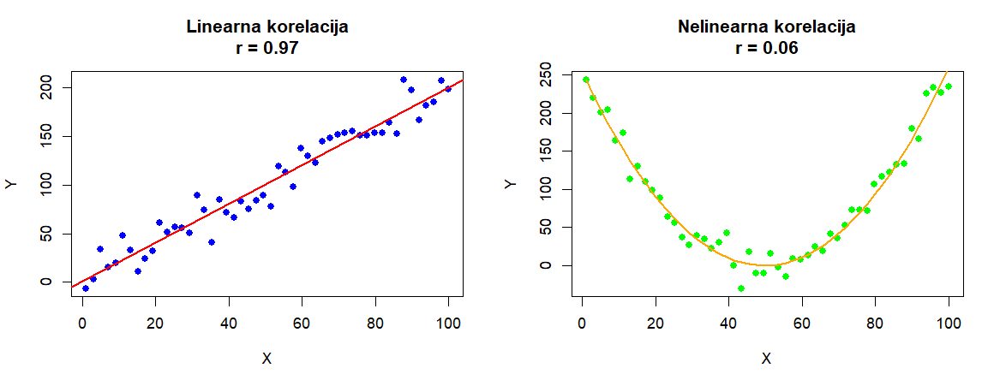
</div>

### Četiri osnovna tipa korelacijskih odnosa:

1. **Pozitivna korelacija** (`+`)
    - **Karakteristike**:
        - Mala vrijednost varijable X ↔ mala vrijednost varijable Y
        - Velika vrijednost varijable X ↔ velika vrijednost varijable Y
    - **Grafički prikaz**: Točke se koncentriraju oko uzlazne linije

2. **Negativna korelacija** (`-`)
    - **Karakteristike**:
        - Mala vrijednost varijable X ↔ velika vrijednost varijable Y
        - Velika vrijednost varijable X ↔ mala vrijednost varijable Y
    - **Grafički prikaz**: Točke se koncentriraju oko silazne linije

3. **Nemonotona korelacija** (`ciklička`)
    - **Karakteristike**:
        - Odnos se mijenja po intervalima
        - U nekim dijelovima može biti pozitivan, u drugima negativan
        - Ako se smjer mijenja više puta → ciklička korelacija
    - **Grafički prikaz**: Točke slijede valoviti obrazac (npr. sinusoida)

4. **Nul-korelacija** (`0`)
    - **Karakteristike**:
        - Nema vidljive veze između varijabli
        - Vrijednosti jedne varijable ne pružaju informaciju o vrijednostima druge
    - **Grafički prikaz**: Točke potpuno nasumično raspršene

<div class="page"></div>

| Tip korelacije | Smjer      | Snaga            | Primjer vizualizacije          |
| -------------- | ---------- | ---------------- | ------------------------------ |
| Pozitivna      | ↗          | Jaka do umjerena | Točke blisko uz uzlaznu liniju |
| Negativna      | ↘          | Jaka do umjerena | Točke blisko uz silaznu liniju |
| Nemonotona     | Promjenjiv | Varira           | Valoviti/periodični obrazac    |
| Nul-korelacija | -          | 0                | Kaotično raspršene točke       |

<div style="width: 100%; display: flex; justify-content: center;">
    
</div>

### Koeficijenti korelacije

**Koeficijenti korelacije** mjere povezanost između varijabli na standardiziranoj skali neovisnoj o mjernim jedinicama. Dva najčešća koeficijenta su:  

1. **Pearsonov (r)** - mjeri **linearnu** povezanost (-1 do +1), optimalan za normalno distribuirane podatke  
2. **Spearmanov (ρ)** - mjeri **monotonu** povezanost kroz rangove, robusniji na nelinearnosti i outlier-e  

Pearson je osjetljiv na linearne odnose, dok Spearman hvata širi spektar monotonih veza (uključujući nelinearne). Oba koeficijenta eliminiraju utjecaj mjernih jedinica, omogućavajući usporedbu različitih varijabli.

#### Pearsonov koeficijent korelacije  

Pearsonov koeficijent (r) mjeri **linearnu povezanost** između dvije numeričke varijable s normalnom distribucijom. Vrijednost Pearsonovog koeficijenta korelacije kreće se od `+1` (*savršena pozitivna korelacija*) do `–1` (*savršena negativna korelacija*). **Predznak** koeficijenta nas upućuje na **smjer korelacije** – je li pozitivna ili negativna, ali nas ne upućuje na snagu korelacije. Pearsonov koeficijent korelacije bazira se na usporedbi stvarnog utjecaja promatranih varijabli jedne na drugu u odnosu na maksimalni mogući utjecaj dviju varijabli.
Vrijednosti:  
- **+1**: savršena pozitivna korelacija  
- **-1**: savršena negativna korelacija  
- **0**: nema linearne veze  

> Osjetljiv je na outlier-e te zahtijeva linearnost i normalnu distribuciju  

`cor()` funkcija uvijek koristi **Pearsonov koeficijent** tako da se ne navodi kao argument:

```r
cor(x, y)
```

*Vrijednosti Pearsonovog koeficijenta korelacije:*

| Vrijednost (r)  | Jakost veze        | Smjer veze |
| --------------- | ------------------ | ---------- |
| -1.0            | Funkcionalna veza  | Negativan  |
| -1.0 < r < -0.8 | Jaka veza          | Negativan  |
| -0.8 ≤ r < -0.5 | Umjerena veza      | Negativan  |
| -0.5 ≤ r < 0    | Slaba veza         | Negativan  |
| 0               | Nema linearne veze | -          |
| 0 < r ≤ 0.5     | Slaba veza         | Pozitivan  |
| 0.5 < r ≤ 0.8   | Umjerena veza      | Pozitivan  |
| 0.8 < r < 1.0   | Jaka veza          | Pozitivan  |
| 1.0             | Funkcionalna veza  | Pozitivan  |

#### Spearmanov koeficijent korelacije  

Spearmanov koeficijent (ρ) mjeri **monotonu povezanost** (linearne i nelinearne) kroz rangove vrijednosti. Koristi se za mjerenje povezanosti između varijabli u slučajevima kada nije moguće primijeniti Pearsonov koeficijent korelacije. Bazira se na tome da se izmjeri dosljednost povezanosti između poredanih varijabli, a oblik povezanosti (npr. linearni oblik koji je preduvjet za korištenje Pearsonovog koeficijenta) nije bitan. 

> Robusniji na odstupanja od normalnosti te detektira širi spektar veza

Da bi koristili **Spearmanov koeficijent** u `cor()` funkciji trebamo ga navesti kao metodu:

```r
cor(x, y, method = "spearman")
```

<div style="width: 100%; display: flex; justify-content: center;">
    
</div>

### Matrica korelacije

Matrica korelacije je tabularni prikaz koeficijenata korelacije između svih parova varijabli u skupu podataka. Omogućuje:
- Simultani pregled međusobnih odnosa više varijabli
- Identifikaciju najjačih povezanosti
- Preliminarnu analizu prije složenijih statističkih modela

**Dijagonala**: Uvijek sadrži vrijednosti 1 (savršena korelacija varijable same sa sobom)
**Simetričnost**: `cor(X,Y) = cor(Y,X)`  

*Izrada korelacijske matrice u R-u s pomoću `corrplot()` ili `corrgram()` funkcija:*
```r
#install.packages("corrplot")
#install.packages("corrgram)
library(corrplot)
library(corrgram)

par(mfrow = c(2, 3))
cor_matrix <- cor(quakes)

corrplot(cor_matrix) # method = "circle" - ako nije postavljeno
corrplot(cor_matrix, method = "color")
corrplot(cor_matrix, method = "number")
corrplot(cor_matrix, method = "square")
corrplot(cor_matrix, method = "ellipse")
corrplot(cor_matrix, method = "pie")
```

<div style="width: 100%; display: flex; justify-content: center;">
    
</div>

<br/>

*Izrada korelacijske matrice u R-u s pomoću `pairs()` funkcije:*
```r
pairs(quakes)
```

<div style="width: 100%; display: flex; justify-content: center;">
    
</div>

<div class="page"></div>

### Outlieri u korelacijskoj analizi

**Outlieri** su **ekstremne vrijednosti** koje značajno odstupaju od većine podataka i mogu dramatično utjecati na rezultate korelacijske analize. Budući da *Pearsonov koeficijent* koristi metode najmanjih kvadrata, samo nekoliko ekstremnih vrijednosti može potpuno iskriviti pravi odnos između varijabli. Vizualna detekcija s pomoću **boxplot**-a jedan je način za vizualnu identifikaciju outliera.

U praksi se koriste **kvantitativne metode** za identifikaciju outliera, poput:  
- Uklanjanja vrijednosti izvan `±2` standardne devijacije  
- IQR metode (vrijednosti izvan `1.5×IQR` od kvartila)  

> Ključni izazov je razlikovati prave outliere od rijetkih ali autentičnih vrijednosti. U velikim uzorcima s malim brojem outliera, njihovo uklanjanje je opravdano. Međutim, u malim uzorcima ili kada outlieri predstavljaju važne biološke/prirodne pojave, njihovo uklanjanje može dovesti do gubitka ključnih informacija.  

<div style="width: 100%; display: flex; justify-content: center;">
    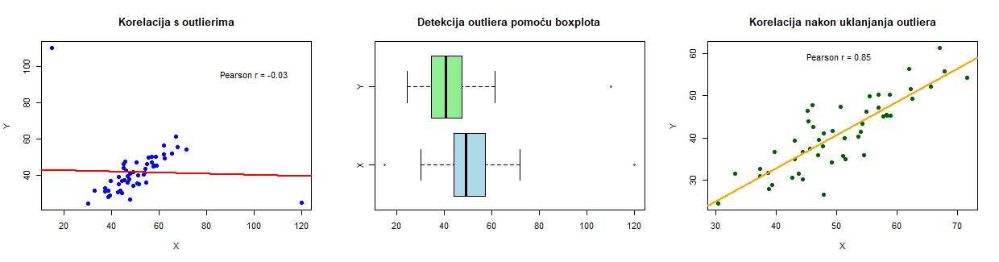
</div>

### Kovarijanca

**Kovarijanca** mjeri zajedničku varijabilnost dviju numeričkih varijabli, pokazujući kako se jedna mijenja u odnosu na drugu. Za razliku od korelacije koja je standardizirana, kovarijanca ovisi o mjernim jedinicama varijabli što otežava izravnu usporedbu između različitih studija. Računa se kao prosječni umnožak odstupanja svake varijable od svoje srednje vrijednosti. 

**Pozitivna vrijednost** ukazuje da se veće vrijednosti jedne varijable obično javljaju uz veće vrijednosti druge, dok **negativna pokazuje** suprotan odnos. **Nulta vrijednost** sugerira odsutnost linearne povezanosti.

- **Pozitivna kovarijanca**: Veće vrijednosti *X* tendiraju uz veće vrijednosti *Y*  
- **Negativna kovarijanca**: Veće vrijednosti *X* tendiraju uz manje vrijednosti *Y*  
- **Nula**: Nema linearne povezanosti  

*U R-u kovarijanca se računa s pomoću sljedeće funkcije:*
```r
cov(x, y)
```  

Korelacija je standardizirana verzija kovarijance:  
$$
\rho = \frac{\text{cov}(X,Y)}{\sigma_X \sigma_Y}
$$
Dok kovarijanca može biti bilo koji realan broj, korelacija je uvijek između -1 i 1.  

### Multikolinearnost

**Multikolinearnost** nastaje kada su dva ili više prediktora u regresijskom modelu visoko međusobno korelirana, što otežava pouzdano procjenjivanje njihovih pojedinačnih utjecaja.

**Zašto je problematična:**

- Koeficijenti postaju nestabilni i osjetljivi na male promjene u podacima
- Standardne pogreške rastu → p-vrijednosti mogu postati nenamjerno visoke
- Teže je interpretirati doprinos pojedinih varijabli

**Kako otkriti:**

- **Korelacijska matrica**: Pogledati visoke korelacije između prediktora (npr. > 0.8)
- **VIF (Variance Inflation Factor)**: Ako je VIF > 5 (ili 10), postoji jaka multikolinearnost

```R
library(car)
vif(model)
```

**Rješenja:**

- Ukloniti jedan od koreliranih prediktora
- Kombinirati varijable (npr. PCA)
- Korištenje regularizacije (npr. Ridge, Lasso regresija)

```R
sqrt(vif(model))>2
# Ako je sve false nema problema multikolinearnosti
```

<div class="page"></div>

## Regresijska analiza

Regresijska analiza omogućuje kvantificiranje veze između promatranih pojava kroz matematički model. 

1. **Objašnjenje odnosa**: Utvrđivanje kako nezavisne varijable utječu na zavisnu varijablu  
2. **Predviđanje vrijednosti**: Procjena budućih vrijednosti zavisne varijable na temelju poznatih vrijednosti nezavisnih varijabli  

*Tipovi regresije:*

| Tip            | Formula                     | Primjena            |
| -------------- | --------------------------- | ------------------- |
| **Linearna**   | $$Y = β_0 + β_1X + ε$$      | Kontinuirani odnosi |
| **Logistička** | $$ln(\frac{p}{1-p}) = βX$$  | Binarni ishodi      |
| **Polinomska** | $$Y = β_0 + β_1X + β_2X^2$$ | Nelinearni trendovi |

### Linearna regresija

*Primjer*:  
```r
# Linearna regresija
model <- lm(mpg ~ wt + hp, data = mtcars)
summary(model)
```  

*Output:*
```R
Call:
lm(formula = mpg ~ wt + hp, data = mtcars)

Residuals:
   Min     1Q Median     3Q    Max 
-3.941 -1.600 -0.182  1.050  5.854 

Coefficients:
            Estimate Std. Error t value Pr(>|t|)    
(Intercept) 37.22727    1.59879  23.285  < 2e-16 ***
wt          -3.87783    0.63273  -6.129 1.12e-06 ***
hp          -0.03177    0.00903  -3.519  0.00145 ** 
---
Signif. codes:  0 ‘***’ 0.001 ‘**’ 0.01 ‘*’ 0.05 ‘.’ 0.1 ‘ ’ 1

Residual standard error: 2.593 on 29 degrees of freedom
Multiple R-squared:  0.8268,	Adjusted R-squared:  0.8148 
F-statistic: 69.21 on 2 and 29 DF,  p-value: 9.109e-12
```

Ova naredba u R-u:

```R
lm(formula = mpg ~ wt + hp, data = mtcars)
```

pokreće **linearnu regresiju** gdje je cilj predvidjeti **potrošnju goriva u miljama po galonu (mpg)** na temelju dvaju prediktora:

* **wt**: težina automobila (u tisućama funti),
* **hp**: konjske snage automobila.

Rezultat koji dobivamo sastoji se od nekoliko dijelova:

**1. Reziduali (Residuals):**

```R
   Min     1Q Median     3Q    Max 
-3.941 -1.600 -0.182  1.050  5.854 
```

Reziduali su razlike između stvarnih vrijednosti (`mpg`) i onih predviđenih modelom:

- **Min**: Najveća negativna pogreška
- **1Q**: Donji kvartil (25% podataka ima manji rezidual)
- **Median**: Srednja vrijednost reziduala (idealno blizu 0)
- **3Q**: Gornji kvartil (25% podataka ima veći rezidual)
- **Max**: Najveća pozitivna pogreška

**2. Koeficijenti regresije (Coefficients):**

| Predictor | Estimate | Std. Error | t value | Pr(\|>t\|) | Signif. code |
| --------- | -------- | ---------- | ------- | ---------- | ------------ |
| Intercept | 37.227   | 1.599      | 23.285  | < 2e-16    | \*\*\*       |
| wt        | -3.878   | 0.633      | -6.129  | 1.12e-06   | \*\*\*       |
| hp        | -0.03177 | 0.00903    | -3.519  | 0.00145    | \*\*         |

- **Intercept (presjek)**: Kada su težina i snaga 0, očekivana vrijednost `mpg` je 37.23 (tehnički, nije realna situacija, ali služi kao referentna točka).
- **wt**: Svako povećanje težine za 1 (tj. 1000 funti) smanjuje `mpg` za 3.88 jedinica, pod uvjetom da su ostali prediktori konstantni.
- **hp**: Svako povećanje snage za 1 konjsku snagu smanjuje `mpg` za oko 0.032 jedinice.

**Std. Error (standardna pogreška)**: Predstavlja procjenu nesigurnosti oko vrijednosti koeficijenta. Manja vrijednost znači veću pouzdanost.
- standardna pogreška za `wt` iznosi 0.633, što ukazuje na relativno stabilnu i pouzdanu procjenu njegovog utjecaja na `mpg`

**t value (t-vrijednost)**: Pokazuje koliko je procijenjeni koeficijent udaljen od nule u jedinicama svoje standardne pogreške. Što je t-vrijednost veća (pozitivno ili negativno), veća je vjerojatnost da koeficijent **nije slučajan**, već ima stvarni utjecaj na zavisnu varijablu (`mpg`). 
- t-vrijednost `-6.129` za `wt` znači da je koeficijent vrlo značajan

**Pr(>|t|)** prikazuje **p-vrijednosti** – sve su značajno manje od 0.05 → svi koeficijenti su statistički značajni.

```R
Signif. codes:  0 ‘***’ 0.001 ‘**’ 0.01 ‘*’ 0.05 ‘.’ 0.1 ‘ ’ 1
```

Oznake govore koliko je prediktor statistički značajan:

- `***` → vrlo značajan (p < 0.001)
- `**` → značajan (p < 0.01)
- `*` → umjereno značajan (p < 0.05)
- `.` → slabo značajan (p < 0.1)
- ` ` (prazno) → nije značajan (p ≥ 0.1)

**3. Ostale statističke vrijednosti modela:**

```R
Residual standard error: 2.593 on 29 degrees of freedom
Multiple R-squared:  0.8268
Adjusted R-squared:  0.8148
F-statistic: 69.21 on 2 and 29 DF,  p-value: 9.109e-12
```

- **Residual standard error**: Prosječna udaljenost stvarnih vrijednosti `mpg` od vrijednosti predviđenih modelom. Niža vrijednost znači da su predikcije bliže stvarnim podacima (ovdje: 2.593).
- **Multiple R-squared**: Postotak varijance u `mpg` koji model objašnjava s pomoću prediktora `wt` i `hp`. Vrijednost 0.8268 znači da model objašnjava 82.68% ukupne varijacije.
- **Adjusted R-squared**: Kao R-squared, ali uzima u obzir broj prediktora. Koristi se kako bi se izbjegla umjetna inflacija R-squared vrijednosti kod dodavanja irelevantnih varijabli. Ovdje: 81.48%.
- **F-statistic**: Testira cijeli model – provjerava je li barem jedan prediktor značajan. Visoka vrijednost (69.21) i vrlo mala p-vrijednost (9.109e-12) ukazuju da je model statistički značajno bolji od modela bez prediktora.

### Logistička regresija

Logistička regresija se koristi za predviđanje binarnih ishoda, tj. kada zavisna varijabla ima dvije kategorije (npr. da/ne, uspješno/neuspješno). U R-u, za izvođenje logističke regresije koristi se funkcija `glm()`, a rezultati se analiziraju kroz koeficijente, standardne pogreške, p-vrijednosti i druge metrike.

Logistička regresija se koristi za predviđanje binarne varijable — u ovom slučaju: ima li osoba prihod veći od *50k USD* ili *ne*. Zavisna varijabla je `income`, s vrijednostima <`=50K` i `>50K`.

*Primjer:*
```R
adult <- read.csv("adult.data", header = FALSE, strip.white = TRUE)
colnames(adult) <- c("age", "workclass", "fnlwgt", "education", "education.num",
                     "marital.status", "occupation", "relationship", "race", "sex",
                     "capital.gain", "capital.loss", "hours.per.week", "native.country", "income")

adult <- na.omit(adult)

adult$income_bin <- ifelse(adult$income == ">50K", 1, 0)

model <- glm(income_bin ~ age + education.num, data = adult, family = binomial)
summary(model)
```

*Output:*

```R
Call:
glm(formula = income_bin ~ age + education.num, family = binomial, 
    data = adult)

Coefficients:
               Estimate Std. Error z value Pr(>|z|)    
(Intercept)   -6.748100   0.088629  -76.14   <2e-16 ***
age            0.043483   0.001091   39.87   <2e-16 ***
education.num  0.362109   0.006366   56.89   <2e-16 ***
---
Signif. codes:  0 ‘***’ 0.001 ‘**’ 0.01 ‘*’ 0.05 ‘.’ 0.1 ‘ ’ 1

(Dispersion parameter for binomial family taken to be 1)

    Null deviance: 35948  on 32560  degrees of freedom
Residual deviance: 30231  on 32558  degrees of freedom
AIC: 30237

Number of Fisher Scoring iterations: 5
```

| Predictor     | Estimate | Std. Error | z value | Pr(&#124;&gt;z&#124;) | Signif. code |
| ------------- | -------- | ---------- | ------- | --------------------- | ------------ |
| Intercept     | -6.7481  | 0.0886     | -76.14  | < 2e-16               | ***          |
| age           | 0.0435   | 0.0011     | 39.87   | < 2e-16               | ***          |
| education.num | 0.3621   | 0.0064     | 56.89   | < 2e-16               | ***          |

- **(Intercept)**: Logaritamski omjer vjerojatnosti da osoba zarađuje >50k USD kada su `age` i `education.num` jednaki 0. Iako ta situacija nije realna (osoba stara 0 godina s obrazovanjem 0), presjek služi kao referentna točka u modelu.

- **age**: Koeficijent `0.0435` znači da svaka dodatna godina starosti povećava log-odds za zaradu veću od 50k za 0.0435. Budući da je pozitivan, stariji ljudi imaju veću vjerojatnost da imaju veće prihode — uz pretpostavku da je `education.num` konstantan.

- **education.num**: Koeficijent `0.3621` znači da svaka dodatna razina obrazovanja (npr. prelazak s 10 na 11 godina formalnog obrazovanja) povećava log-odds za visoku zaradu za 0.3621. Dakle, veće obrazovanje snažno utječe na vjerojatnost veće plaće.


### Izračunavanje vjerojatnosti

Za predviđanje vjerojatnosti određenog ishoda (npr. `outcome = 1`), koristimo funkciju `predict()`:

```R
prob <- predict(model, type = "response")
```

Ova funkcija vraća vjerojatnosti (između 0 i 1) za svaki primjerak u datasetu. Ako želimo pretvoriti te vjerojatnosti u kategorije (npr. 1 ako je vjerojatnost veća od 0.5, inače 0), možemo to napraviti ovako:

```R
pred_class <- ifelse(prob > 0.5, 1, 0)
```

Za procjenu kvalitete modela možemo koristiti nekoliko metrika, uključujući **točnost (accuracy)**, **preciznost (precision)**, **osjetljivost (recall)** i **F1-score**. Također, često se koristi **confusion matrix** za vizualizaciju performansi modela:

```r
table(Predicted = pred_class, Actual = adult$income_bin)
```

Dobivena matrica:

|             | Actual 0 (`<=50K`) | Actual 1 (`>50K`) |
| ----------- | ------------------ | ----------------- |
| Predicted 0 | 23,286 (TN)        | 5,656 (FN)        |
| Predicted 1 | 1,434 (FP)         | 2,185 (TP)        |

- **TN (True Negative)** = 23,286
  → Model je točno predvidio da osoba *nema visoki prihod* (`<=50K`)

- **TP (True Positive)** = 2,185
  → Model je točno predvidio da osoba *ima visoki prihod* (`>50K`)

- **FN (False Negative)** = 5,656
  → Model je krivo predvidio da osoba *nema visoki prihod*, iako zapravo ima (`>50K`)

- **FP (False Positive)** = 1,434
  → Model je krivo predvidio da osoba *ima visoki prihod*, iako zapravo nema (`<=50K`)

<div class="page"></div>

*Izračun metrika:*
```r
# Vrijednosti iz confusion matrice
TP <- 2185
TN <- 23286
FP <- 1434
FN <- 5656

# Ukupno primjera
total <- TP + TN + FP + FN  # = 32361

# Izračun metrika
accuracy    <- (TP + TN) / total        # Točnost
precision   <- TP / (TP + FP)           # Preciznost
recall      <- TP / (TP + FN)           # Osjetljivost (Recall)
specificity <- TN / (TN + FP)           # Specifičnost
f1_score    <- 2 * (precision * recall) / (precision + recall)  # F1-score
```

**Rezultati:**

| Metrika          | Vrijednost | Objašnjenje                                                    |
| ---------------- | ---------- | -------------------------------------------------------------- |
| **Točnost**      | 0.7822     | 78.22% ispravnih predikcija                                    |
| **Preciznost**   | 0.6037     | Od svih za koje je model rekao `>50K`, točno je 60.37%         |
| **Osjetljivost** | 0.2786     | Od svih koji stvarno imaju `>50K`, uhvaćeno je 27.86%          |
| **Specifičnost** | 0.9419     | Od svih koji stvarno imaju `<=50K`, točno klasificirano 94.19% |
| **F1-score**     | 0.3813     | Harmonična sredina preciznosti i osjetljivosti (za `>50K`)     |

## Vremenski nizovi

Vremenski nizovi predstavljaju **nizove podataka** prikupljenih u **redovitim vremenskim intervalima**. Analiza vremenskih nizova omogućava prepoznavanje obrazaca, trendova i sezonalnosti te predviđanje budućih vrijednosti.

> Vremenski niz je skup opažanja indeksiranih vremenskih trenutaka, obično **ekvidistantnim** (*jednako razmaknutim*).

Dvije glavne karakteristike vremenskih nizova su **vremenski period** i **frekvencija**. Ove karakteristike pružaju osnovne informacije o strukturi i prirodi podataka te omogućavajući da bolje razumijemo dinamiku promjena koje se odvijaju kroz vrijeme.
- **Vremenski period** - nema ograničenja u pogledu ukupnog trajanja vremenskog niza. To može biti minuta, dan, mjesec ili čak stoljeće. Sve što je potrebno su *početna* i *završna* točka.
    - npr. ako su podaci prikupljeni jednom dnevno od 1. siječnja 2000. do 31. prosinca 2009., razmak od jednog dana predstavlja **vremenski trenutak**, dok je skup vremenskih trenutaka cijelo desetljeće 
- **Frekvencija** - označava koliko često se bilježe vrijednosti skupa podataka. Da bi analiza vremenskog niza bila smislena, svi vremenski trenutci moraju biti jednaki i jasno definirani. To rezultira **ekvidistantnim** rasporedom vremenskih trenutaka, što pokazuje pravilnost u bilježenju podataka.
    - npr. frekvencija se može kretati od nekoliko milisekundi do nekoliko desetljeća, ali najčešće se pojavljuju dnevni, mjesečni, kvartalni i godišnji podaci

**Ključne komponente**:
- **Trend** - dugoročni smjer promjena (rast, pad, stabilnost)
- **Sezonalnost** - pravilne fluktuacije povezane s periodima (dnevno, mjesečno, godišnje)
- **Cikličke varijacije** - dugotrajne fluktuacije bez fiksnog perioda
- **Nasumične varijacije** - nepredvidivi šum u podacima

*Paketi za rad s vremenskim nizovima:*

```r
# install.packages(c("ggplot2", "forecast", "tseries"))
library(ggplot2)    # Za naprednu vizualizaciju grafova
library(forecast)   # Alati za analizu i predikciju vremenskih nizova (ARIMA, ETS, STL, itd.)
library("tseries")  # Statistički testovi i alati za vremenske nizove (ADF test, KPSS test i dr.)
```

U R-u se vremenski nizovi prikazuju s pomoću funkcije `ts()` (*time series*):

```r
podaci <- c(23,45,67,34,56,78,89,45,67,89,43,56, 
            34,67,89,54,76,88,91,52,71,85,49,63)
vremenski_niz <- ts(podaci, start = c(2020, 1), frequency = 12)

# čišćenje od nedostajućih vrijednosti i outliera
vremenski_niz <- tsclean(vremenski_niz)
```


Gdje:
- `start` - početni vremenski trenutak (godina, period)
- `frequency` - broj opažanja po vremenskoj jedinici (365 za dnevne podatke, 12 za mjesečne, 4 za kvartalne, 1 za godišnje)

Vizualizacija s pomoću `plot()` funkcije:

```r
data("AirPassengers") # Monthly totals of international airline passengers, 1949 to 1960.
vremenski_niz <- AirPassengers
```

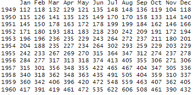

```r
plot(vremenski_niz, main = "Vremenski niz sa trend linijom")
abline(lm(vremenski_niz ~ time(vremenski_niz)), col = "red")
```

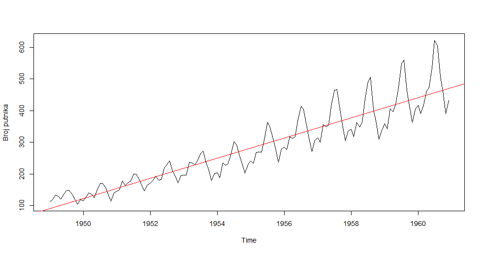

Vizualizacija s pomoću `ma()` (*moving average*) funkcije, za glađi prikaz podataka:

```r
par(mfrow=c(2,2))
vremenski_niz_ma3 <- ma(vremenski_niz, order = 3)
vremenski_niz_ma5 <- ma(vremenski_niz, order = 9)
vremenski_niz_ma7 <- ma(vremenski_niz, order = 27)
plot(vremenski_niz, main = "Bez pomičnog prosjeka")
plot(vremenski_niz_ma3, main = "Pomični prosjek (red 3)")
plot(vremenski_niz_ma5, main = "Pomični prosjek (red 9)")
plot(vremenski_niz_ma7, main = "Pomični prosjek (red 27)")
```


### Analiza vremenskih nizova

**Analiza vremenskih nizova** je ključna u upravljanju, posebno za predviđanje ishoda kao što su prodaja, troškovi ili uspjeh projekata. Koristi povijesne podatke za predviđanje budućih rezultata i procjenu utjecaja upravljačkih odluka. Podaci se bilježe u redovitim vremenskim intervalima, što omogućuje praćenje promjena varijabli tijekom vremena. Vrijeme postaje ključna varijabla koja pokazuje trendove, sezonske utjecaje i obrasce ponašanja. Za pouzdanu analizu potrebno je dovoljno podataka kako bi se izbjegle pogreške uzrokovane iznimnim vrijednostima. Što je skup podataka veći, to su rezultati pouzdaniji. Analiza vremenskih nizova pomaže u donošenju informiranih odluka na temelju jasnih vremenskih ovisnosti.

### Dekompozicija vremenskog niza

Dekompozicija vremenskog niza je ključna tehnika u analizi vremenskih serija koja omogućuje razdvajanje kompleksnog niza podataka na njegove osnovne komponente. Ova metoda pruža jasniji uvid u strukturu podataka i olakšava interpretaciju.

1. **Originalni podaci (observed)**: predstavljaju neobrađene podatke koji su izravno prikupljeni iz izvora. Ovi podaci sadrže sve informacije u svom izvornom obliku, bez ikakvih modifikacija ili transformacija.

2. **Trend komponenta (trend)**: pokazuje osnovni pravac kretanja podataka. Može biti uzlazan, silazan ili stabilan. Na primjer, ako analiziramo prodaju nekog proizvoda, trend će vjerojatno pokazivati postupni rast kroz godine. Ova komponenta nam pomaže uočiti osnovni smjer razvoja bez sporednih utjecaja.

3. **Sezonska komponenta (seasonal)**: otkriva ponavljajuće obrasce koji se javljaju u redovitim intervalima. To mogu biti dnevne, tjedne, mjesečne ili godišnje varijacije. Tipičan primjer je povećana prodaja božićnih ukrasa u prosincu ili veća potrošnja električne energije tijekom zimskih mjeseci. Ova komponenta je posebno važna za planiranje u poslovnim aktivnostima.

4. **Slučajna komponenta (random)**: sadrži sve one promjene koje ne možemo objasniti trendom niti sezonalnosti. To su nepredvidive fluktuacije koje mogu biti posljedica iznenadnih događaja, mjernih pogrešaka ili drugih neplaniranih čimbenika. Iako često smetaju analizi, njihovo praćenje može biti korisno za otkrivanje neuobičajenih pojava.

*Primjer:*

```r
dekompozicija <- decompose(AirPassengers)

plot(dekompozicija)
```


#### STL metoda

**STL** (*Seasonal Decomposition of Time Series by Loess*) je naprednija metoda dekompozicije koja koristi lokalnu regresiju (*LOESS*) za razdvajanje komponenti.

```r
# Primjer STL dekompozicije
stl_dekomp <- stl(AirPassengers, s.window = "periodic")

# Vizualizacija
plot(stl_dekomp, main = "STL dekompozicija AirPassengers dataseta")

```

### Aditivna i multiplikativna dekompozicija vremenskog niza

#### 1. **Aditivna dekompozicija**
Koristi se kada amplitude sezonskih fluktuacija ostaju konstantne kroz vrijeme.

**Model:**  
`Y(t) = Trend(t) + Sezonska(t) + Slučajna(t)`

**Karakteristike:**
- Sezonske varijacije su konstantne magnitude
- Trend linearni ili polinomijalni
- Pogodna za nizove s konstantnom varijancom

**Primjer u R:**
```r
decomp_add <- decompose(AirPassengers, type = "additive")
plot(decomp_add)

stl_add <- stl(AirPassengers, s.window = "periodic")
plot(stl_add, main = "STL Aditivna dekompozicija")
```

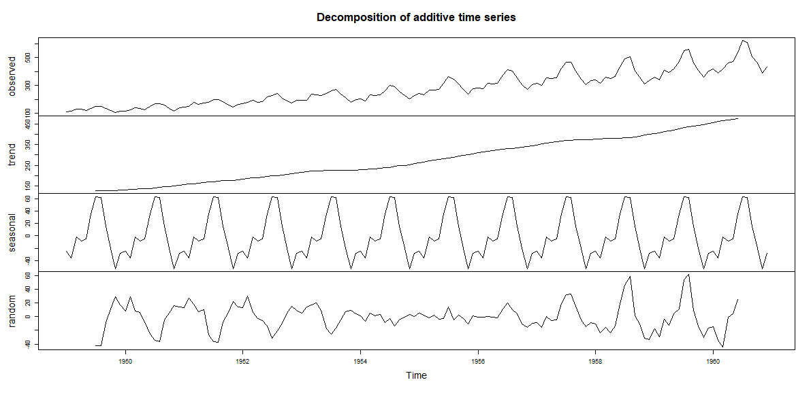

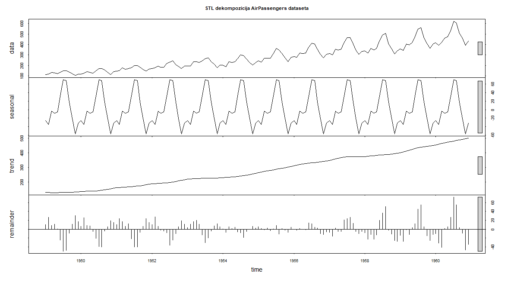

#### 2. **Multiplikativna dekompozicija**
Koristi se kada sezonske fluktuacije rastu/smanjuju s trendom.

**Model:**  
`Y(t) = Trend(t) * Sezonska(t) * Slučajna(t)`

**Karakteristike:**
- Sezonske varijacije proporcionalne trendu
- Često kod ekonomskih nizova s eksponencijalnim rastom
- Zahtijeva log transformaciju ako postoje negativne vrijednosti

**Primjer u R:**
```r
decomp_mult <- decompose(AirPassengers, type = "multiplicative")
plot(decomp_mult)

log_ap <- log(AirPassengers)
stl_mult <- stl(log_ap, s.window = "periodic")
plot(stl_mult, main = "STL Multiplikativna dekompozicija")
```

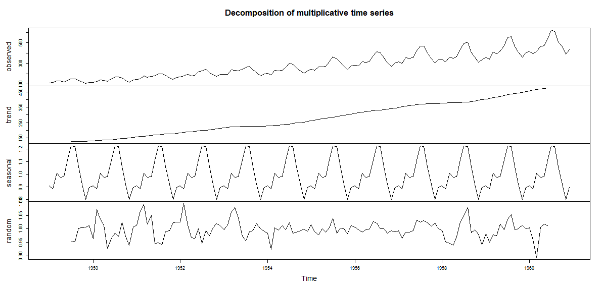

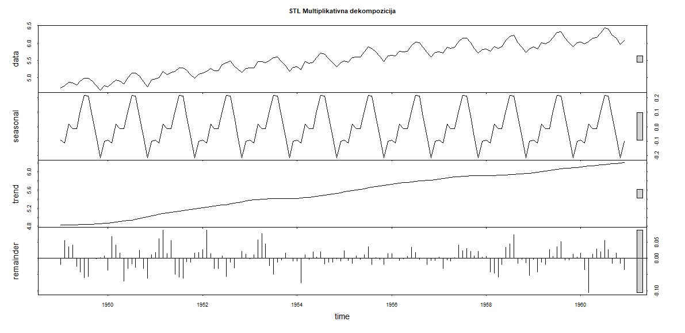

### Stacionarnosti vremenskog niza

Stacionarnost je ključni koncept u analizi vremenskih nizova. Vremenski niz se smatra stacionarnim ako njegove statističke karakteristike, kao što su srednja vrijednost, varijanca i kovarijanca, ne ovise o vremenu. Drugim riječima, stacionarni niz ne pokazuje dugoročne trendove i sezonske promjene, te je moguće predvidjeti njegove buduće vrijednosti na temelju prošlih podataka. Ako niz nije stacionaran, može biti potrebno primijeniti transformacije poput diferenciranja kako bi se postigla stacionarnost.

Vrste stacionarnosti:

1. **Striktna stacionarnost**:
    - Niz je striktno stacionaran ako su sve njegove distribucije u svim vremenskim točkama identične. Ovo uključuje ne samo srednju vrijednost, varijancu i kovarijancu, nego i sve više statističke momente.
2. **Slaba stacionarnost**:
    - Niz je slabo stacionaran ako su samo prva dva statistička momenta (srednja vrijednost i varijanca) konstantni kroz vrijeme, a kovarijanca između vrijednosti u različitim vremenskim točkama ovisi samo o vremenskom razmaku, a ne o apsolutnim vremenskim točkama.

#### Provjera stacionarnosti

Jedan od najpoznatijih testova za provjeru stacionarnosti vremenskog niza je **Augmented Dickey-Fuller (ADF)** test, koji testira hipotezu da niz ima jedinčasti korijen, odnosno da nije stacionaran. Ako p-vrijednost testa bude manja od 0.05, možemo odbaciti hipotezu da niz nije stacionaran i zaključiti da je niz stacionaran.

*Primjer:*

```r
library(tseries)

data("AirPassengers")
vremenski_niz <- AirPassengers

adf_test <- adf.test(vremenski_niz)
adf_test
```

*Output:*
```r
Warning message:
In adf.test(vremenski_niz) : p-value smaller than printed p-value
> adf_test

	Augmented Dickey-Fuller Test

data:  vremenski_niz
Dickey-Fuller = -7.3186, Lag order = 5, p-value = 0.01
alternative hypothesis: stationary
```

**p-vrijednost**: `0.01`
Ovaj rezultat znači da je p-vrijednost manja od 0.05, što sugerira da možemo odbaciti nultu hipotezu da vremenski niz nije stacionaran. Dakle, vremenski niz je stacionaran.

- **Dickey-Fuller**: Vrijednost test statistike je -7.3186. Ova statistika mjeri koliko su podaci u skladu s hipotezom o postojanju jedinčastog korijena (ne-stacionarnosti). Manje negativne vrijednosti obično ukazuju na veću vjerojatnost da niz nije stacionaran, dok negativne vrijednosti poput ove sugeriraju da je niz vjerojatno stacionaran.

- **Lag order = 5**: Test je korišten s 5 vremenskih kašnjenja (lags), što znači da su uzeti u obzir prethodni podaci na 5 vremenskih razmaka u analizi.

- **Alternative hypothesis**: Hipoteza je da je niz stacionaran, što je u skladu s rezultatima p-vrijednosti.

**Zaključak**: Budući da je p-vrijednost manja od 0.05, možemo zaključiti da je vremenski niz stacionaran, odnosno da ne pokazuje dugoročne trendove ili sezonske promjene koje bi ometale daljnju analizu i modeliranje.

> Ako je p-vrijednost manja od 0.05, možemo zaključiti da je niz stacionaran.

#### Prilagodba niza za stacionarnost

Ako vremenski niz nije stacionaran, možemo primijeniti nekoliko metoda za njegovu prilagodbu:

1. **Diferenciranje**:

    - Diferenciranje je najčešće korištena tehnika za postizanje stacionarnosti. To znači da od svakog podatka oduzimamo prethodnu vrijednost, čime se uklanjaju trendovi i sezonske promjene. U R-u to možemo postići s funkcijom `diff()`.

    Funkcija `diff()` koristi se za izračun razlike između uzastopnih vrijednosti vremenskog niza, što pomaže u uklanjanju trenda i postizanju stacionarnosti.

    *Primjer:*

    ```r
    diferencirani_niz <- diff(vremenski_niz, 1)
    adf.test(diferencirani_niz)
    ```

    Funkcija `ndiffs()` automatski određuje broj diferencijacija potrebnih za postizanje stacionarnosti vremenskog niza.
    
    *Primjer:*
    ```r
    num_diffs <- ndiffs(ap)
    num_diffs  # Vraća broj potrebnih diferencijacija za stacionarnost, 1 u ovom slučaju
    ```

2. **Logaritamska transformacija**:

   - Ako niz pokazuje eksponencijalni rast, primjena logaritamske transformacije može pomoći u stabilizaciji varijance i postizanju stacionarnosti.

   ```r
   # Logaritamska transformacija
   log_niz <- log(vremenski_niz)
   adf.test(log_niz)
   ```
### ACF i PACF

**ACF (*Autocorrelation Function*)** i **PACF (*Partial Autocorrelation Function*)** su dva ključna alata za analizu vremenskih nizova. Ove funkcije pomažu u razumijevanju odnosa između različitih vremenskih točaka unutar niza i korištene su u identifikaciji odgovarajućih modela za vremenske nizove, poput ARIMA modela.

#### ACF (Autocorrelation Function)

ACF mjeri ukupnu korelaciju između trenutnih i prošlih vrijednosti vremenskog niza. To pokazuje kako su prošle vrijednosti povezane s trenutnim stanjem. Na primjer, ako se promjena u prošlim vrijednostima negativno ili pozitivno odražava na trenutne vrijednosti, ACF će to pokazati.

*Primjer:*

```r
data("AirPassengers")
ap <- AirPassengers

acf(ap, main = "ACF - AirPassengers")
```

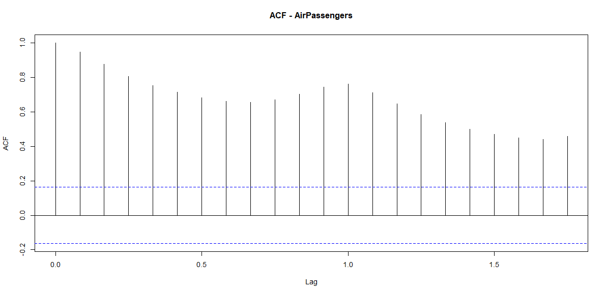

- Ako ACF prikazuje visoke korelacije u početnim vremenskim pomacima, to može značiti da je niz značajno *autocorrelated*, tj. da postoje značajni trendovi ili sezonske komponente.

#### PACF (Partial Autocorrelation Function)

PACF mjeri korelaciju između trenutne i prošle vrijednosti vremenskog niza, uzimajući u obzir sve intermedijarne vremenske točke. To je korisno za utvrđivanje koji broj prethodnih vrijednosti je potrebno uključiti u model. PACF je koristan kada želimo razumjeti utjecaj točno određene vremenske točke bez "smetnji" drugih vremenskih točaka.

*Primjer:*

```r
pacf(ap, main = "PACF - AirPassengers")
```

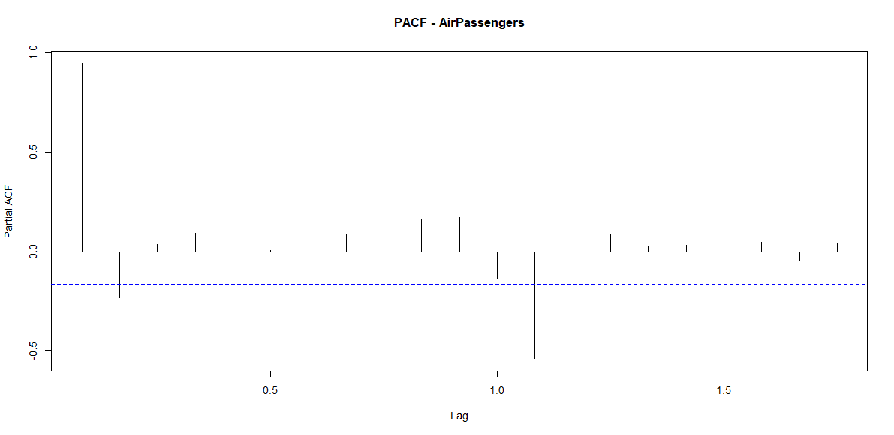

- Ako PACF pokazuje značajnu korelaciju samo na početnim pomacima, to može ukazivati na to da se model treba fokusirati samo na te početne vrijednosti, dok kasniji pomaci nemaju značajan utjecaj.

#### Korištenje ACF i PACF u modeliranju

- **ACF** je koristan za odabir redova MA (Moving Average) dijela ARIMA modela, dok **PACF** pomaže u odabiru redova **AR** (*AutoRegressive*) dijela.
- Ako **ACF** pokazuje značajnu korelaciju na početnim pomacima, ali brzo opada, to može sugerirati da je **MA** model prikladan.
- Ako **PACF** pokazuje značajnu korelaciju na početnim pomacima, a zatim opada, to može sugerirati da je **AR** model prikladan.

> Ovisno o vizualizaciji ACF-a i PACF-a, možemo odlučiti koje parametre AR i MA odabrati za ARIMA model.

### ARIMA model

**ARIMA** (*AutoRegressive Integrated Moving Averag*e) je model koji kombinira autoregresiju, diferenciranje i pomični prosjek kako bi predvidio buduće vrijednosti vremenskog niza.

*Primjer:*
```r
data("AirPassengers")
ap <- AirPassengers

ap_arima <- auto.arima(ap)

summary(ap_arima)
```

<div class="page"></div>

*Output:*
```r
Series: ap 
ARIMA(2,1,1)(0,1,0)[12] 

Coefficients:
         ar1     ar2      ma1
      0.5960  0.2143  -0.9819
s.e.  0.0888  0.0880   0.0292

sigma^2 = 132.3:  log likelihood = -504.92
AIC=1017.85   AICc=1018.17   BIC=1029.35

Training set error measures:
                 ME     RMSE     MAE      MPE     MAPE     MASE        ACF1
Training set 1.3423 10.84619 7.86754 0.420698 2.800458 0.245628 -0.00124847
```

**ARIMA(2,1,1)(0,1,0)\[12]**: Ovaj model koristi dva autoregresivna parametra (AR(2)), jedan pomični prosjek (MA(1)), s prvim diferenciranjem i sezonskim diferenciranjem na 12 mjeseci. Model je optimiziran za predviđanje vremenskih nizova sa sezonskim obrazcima.

**AR1**: Koeficijent `0.5960` znači da vrijednost vremenskog niza u trenutnom mjesecu ima značajnu pozitivnu korelaciju sa stanjem prije mjesec dana. Za svaki porast prethodne vrijednosti, trenutna vrijednost će se povećati za 0.5960.

**AR2**: Koeficijent `0.2143` pokazuje umjerenu pozitivnu korelaciju između trenutne vrijednosti i vrijednosti dva mjeseca prije. Za svaku promjenu u vrijednosti prije dva mjeseca, trenutna vrijednost se mijenja za 0.2143.

**MA1**: Koeficijent `-0.9819` označava da postoji snažna negativna korelacija između trenutne vrijednosti i pogreške koja je nastala prije mjesec dana. To znači da velike pogreške iz prošlih razdoblja snažno utječu na trenutnu vrijednost, ali u suprotnom smjeru.

**AIC (*Akaike Information Criterion*)**: Vrijednost `1017.85` pokazuje kvalitetu modela, pri čemu niže vrijednosti AIC označavaju bolji model. AIC je koristan za usporedbu različitih modela.

**BIC (*Bayesian Information Criterion*)**: BIC je sličan AIC-u, ali uključuje i kaznu za broj parametara u modelu. Vrijednost `1029.35` pomaže u odabiru modela s nižim rizikom od pretreniranja.

- **Training set error measures**:

  - **ME (Mean Error)**: `1.3423`, što znači da je prosječna pogreška modela u predviđanju 1.34
  - **RMSE (Root Mean Squared Error)**: `10.84619` ukazuje na veličinu pogreške u modelu
  - **MAE (Mean Absolute Error)**: `7.86754` označava prosječnu apsolutnu pogrešku predviđanja
  - **MPE (Mean Percentage Error)**: `0.420698` označava postotnu pogrešku modela
  - **MAPE (Mean Absolute Percentage Error)**: `2.800458` pokazuje postotak pogreške u modelu
  - **MASE (Mean Absolute Scaled Error)**: `0.245628` ukazuje na skaliranu pogrešku u modelu u odnosu na osnovni model
  - **ACF1**: `-0.00124847` označava nisku korelaciju između pogrešaka modela i prethodnih pogrešaka, što sugerira da model ima dobar fit

***ARIMA predikcija** putnika:*

```r
ap_forecast_arima <- forecast(ap_arima, h = 36)

autoplot(ap_forecast_arima) +
  ggtitle("ARIMA predikcija broja putnika") +
  xlab("Godina") + ylab("Broj putnika")
```

 

<div class="page"></div>

## Klasifikacija

Klasifikacija je nadzirana tehnika strojnog učenja koja se koristi za predviđanje kategoričkih vrijednosti. Cilj je dodijeliti ulazne podatke unaprijed definiranim klasama na temelju značajki (*features*). U R-u se klasifikacija može provoditi korištenjem različitih algoritama, ovisno o prirodi problema i podataka.

- **Klasa**: Kategorija ili skupina u koju se podatak svrstava (npr. "bolest" / "nema bolesti")
- **Značajke (features)**: Varijable koje se koriste za predviđanje klase
- **Model**: Algoritam koji uči vezu između značajki i ciljne varijable

**Tipovi klasifikacijskih problema:**

1. **Binarna klasifikacija**: 
   - Samo dvije moguće klase (*npr. spam/ne-spam*)
   
2. **Multiklasna klasifikacija**: 
   - Više od dvije klase (*npr. prepoznavanje znamenki 0-9*)

3. **Multilabelna klasifikacija**: 
   - Jedan primjer može pripadati više klasama istovremeno

*Algoritmi klasifikacije:*
| Algoritam               | Paket u R-u      | Opis                                                                                             |
| ----------------------- | ---------------- | ------------------------------------------------------------------------------------------------ |
| **Stabla odluke**       | `rpart()`        | Hijerarhijska struktura za donošenje odluka koja dijeli podatke prema značajkama.                |
| **Slučajna šuma**       | `randomForest()` | Ansambl metoda koja koristi više stabala odluke za poboljšanje točnosti i robusnosti.            |
| **Naivni Bayes**        | `e1071`          | Probabilistički klasifikator temeljen na Bayesovom teoremu i pretpostavci nezavisnosti značajki. |
| **K-najbližih susjeda** | `class::knn()`   | Metoda koja klasificira primjer prema većinskoj klasi njegovih najbližih susjeda.                |

### Stablo odluke

**Stablo odluke** je **model za prediktivnu analizu** koji koristi strukturu nalik stablu za donošenje odluka i predviđanje ishoda. Sastoji se od:

- **Čvorova odluke** (*unutarnji čvorovi*) koji predstavljaju testiranje neke značajke (*npr. je li visina > 170 cm*),
- **Grana** koje vode do sljedećih čvorova ovisno o ishodu testa
- **Listova** (*krajnjih čvorova*) koji predstavljaju konačne odluke ili predikcije (*npr. klasa „da“ ili „ne“*).

Prednosti su što je model **lako razumljiv i vizualno jasan**, dok je glavni nedostatak **osjetljivost na pretreniravanje**, posebno kada je stablo duboko i složeno.

U R-u se može izraditi pomoću funkcije `rpart()` iz paketa `rpart`, a vizualizirati s `rpart.plot`.

*Primjer: Stablo odluke za iris dataset*

```r
#install.packages("rpart")
#install.packages("rpart.plot")
library(rpart)
library(rpart.plot)

# Podjela podataka na trening i test skup
set.seed(123)
indeksi <- sample(1:nrow(iris), 0.7*nrow(iris))
train <- iris[indeksi,]
test <- iris[-indeksi,]

# Izgradnja stabla
stablo <- rpart(Species ~ ., data = train, method = "class")

# Vizualizacija
rpart.plot(stablo)
```


<div class="page"></div>

*Primjer: Analiza stabla*

```r
# najvažnije varijable
stablo$variable.importance
# Petal.Width Petal.Length Sepal.Length  Sepal.Width 
#     60.83978     56.37649     37.31876     23.48140 

# najvažnije varijable
stablo$cptable
#          CP nsplit  rel error    xerror       xstd
# 1 0.5294118      0 1.00000000 1.2058824 0.06232572
# 2 0.3970588      1 0.47058824 0.5441176 0.07198662
# 3 0.0100000      2 0.07352941 0.1176471 0.03997857
```

- `variable.importance` prikazuje važnost varijabli korištenih u stablu. Veće vrijednosti znači da je varijabla više puta korištena u granama koje su najviše doprinijele smanjenju nečistoće.
- `cptable` sadrži tablicu parametara rezanja stabla (*complexity parameter table*), Koristi se za odabir optimalne veličine stabla, tj. koliko jako "rezati" stablo da se izbjegne pretreniranost

| Stupac      | Značenje                                                              |
| ----------- | --------------------------------------------------------------------- |
| `CP`        | Complexity parameter – veće vrijednosti znače **jače rezanje** stabla |
| `nsplit`    | Broj podjela (*čvorova*) u stablu                                     |
| `rel error` | Relativna pogreška – greška trenutnog stabla u odnosu na početnu      |
| `xerror`    | Križno-validacijska greška (procjena pogreške na novim podacima)      |
| `xstd`      | Standardna pogreška križno-validacijske greške                        |

*Primjer: Rezanje stabla*

```r
# uzimamo cp s velikom nsplit vrijednosti
podreznao_stablo <- prune(stablo, cp=0.0100000)
```


*Primjer: Predikcija i evaluacija*

```r
#install.packages("caret")
library(caret)

# Predikcija
predikcije <- predict(stablo, test, type = "class")

# Evaluacija
confusionMatrix(predikcije, test$Species)
```

<div class="page"></div>

*Output:*
```r
Confusion Matrix and Statistics

            Reference
Prediction   setosa versicolor virginica
  setosa         14          0         0
  versicolor      0         18         1
  virginica       0          0        12

Overall Statistics
                                          
               Accuracy : 0.9778          
                 95% CI : (0.8823, 0.9994)
    No Information Rate : 0.4             
    P-Value [Acc > NIR] : < 2.2e-16       
                                          
                  Kappa : 0.9662          
                                          
 Mcnemar's Test P-Value : NA              

Statistics by Class:

                     Class: setosa Class: versicolor Class: virginica
Sensitivity                 1.0000            1.0000           0.9231
Specificity                 1.0000            0.9630           1.0000
Pos Pred Value              1.0000            0.9474           1.0000
Neg Pred Value              1.0000            1.0000           0.9697
Prevalence                  0.3111            0.4000           0.2889
Detection Rate              0.3111            0.4000           0.2667
Detection Prevalence        0.3111            0.4222           0.2667
Balanced Accuracy           1.0000            0.9815           0.9615
```

Konfuzijska matrica prikazuje koliko je model točno ili pogrešno klasificirao primjere za svaku klasu:

- **Setosa:** svih 14 primjera su ispravno klasificirani
- **Versicolor:** 18 ispravno, 1 pogrešno klasificiran kao *virginica*
- **Virginica:** 12 ispravno, nijedan pogrešno klasificiran

**Overall Statistics**:

- **Accuracy: 0.9778**
  Točnost modela: \~97.78%. Od svih primjera, gotovo svi su točno klasificirani.

- **95% CI: (0.8823, 0.9994)**
  Interval pouzdanosti: pravi rezultat točnosti u populaciji je između 88.23% i 99.94%, s 95% sigurnošću.

- **No Information Rate (NIR): 0.4**
  Točnost koju bismo dobili da **uvijek pogodimo najčešću klasu** (*versicolor u ovom slučaju*).
  → Modelova točnost (97.78%) je **znatno bolja** od NIR-a (40%).

- **P-Value \[Acc > NIR]: < 2.2e-16**
  Statistički značajna razlika između modelove točnosti i NIR-a
  → Model je **puno bolji od slučajnog pogađanja**

- **Kappa: 0.9662**
  Mjera slaganja između predikcije i stvarnih vrijednosti **korekcijom za slučajnost**.

  * 1 = savršena točnost, 0 = pogađanje nasumično
    → 0.9662 označava **izvrsnu pouzdanost**

* **McNemar's Test P-Value: NA**
  Ova statistika se koristi za binarnu klasifikaciju; ovdje nije primjenjiva jer imamo 3 klase.

Za svaku klasu (*setosa, versicolor, virginica*):

| Metrika               | Značenje                                                                 |
| --------------------- | ------------------------------------------------------------------------ |
| **Sensitivity**       | Tj. *recall*, koliko stvarnih primjera klase je ispravno prepoznato.     |
| **Specificity**       | Koliko ostalih klasa je točno klasificirano kao "ne-ta klasa".           |
| **Pos Pred Value**    | Tj. *precision*, koliko predviđenih pripadnika klase je stvarno točno.   |
| **Neg Pred Value**    | Koliko negativnih predikcija je točno (npr. ono što nije setosa – nije). |
| **Prevalence**        | Udio te klase u cijelom skupu podataka.                                  |
| **Detection Rate**    | Udio ispravno klasificiranih instanci određene klase.                    |
| **Detection Prev.**   | Koliko je puta model predvidio tu klasu, podijeljeno sa svim primjerima. |
| **Balanced Accuracy** | Prosjek između Sensitivity i Specificity.                                |

### Random forest

**Random forest** je ansambl metoda za strojno učenje koja kombinira više stabala odluke kako bi poboljšala točnost i robusnost modela. Svako stablo se trenira na slučajnom podskupu podataka i značajki (tzv. *bagging*), a konačna odluka donosi se glasanjem (*za klasifikaciju*) ili prosjekom (*za regresiju*).

- **Robustan na šum i outliere** — jer kombinira više modela
- **Smanjuje pretreniranost** u odnosu na pojedinačna stabla
- **Manje interpretabilan** — jer je teško vizualizirati mnogo stabala zajedno

*Primjer: Random forest za PimaIndiansDiabetes*
```r
# install.packages("randomForest")
# install.packages("caret")
library(randomForest)
library(caret)

# Učitavanje podataka
data("PimaIndiansDiabetes")
diabetes <- PimaIndiansDiabetes

# Podjela podataka (70% trening, 30% test)
set.seed(123)
indeksi <- sample(1:nrow(diabetes), 0.7*nrow(diabetes))
train <- diabetes[indeksi, ]
test <- diabetes[-indeksi, ]

# Izgradnja modela (ciljna varijabla je 'diabetes')
model <- randomForest(diabetes ~ ., data = train)

# Broj stabala
forest$ntree # 500

# Broj varijabli (prediktora)
forest$mtry # 2

# Važnost varijabli
importance(model)
#          MeanDecreaseGini
# pregnant         19.86030
# glucose          62.96948
# pressure         21.92756
# triceps          17.33345
# insulin          19.09810
# mass             42.21571
# pedigree         29.56443
# age              29.14090

# grafički prikaz
varImpPlot(model)
```

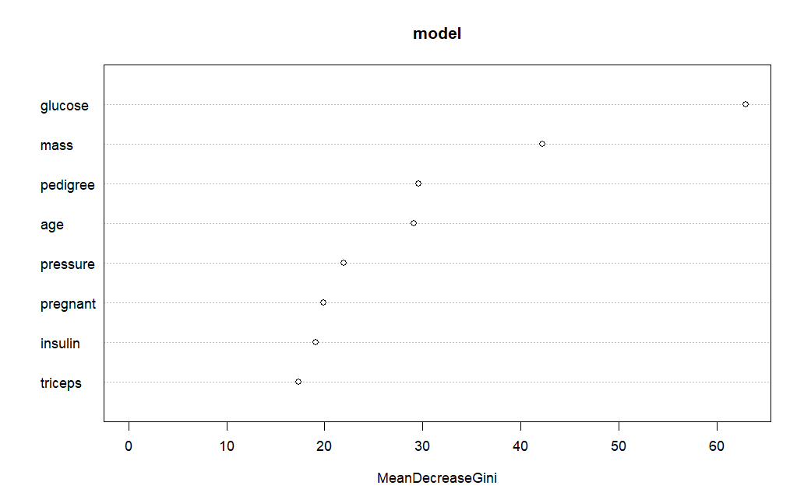

<div class="page"></div>

*Predikcija i evaluacija:*
```r
# Predikcija na testnom skupu
predikcije <- predict(model, test)

# Evaluacija - matrica konfuzije
confusionMatrix(predikcije, test$diabetes)
```

*Output:*
```r
Confusion Matrix and Statistics

          Reference
Prediction neg pos
       neg 126  36
       pos  24  45
                                          
               Accuracy : 0.7403          
                 95% CI : (0.6787, 0.7956)
    No Information Rate : 0.6494          
    P-Value [Acc > NIR] : 0.001953        
                                          
                  Kappa : 0.4095          
                                          
 Mcnemar's Test P-Value : 0.155580        
                                          
            Sensitivity : 0.8400          
            Specificity : 0.5556          
         Pos Pred Value : 0.7778          
         Neg Pred Value : 0.6522          
             Prevalence : 0.6494          
         Detection Rate : 0.5455          
   Detection Prevalence : 0.7013          
      Balanced Accuracy : 0.6978          
                                          
       'Positive' Class : neg      
``` 

Oznaka `'Positive' Class : neg` znači da je u evaluaciji modela kao *"pozitivna"* klasa definirana klasa *"neg"*
- **Pozitivna klasa** je ona na koju se računaju mjere kao što su senzitivnost (*sensitivity*), pozitivna prediktivna vrijednost (*precision*) i dr.

|                | Reference (stvarno) |     |
| -------------- | ------------------- | --- |
| **Prediction** | neg                 | pos |
| neg            | 126                 | 36  |
| pos            | 24                  | 45  |

* **126**: model je točno predvidio "neg" (*negativne primjere*)
* **36**: model je pogrešno predvidio "neg" umjesto "pos"
* **24**: model je pogrešno predvidio "pos" umjesto "neg"
* **45**: model je točno predvidio "pos"

**McNemarov test** se koristi za procjenu razlike između dvije povezane klasifikacije, najčešće u binarnoj klasifikaciji.
- **P-vrijednost > 0.05** (*npr. 0.155580*) znači da nema dovoljno dokaza da se razlikuju dvije klasifikacije u smislu pogrešaka.
- Drugim riječima, **ne odbacujemo hipotezu** da su pogreške modela i referentnog modela (*ili dvije metode*) slične.

## Grupiranje

**Grupiranje (*engl. clustering*)** je tehnika nenadziranog učenja (*engl. unsupervised learning*). koja služi za grupiranje sličnih primjera u skupine, odnosno *klastere*, na temelju njihovih značajki. Za razliku od klasifikacije, kod grupiranja ne postoji unaprijed zadana *ciljna varijabla* — algoritam sam otkriva prirodne skupine unutar podataka.

**Klaster** je skup sličnih objekata koji su međusobno što sličniji, a različiti od objekata u drugim klasterima. Dobri klasteri imaju:

- Veliku sličnost unutar klastera (*homogenost*),
- Mali stupanj sličnosti između klastera (*separabilnost*).

**Mjere sličnosti**:
- Euklidska udaljenost: $$\sqrt{\sum_{i=1}^n (x_i - y_i)^2}$$
- Manhattan udaljenost: $$\sum_{i=1}^n |x_i - y_i|$$
- Kosinusna sličnost: $$\frac{x \cdot y}{\|x\| \|y\|}$$

### K-means

**K-means** je jedan od najpopularnijih algoritama za grupiranje podataka. Cilj mu je podijeliti podatke u `K` klastera tako da se **minimizira zbroj kvadrata udaljenosti** između elemenata i njihovih centara klastera, odnosno da se smanji varijanca unutar svakog klastera.

<div class="page"></div>

*Traženje optimalnog broja klastera:*
```r
# install.packages("NbClust")
library(NbClust)

data(iris)
iris_features <- iris[, 1:4]

set.seed(123)

# Traženje optimalnog broja klastera
nb <- NbClust(data = iris_features, distance = "euclidean", method = "kmeans")

# ******************************************************************* 
# * Among all indices:                                                
# * 11 proposed 2 as the best number of clusters 
# * 11 proposed 3 as the best number of clusters 
# * 1 proposed 8 as the best number of clusters 
# * 1 proposed 12 as the best number of clusters 
# 
#                    ***** Conclusion *****                            
#  
# * According to the majority rule, the best number of clusters is  2 
#  
#  
# ******************************************************************* 

# Prikaz optimalnog broja klastera prema većini kriterija
bestnc <- nb$Best.nc[1, ] 
table(bestnc)

# bestnc
#  0  2  3  8 12 
#  2 11 11  1  1 
```


*Primjena kmeans():*
```r
# Primjena K-means s K=3
set.seed(123)
kmeans_result <- kmeans(iris_features, centers = 2)
```

*Output:*
```r
K-means clustering with 3 clusters of sizes 50, 62, 38

Cluster means:
  Sepal.Length Sepal.Width Petal.Length Petal.Width
1     5.006000    3.428000     1.462000    0.246000
2     5.901613    2.748387     4.393548    1.433871
3     6.850000    3.073684     5.742105    2.071053

Clustering vector:
  [1] 1 1 1 1 1 1 1 1 1 1 1 1 1 1 1 1 1 1 1 1 1 1 1 1 1 1 1 1 1 1 1 1 1 1 1 1 1 1 1 1 1 1
 [43] 1 1 1 1 1 1 1 1 2 2 3 2 2 2 2 2 2 2 2 2 2 2 2 2 2 2 2 2 2 2 2 2 2 2 2 3 2 2 2 2 2 2
 [85] 2 2 2 2 2 2 2 2 2 2 2 2 2 2 2 2 3 2 3 3 3 3 2 3 3 3 3 3 3 2 2 3 3 3 3 2 3 2 3 2 3 3
[127] 2 2 3 3 3 3 3 2 3 3 3 3 2 3 3 3 2 3 3 3 2 3 3 2

Within cluster sum of squares by cluster:
[1] 15.15100 39.82097 23.87947
 (between_SS / total_SS =  88.4 %)
```

K-means grupiranje s **2** klastera:

- **Veličine klastera**: 53 i 97 primjera
- **Centroidi**: srednje vrijednosti za svaki atribut po klasterima.
- **Clustering vector**: vektor koji prikazuje kojem klasteru pripada svaki primjerak.
- **Within-cluster sum of squares**: mjera homogenosti klastera. Manja vrijednost znači da su primjeri bliže centru klastera.
- **between\_SS / total\_SS = 77.6 %**: 77.6 % ukupne varijance u podacima je objašnjeno ovom podjelom – što ukazuje na dobru separaciju.

*Stavke K-means:*
```r
kmeans_result$cluster 
#   [1] 1 1 1 1 1 1 1 1 1 1 1 1 1 1 1 1 1 1 1 1 1 1 1 1 1 1 1 1 1 1 1 1 1 1 1 1 1 1 1 1 1 1
#  [43] 1 1 1 1 1 1 1 1 2 2 3 2 2 2 2 2 2 2 2 2 2 2 2 2 2 2 2 2 2 2 2 2 2 2 2 3 2 2 2 2 2 2
#  [85] 2 2 2 2 2 2 2 2 2 2 2 2 2 2 2 2 3 2 3 3 3 3 2 3 3 3 3 3 3 2 2 3 3 3 3 2 3 2 3 2 3 3
# [127] 2 2 3 3 3 3 3 2 3 3 3 3 2 3 3 3 2 3 3 3 2 3 3 2

kmeans_result$size
# [1] 50 62 38

kmeans_result$withinss
# [1] 15.15100 39.82097 23.87947

kmeans_result$betweenss
# [1] 602.5192

# Prikaz rezultata
table(kmeans_result$cluster, iris$Species)

#    setosa versicolor virginica
#  1     50          0         0
#  2      0         48        14
#  3      0          2        36
```

- **`kmeans_result$cluster`** – vektor koji pokazuje kojem klasteru pripada svaki primjerak iz skupa podataka.
- **`kmeans_result$size`** – broj elemenata u svakom klasteru.
- **`kmeans_result$withinss`** – unutar-klasterska suma kvadrata za svaki klaster (*mjera koliko su podaci unutar klastera blizu svom centru*).
- **`kmeans_result$betweenss`** – između-klasterska suma kvadrata (*mjera koliko su klasteri međusobno udaljeni; viša vrijednost znači bolju razdvojenost*).

*K-means vizualizacija:*
```r
plot(iris_features[, c("Sepal.Length", "Sepal.Width")], 
     col = kmeans_result$cluster, 
     main = "K-means grupiranje (K=3)")
points(kmeans_result$centers[, c("Sepal.Length", "Sepal.Width")], 
       col = 1:3, pch = 8, cex = 2)
```

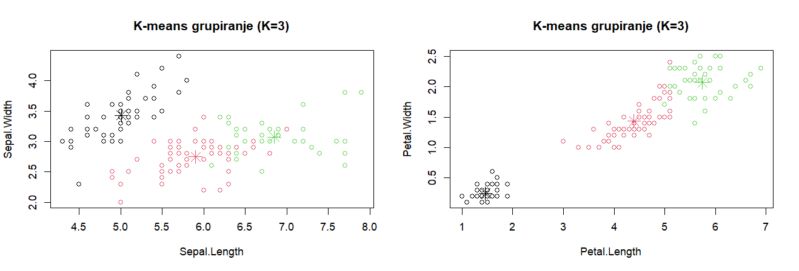

*Evaluacija i usporedba:*
```r
# install.packages("flexclust")
library(flexclust)

# Pretvaranje rezultata u Kcentroids objekt
kcca_model <- as.kcca(kmeans_result, iris_features)

# Dodjela klastera pomoću flexclust metode
clusters_flex <- predict(kcca_model)

# Evaluacija točnosti u odnosu na stvarne klase
table(clusters_flex, iris$Species)
# clusters_flex setosa versicolor virginica
#             1     50          0         0
#             2      0         48        14
#             3      0          2        36

# Preciznost klasifikacije
randIndex(table(clusters_flex, iris$Species))
#       ARI 
# 0.7302383 
```

- **Tablica klastera** pokazuje da je *setosa* savršeno prepoznata, dok su *versicolor* i *virginica* djelomično izmiješane
- **Rand indeks (ARI = 0.73)** pokazuje **dobru usklađenost** klastera s pravim klasama

*Partitioning Around Medoids (PAM) algoritam:*
```r
# install.packages("cluster")
library(cluster)

# Primjena pam algoritma s 3 klastera
set.seed(123)
pam_result <- pam(iris_features, k = 3)

# Prikaz medoida
pam_result$medoids
#      Sepal.Length Sepal.Width Petal.Length Petal.Width
# [1,]          5.0         3.4          1.5         0.2
# [2,]          6.0         2.9          4.5         1.5
# [3,]          6.8         3.0          5.5         2.1

# Prikaz klastera i usporedba sa stvarnim vrstama
table(pam_result$clustering, iris$Species)
#   setosa versicolor virginica
# 1     50          0         0
# 2      0         48        14
# 3      0          2        36

# D
clusplot(iris_features, 
         kmeans_result$cluster, 
         color = TRUE, shade = TRUE, labels = 2, lines = 0, 
         main = "Clusplot prikaz K-means klastera")
```

**PAM algoritam** (Partitioning Around Medoids) sličan K-meansu, ali koristi **medoide** umjesto sredina (*otporniji na šum i outliere*)


</div>