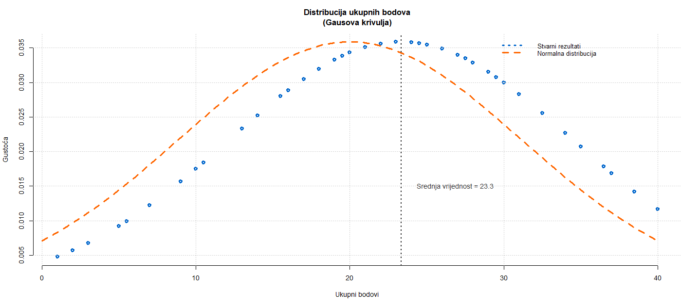

# Seminar

## Analiza uspješnosti studenata na kolokviju iz kolegija Programiranje u skriptnim jezicima (PJS)

### Cilj

Cilj ove analize je ispitati uspješnost studenata na kolokviju iz kolegija PJS. Gdje mi je cilj odgovoriti na sljedeća pitanja:

1. **Kakva je distribucija svih studenata po grupama?**
2. **Kolika je prolaznost studenata po određenoj grupi, vrsti i sveukupno?**
3. **Da li bodovi svih studenata prate Gaussovu krivulju?**
4. **Kakav je raspon bodova svih studenata?**

---

### Podaci

Skup podataka nad kojim se vrši analiza se sastoji od **59** opservacija i **17** varijabli od čega ima:
- **2** kategorijske - nominalne:
    - `group`: grupa kolokvija dodijeljena studentu (*1–4*)
    - `student_type`: vrsta studenta (*online, redovni*)

- **15** kontinuiranih - racionalnih:
    - `ID`: jedinstveni identifikator studenta
    - `task_1` do `task_14`: broj bodova ostvarenih na svakom od 14 zadataka
        - nemaju svi zadaci jednak maksimalni broj bodova

Nema nedostajućih vrijednosti tako da ih nije potrebno čistiti.
Pretvorit ćemo kategorijske varijable (`vrsta_studenta`, `grupa`) u faktorske varijable.
Dodat ćemo dva stupca:
- `ukupno`: zbroj svih bodova zadataka
- `prolaz`: TRUE/FALSE ovisno o tome da li student ima barem 50% bodova

---

### Analiza i vizualizacija podataka

#### 1. Kakva je distribucija svih studenata po grupama?

Analiza distribucije pokazuje sljedeću raspodjelu studenata po četiri različite grupe:

| Grupa      | Broj studenata | Postotak |
| ---------- | -------------: | -------: |
| 0          |              9 |    15.3% |
| 1          |             20 |    33.9% |
| 2          |             17 |    28.8% |
| 3          |             13 |    22.0% |
| **Ukupno** |         **59** | **100%** |

**Grupa 1** je najbrojnija s `20` studenata, što čini `33.9%` ukupnog broja. **Grupe 2** i **3** imaju relativno sličnu zastupljenost (`28.8%` i `22.0%` respektivno), dok je *Grupa 0* najmanje zastupljena sa samo `9` studenata (`15.3%`). Ova distribucija sugerira da su studenti podijeljeni u četiri grupe nejednakih veličina, što nam govori da trenutačni način dodjeljivanja grupa nije ravnomjeran.

Grafički prikaz ove distribucije može se vizualizirati kroz **pie chart** koji jasno prikazuje udjele pojedinih grupa u ukupnom broju studenata.

Pie chart jasno prikazuje kako **Grupa 1** zauzima najveći dio kruga (*oko trećinu ukupnog broja*), dok su ostale grupe proporcionalno manje, gdje je **Grupa 0** ima najmanji segment.

#### 2. Kolika je prolaznost studenata po određenoj grupi, vrsti i sveukupno?

Analiza prolaznosti studenata prikazana je prema grupi i vrsti studija (online/redovni):

  

    <table>
      <caption><strong style="white-space: pre;">Prolaznost po grupama</strong></caption>
      <thead>
        <tr><th>Grupa</th><th>Prolaznost (%)</th></tr>
      </thead>
      <tbody>
        <tr><td>0</td><td>88.9</td></tr>
        <tr><td>1</td><td>55.0</td></tr>
        <tr><td>2</td><td>58.8</td></tr>
        <tr><td>3</td><td>69.2</td></tr>
        <tr><td><strong>Ukupno</strong></td><td><strong>64.4</strong></td></tr>
      </tbody>
    </table>
  

  

    <table>
      <caption><strong style="white-space: pre;">Prolaznost po grupi i tipu studija</strong></caption>
      <thead>
        <tr><th>Grupa</th><th>Tip studija</th><th>Prolaznost (%)</th></tr>
      </thead>
      <tbody>
        <tr><td>0</td><td>Online</td><td>85.7</td></tr>
        <tr><td>1</td><td>Online</td><td>66.7</td></tr>
        <tr><td>2</td><td>Online</td><td>57.1</td></tr>
        <tr><td>3</td><td>Online</td><td>55.6</td></tr>
        <tr><td>0</td><td>Redovni</td><td>100.0</td></tr>
        <tr><td>1</td><td>Redovni</td><td>37.5</td></tr>
        <tr><td>2</td><td>Redovni</td><td>60.0</td></tr>
        <tr><td>3</td><td>Redovni</td><td>100.0</td></tr>
      </tbody>
    </table>
  

  

    <table>
      <caption><strong style="white-space: pre;">Prolaznost po tipu studija</strong></caption>
      <thead>
        <tr><th>Tip studija</th><th>Prolaznost (%)</th></tr>
      </thead>
      <tbody>
        <tr><td>Online</td><td>65.7</td></tr>
        <tr><td>Redovni</td><td>62.5</td></tr>
      </tbody>
    </table>
  

  

    <table>
      <caption><strong style="white-space: pre;">Ukupna prolaznost</strong></caption>
      <thead>
        <tr><th>Prolaznost (%)</th></tr>
      </thead>
      <tbody>
        <tr><td><strong>64.4</strong></td></tr>
      </tbody>
    </table>
  

Iz dobivenih rezultata vidimo da je ukupna prolaznost studenata **64.4%** (*online 65.7% i redovni 62.5%*) što zadovoljava minimalnu prolaznost studenata od **40%** te uz to i možemo vidje da obje vrste studenata imaju jednaku prolaznost.

Iz grafa se posebno ističe **Grupa 0**, gdje svi redovni studenti, a većina online studenata, ostvaruje prolaz, što može ukazivati na povoljne zadatke. S druge strane, **Grupa 1** pokazuje znatno slabiji uspjeh kod redovnih studenata, što može zahtijevati dodatnu analizu sadržaja zadataka u toj grupi.

#### 3. Da li bodovi svih studenata prate Gaussovu krivulju?

Za potrebu ovog pitanja napravili smo scatter plot za prikaz sortiranih podataka normalne distribucije.

Na temelju grafa, možemo usporediti stvarnu raspodjelu ukupnih bodova studenata (*plave točke*) s idealnom normalnom distribucijom (*narančasta isprekidana linija*).

Distribucija bodova **ne prati u potpunosti Gaussovu krivulju**:

* **Lijeva strana** (*niži bodovi*) relativno dobro prati oblik normalne distribucije
* **Desna strana** (*viši bodovi*) pokazuje **asimetriju** – stvarni rezultati su češći u blizini vrha i naglo opadaju, što ukazuje na **blagu negativnu asimetriju** (*lijevo zbijena, desno raširena*)
* **Srednja vrijednost** iznosi `23.3` te ne odgovara idealnoj simetriji normalne krivulje ali nije daleko

Raspodjela bodova ima obilježja normalne distribucije s odstupanjima u repovima i vrhu. Rezultati **nisu savršeno normalno distribuirani**, što je i za očekivati zbog specifičnih čimbenika poput: težine kolokvija, razlike u pripremljenosti, strukturi zadataka i sl.

#### 4. Kakav je raspon bodova svih studenata?

Analiza raspona bodova svih studenata pokazuje sljedeće statističke vrijednosti:

| Statistika | Vrijednost |
| ---------- | ---------: |
| Min.       |       1.00 |
| 1st Qu.    |      16.00 |
| Median     |      24.50 |
| Mean       |      23.34 |
| 3rd Qu.    |      31.00 |
| Max.       |      40.00 |

Raspon bodova se proteže od minimalnih `1` bod do maksimalnih `40` bodova, s prosječnim rezultatom od `23.34` boda. **Medijan** bodova iznosi `24.50`, što znači da je polovica studenata ostvarila rezultate iznad tog broja, dok je druga polovica ispod. **Prvi kvartil** (`16.00`) ukazuje na to da je **25%** studenata ostvarilo rezultate ispod tog broja, dok je **treći kvartil** (`31.00`) pokazatelj da je **75%** studenata imalo bolji rezultat.

Grafički prikaz ove distribucije može se prikazati kroz **box plot** koji jasno ilustrira raspon bodova i položaj ključnih statističkih vrijednosti.

Box plot prikazuje kako se većina bodova koncentrira u srednjem širokom rasponu (`16-31`), te možemo vidjeti da su studenti u prosjeku ostvarili veće bodove s obzirom na to da je interkvartilni raspon podignut.

### Zaključak

Analiza uspješnosti studenata na kolokviju iz kolegija PJS ukazuje na to da je težina kolokvija bila dobro izbalansirana. Ukupna prolaznost od **64.6%** može se smatrati zadovoljavajućom, posebno uzimajući u obzir gotovo jednaku uspješnost **redovnih** i **online** studenata, što dodatno potvrđuje pravednost pristupa ocjenjivanju.

Posebnu pažnju treba usmjeriti na **Grupu 1**, gdje su rezultati bili slabiji u odnosu na ostale grupe, kako bi se identificirale moguće poteškoće ili nepravilnosti u sadržaju zadataka.

Distribucija bodova donekle slijedi oblik **normalne (Gaussove) krivulje**, uz blagu asimetriju prema višim bodovima, što nije zabrinjavajuće jer općenito zadržava pravilnu raspodjelu.

**Raspon bodova**, uz medijan i prosjek blizu sredine, te blag pomak prema višim rezultatima, pokazuje da je većina studenata ostvarila srednje do više bodove, što je u skladu s očekivanjima i dodatno potvrđuje primjerenu razinu težine kolokvija.

