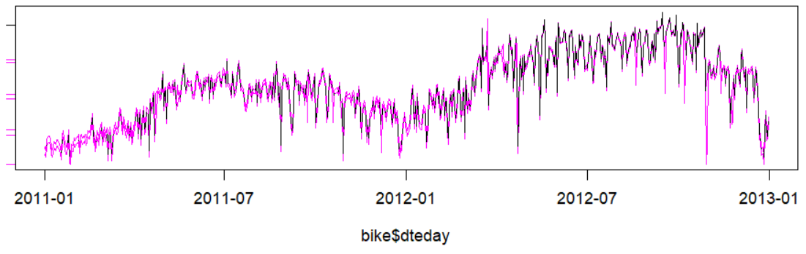
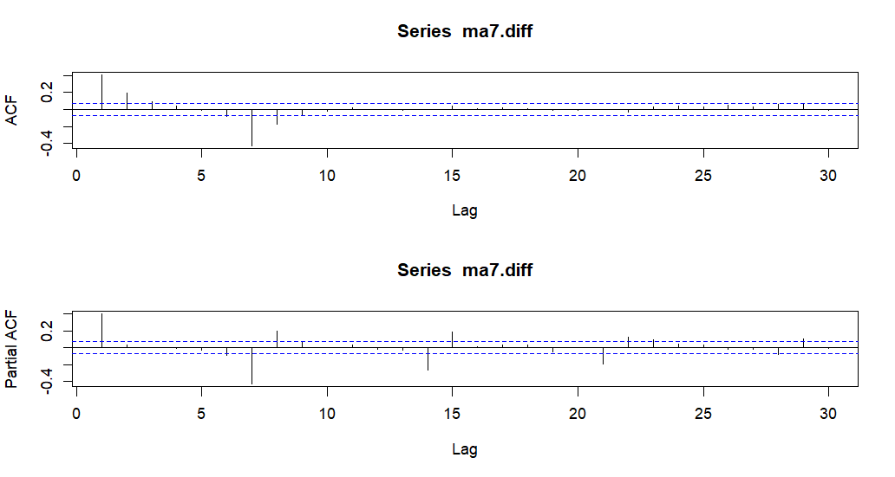
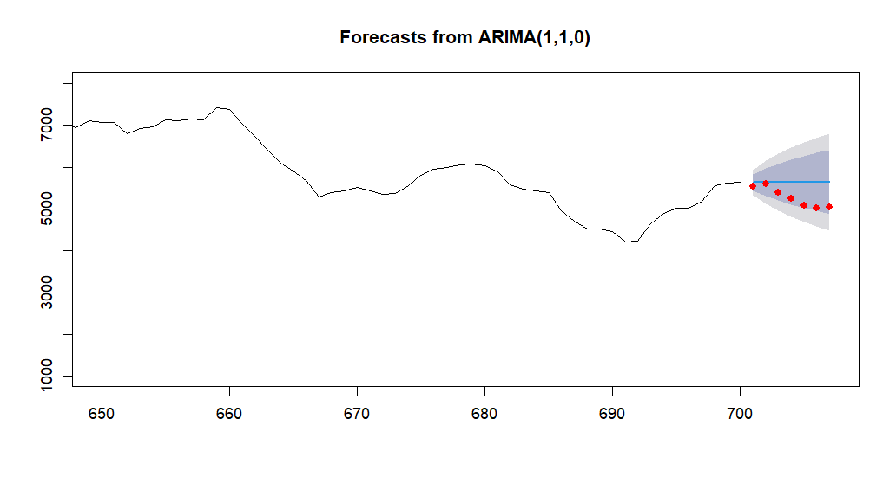

<div class="body">

# Analiza bicikli


1. Učitajte podatke iz datoteke `day.csv` u data frame naziva bike uz postavku da se ne izvrši
automatsko pretvaranje znakovnih nizova u **factor**.
```r
read.csv("day.csv", stringsAsFactors = FALSE)
```

2. Pretvorite `dteday` u datum formata **godina-mjesec-dan**.
```r
as.Date(vector, format = "%Y-%m-%d")
```

3. Pomoću **linijskog grafikona** prikažite broj **posudbi** (`cnt`) prema **danima** (`dteday`).

4. Na koji je datum bilo **najviše**, a na koji **najmanje posudbi**?

5. Pretvorite `cnt` u **vremenski niz** (*frequency = 365*) te ga očistite od nedostajućih vrijednosti i outliera (*ako ih ima*; `tsclean()`). Podatke spremite u varijablu `cnt.clean`.

6. **Usporedite grafički** *originalni niz* i *očišćeni niz* (`cnt.clean`).

    *Primjer:*
    
    

7. Napravite **3** nova niza tako da `cnt.clean` zagladite pomoću **pomičnih prosjeka** reda **7**, **15** i **30**.

8. Prikažite grafički `cnt.clean` i nizove pomičnih prosjeka.

    *Primjer:*
    

9. Izvršite **aditivnu dekompoziciju** vremenskog niza. Za koliko se **promijenio broj posudbi** zbog
sezonskog utjecaja na dan **6.1.2011.**?

10. Izvršite **multiplikativnu dekompoziciju** vremenskog niza kosristeći originalne podatke. Za koliko se **promijenio broj posudbi** zbog sezonskog utjecaja na dan **1.1.2011.**?

11. Prikažite **grafički** rezultat dekompozicije.

    *Primjer:*
    

12. Koristit ćemo **zaglađene podatke** (*reda 7*). Uklonite nedostajuće vrijednosti.

13. Izvršite **provjeru stacionarnosti** vremenskog niza. Je li niz stacionaran?

14. Izračunajte **prvu diferenciju** niza. Ponovite test stacionarnosti. Je li niz stacionaran?

15. Provjerite pomoću funkcije (`ndiffs()`) broj diferenciranja potreban da bi niz postao
stacionaran. Odgovara li rezultat onome iz zadatka 14.?

16. **Grafički usporedite** nizove prije i nakon diferenciranja.

    *Primjer:*
    

17. **Grafički prikažite autokorelacijsku** funkciju i funkciju **parcijalne autokorelacije** (*lag.max = 30*). Na kojim su pomacima **značajni koeficijenti**?

    *Primjer:*
    

18. Napravite **ARIMA model** koristeći funkciju za **automatsko određivanje parametara** (`auto.arima()`). Koristite
prvih 700 vrijednosti zaglađenih podataka bez diferenciranja.

19. Koje su vrijednosti parametara odabrane?

20. Koliko iznosi **RMSE modela**?

21. Koristite model za **predviđanje 7 dana unaprijed**. Prikažite rezultate grafički zajedno sa
stvarnim vrijednostima.

    *Primjer:*
    

</div>