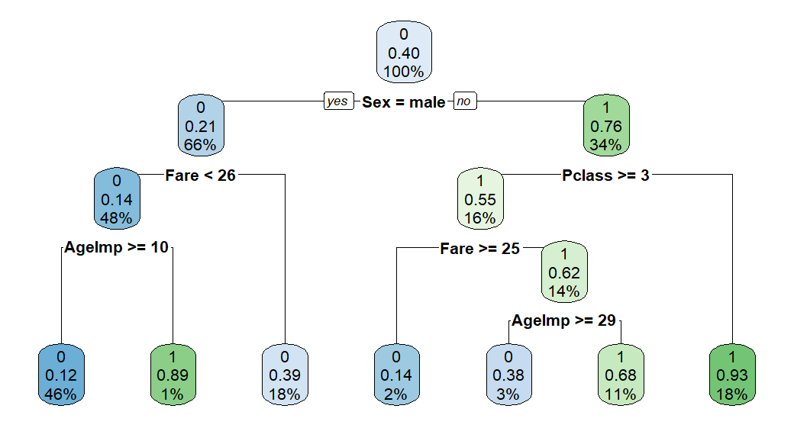

# Analiza Titanik

1. Učitajte podatke iz datoteke `titanic_med.csv` u data frame naziva **titanic**.

2. Podatke titanic **podijelite* slučajnom** podjelom u omjeru `70:30` na skupove
*trening* i *test*. Postavite sjeme na **27**.

3. Kreirajte **stablo odluke** za klasifikaciju putnika na *preživjele* i one koji *nisu uspjeli preživjeti*. Koristite **sve** varijable. Postavite sjeme na `68`.

4. Koja je varijabla najznačajnija za klasifikaciju putnika prema varijabli Survived?

5. **Grafički prikažite** dobiveno stablo.

    *Primjer:*
    

6. Na temelju koje **varijable** i koje **vrijednosti** varijable je izvršena **prva podjela**?

7. Odgovorite **jesu li preživjeli**:
    a) *muškarac* star `36` godina koji se ukrcao u luci `“S”` i putovao `besplatno`?
    b) *žena* koja je putovala `3. klasom`?

8. Da je na brodu bila osoba stara `87` godina, **da li bi preživjela**?

9. Stablo odluke koristite za **predviđanje** na *novim podacima* iz skupa **test**. Koliko iznosi **točnost**?

10. Koliko iznosi **najmanja vrijednost pogreške** dobivene na temelju **unakrsne
validacije** (*cptable*; *xerror*)?

11. **Podrežite stablo** na temelju vrijednosti `CP` parametra. Za podrezivanje odaberite
vrijednost koja odgovara *najmanjem stablu* unutar **raspona** vrijednosti koju ste
utvrdili u *zadatku 10*.

12. **Grafički prikažite** podrezano stablo.

13. **Podrezano stablo** koristite za **predviđanje** na podacima iz skupa **test**.
Koliko iznosi **točnost**?

14. Koristeći podatke **trening** kreirajte **slučajnu šumu** (*random forest*) i spremite
u varijablu naziva `rf1`. Sjeme postavite na `68`. Odaberite opciju izračuna važnosti varijabli.

15. Koja je varijabla **najznačajnija** prema kriteriju **prosječnog smanjenje točnosti** ako
se premutiraju vrijednosti varijable? Podudara li se to s odgovorom iz zadatka 10?

16. Za koliko će se **smanjiti točnost klasifikacije** ako se varijabli `Fare` permutiraju
vrijednosti?

17. Model `rf1` dobiven pod *14* koristite za za **predviđanje** na podacima iz skupa **test**.
Koliko iznosi **točnost**?

18. **Koliko** stabala sadrži šuma (*ntree*)?

19. Napravite još jedan model **slučajne šume** koji će sadržavati **1000** stabala i koji će
uzimati u obzir **3** varijable kod svake **podjele**. Spremite ga u varijablu naziva `rf2`.

20. Model `rf2` dobiven pod *19* koristite za za predviđanje na podacima iz skupa test.
Koliko iznosi **točnost**?

